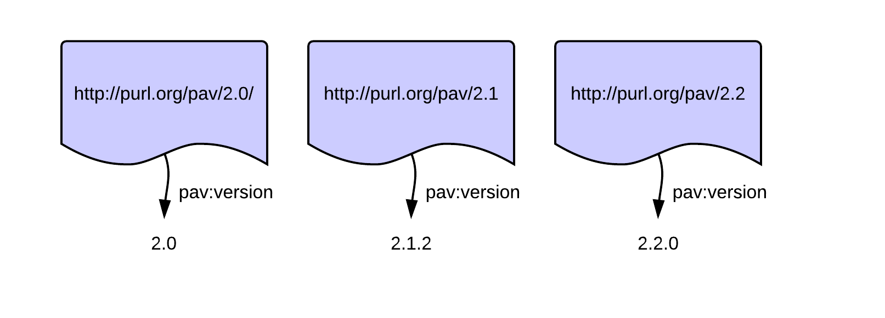
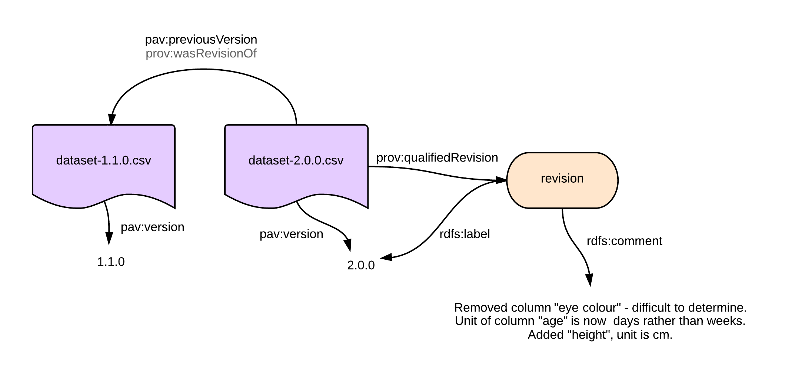
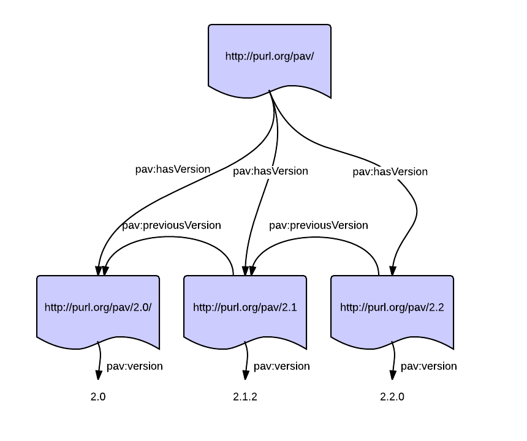
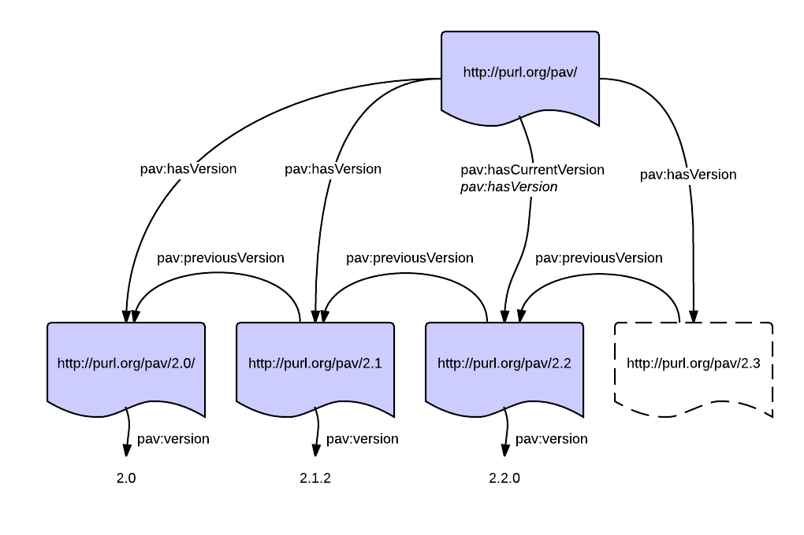

The [PAV ontology](../2013/pav/) specializes the [W3C PROV-O](http://www.w3.org/TR/prov-o/) standard to give a lightweight approach to recording details about a resource, giving its Provenance, Authorship and Versioning. Our [paper on PAV](https://doi.org/10.1186/2041-1480-4-37) explores all of these aspects in details. In this blog post we discuss **Versioning** as modelled by PAV, including their hierarchical organization.

*   [Version numbers](#versionnumbers)
    *   [Semantic versioning](#semver)
*   [Making versions retrievable](#retrievable)
*   [Ordering previous versions](#ordering)
    *   [Providing provenance for each version](#each-version)
*   [Related work](#relatedwork)
    *   [PROV-O revisions](#provo)
    *   [Qualified revisions](#qualified)
    *   [DC Terms](#dcterms)
    *   [schema.org](#schemaorg)
*   [Organize the versions](#organize)
    *   [Earlier versions](#earlier)
    *   [Has a version (snapshots)](#hasVersion)
    *   [Current version](#current)
    *   [Hierarchies all the way down](#hierarchies)

Versioning is commonly used for software releases (e.g. Windows 8.1, Firefox 26, Python 3.3.2), but increasingly also for datasets and documents. For the purpose of _provenance_, a version number allows the declaration of the _current state_ of a resource, which can be cross-checked against release notes and used for references, for instance to indicate which particular version of a dataset was used in producing an analysis report.

Versions in PAV are quite straight forward. For our working example, let's look at the [official releases of the PAV ontology](https://github.com/pav-ontology/pav/releases) itself. Note that PAV is intended for describing any kind of web resource (e.g. documents, datasets, diagrams), not just ontologies, but we'll use this example as it allows us to explore versioning both from a document and a technical perspective.

## Version numbers {#versionnumbers}

So as an example, some versions of the PAV 2.x series (skipping patch versions for now):

[](pav-versions-simple-new-page.png)

The property [pav:version](http://purl.org/pav/html#http://purl.org/pav/version "pav:version") gives a human-readable version string. Note that there is no particular requirements on this string, we could just as well have labelled the versions "red", "blue" and "green".

### Semantic versioning {#semver}

Rather than arbitrary version strings, a numeric _major.minor.patch_ version number following [semantic versioning rules](http://semver.org/) are a bit easier to understand, and come with explicit promises that help predict backward and forward compatibility. What would classify as a major/minor/patch change really depend on the nature of a resource and its role, and although these rules are written for software they also apply well to a range of resources. For instance:

*   Changing the font of the Coca-Cola _logo_ would mean a new **major** version, e.g. from 1.1.5 to 2.0.0
*   Adding a new paragraph to a _legal document_ means incrementing the **minor** version, e.g. from 2.2.1 to 2.3.0
*   Fixing grammar in a chemistry _lab report_ would increment the **patch** version, e.g. from 2.4.0 to 2.4.1
    *   Changing a single chemical symbol in a formula would however be a **minor** increment (changing the reaction), e.g. from 2.4.1 to 2.5.0
*   In _software_, adding a new function to an API or a new command line option means incrementing the **minor** version, e.g. from 2.5.0 to 2.6.0
*   For a _web mail service_, removing the "Reply To All" button would be a new **major** version (removes functionality), e.g. from 2.6.0 to 3.0.0
*   Removing a column from a _dataset_ would usually mean incrementing the **major** version (as this could break functionality for anyone depending on that column), e.g. from 3.5.1 to 4.0.0
    *   Adding more rows would be a **minor** change (as it would scientifically speaking be an updated dataset), e.g from 4.0.0 to 4.1.0
    *   Fixing a particular cell that was wrongly formatted as a number rather than a date would just be a **patch** change, e.g. from 4.1.0 to 4.1.1

Many resources such as a regular home page or an Excel spreadsheet of expenses does not have any formal versioning process, and probably won't really benefit much from semantic versioning, in which case the best options would often be increasing numbers ("19", "20", "21") or [ISO-8601](http://www.w3.org/TR/NOTE-datetime) date/time stamps ("2013-12-24", "2013-12-28", "2014-01-02 15:04:01Z") -- both which can easily be generated by software without needing any understanding of the nature of the change.

## Making versions retrievable {#retrievable}

In the figure above, each versioned resource have their own URI to allow you to **retrieve** that particular version. Although there is no requirement for such availability, it can be quite beneficial for several reasons, particularly combined with semantic versioning. For instance, the way we have deployed our ontology means that if you wanted to use PAV version 2.1 without any terms introduced in 2.2 or later, then you can use <http://purl.org/pav/2.1> to consistently download (or programmatically import) the ontology as it was in version 2.1.

(Side note: We deliberately have not versioned the PAV _namespace_, so `pav:version` expands to <http://purl.org/pav/version> no matter which ontology version was loaded. To avoid misunderstandings such as <http://purl.org/pav/2.0/version> we removed the trailing _/_ in the version URI from 2.1 onwards).

## Ordering previous versions {#ordering}

Now, a computer seeing these three resources would not know they are ordered 2.0, 2.1, 2.2, or not even that they are related at all. With PAV we can add the `pav:previousVersion` property:

[](pav-versions-new-page-2.png)

Note how [pav:previousVersion](http://purl.org/pav/html#http://purl.org/pav/previousVersion "pav:previousVersion") goes directly between the resources, in PAV the 'previous version' is not a free standing tag separate from the resource, but an actual copy or snapshot of the versioned resource as it was in that state. This eventually forms a chain of versioned resources, here providing the lineage of version 2.3 through 2.2 and 2.1 to 2.0. 

In PAV, `pav:previousVersion` is meant to be used as a _functional property_ (pointing at a single resource); this means that for any given resource, only the exactly previous version is stated directly, to find any earlier versions you can follow the chain.

In the picture above I have pencilled in a PAV version 2.3 as a draft, to highlight that `pav:previousVersion` is purely a way to show the version lineage from a given resource, and not as prescribing as [dcterms:replaces](http://purl.org/dc/terms/replaces "dcterms:replaces"), which specifies _a related resource that is supplanted, displaced, or superseded by the described resource_. The authority of when a resource is ready to supersede its previous version is often separate from its version lineage. We'll come back to the "current version" later in this blog post. 

_Note that since making this figure, PAV 2.3 has actually been released._ 😊

### Providing provenance for each version {#each-version}

One advantage of having each versioned resource explicit, beyond being able to retrieve them, is that you can attach additional properties, reflecting the state of each version. For instance, for a dataset, each version can have its own provenance of how they had been prepared:

[](pav-dataset-lineage-new-page-2.png)

Example of using PAV to version datasets, showing the provenance of each individual version. [doi:10.6084/m9.figshare.894329](https://doi.org/10.6084/m9.figshare.894329)

In this example, _dataset-1.0.0.csv_ has been [pav:importedFrom](http://purl.org/pav/html#http://purl.org/pav/importedFrom "pav:importedFrom") _survey.xls_, i.e. probably saved from Excel (the software can be specified using [pav:createdWith](http://purl.org/pav/html#http://purl.org/pav/createdWith "pav:createdWith")). The Excel file was imported from an SPSS survey data file, but in addition had a [pav:sourceAccessedAt](http://purl.org/pav/html#http://purl.org/pav/sourceAccessedAt "pav:sourceAccessedAt") the survey form (e.g. the creator looked up more descriptive column headers).

For _dataset-1.1.0.csv_ we (as humans) can see the minor version has been incremented, and that it has a different provenance, this version was imported from _dataset.xlsx_, which has been [pav:derivedFrom](http://purl.org/pav/html#http://purl.org/pav/derivedFrom "pav:derivedFrom") the earlier _survey.xls_ (indicating that the spreadsheet have evolved significantly). The data was imported from a different _survey2.spv_ (which might or might not be related to _survey.spv_), but still accessed the same _surveyform.docx_.

For _dataset-2.0.0.csv_ the provenance is quite different, this time the scientist has simply used [Survey Monkey](https://www.surveymonkey.com/) rather than SPSS to manage their survey, and have simply published its exported CSV. Presumably this dataset is quite different in its structure, as it has gained a new major version to become 2.0.0. Note that if the _content_ of the dataset (its knowledge) had significantly changed, e.g the old dataset showed  baby birth weights while the next dataset was a survey of pregnant mothers, their education levels and their baby's birth weight, then the new dataset should rather be related with [pav:derivedFrom](http://purl.org/pav/html#http://purl.org/pav/derivedFrom).

Adding other PAV properties to relate agents to versions, such as [pav:createdBy](http://purl.org/pav/html#http://purl.org/pav/createdBy "pav:createdBy"), [pav:importedBy](http://purl.org/pav/html#http://purl.org/pav/importedBy "pav:importedBy") and [pav:authoredBy](http://purl.org/pav/html#http://purl.org/pav/authoredBy "pav:authoredBy"), can be useful particularly to attribute different people involved with each release. 

## Related work {#relatedwork}

While we have presented versioning with PAV, other vocabularies exists with alternative ways to model versions.

### PROV-O revisions {#provo}

In the [W3C specification PROV-O](http://www.w3.org/TR/prov-o/), the term [prov:wasRevisionOf](http://www.w3.org/TR/prov-o/#wasRevisionOf) can be used to relate versions:

> A revision is a derivation for which the resulting entity is a revised version of some original. The implication here is that the resulting entity contains substantial content from the original. Revision is a particular case of derivation.

While at first `prov:wasRevisionOf` seem to achieve the same as [pav:previousVersion](http://purl.org/pav/html#http://purl.org/pav/previousVersion "pav:previousVersion"), the PROV definition is focusing on revision as a form of derivation. As the dataset example above showed, versions are not necessarily related through simple derivations, but can have their own provenance. It is unclear if `prov:wasRevisionOf` also might be used to give shortcuts to older versions, while `pav:previousVersion` only should be used towards the directly previous version. The PAV property also recommends giving the human-readable [pav:version](http://purl.org/pav/html#http://purl.org/pav/version "pav:version").

We do however acknowledge that most common use of `prov:wasRevisionOf` is very similar to `pav:previousVersion`, and have therefore mapped `pav:previousVersion` as a [subproperty](https://www.w3.org/TR/owl2-primer/#Property_Hierarchies) of `prov:wasRevisionOf`. Although this also indirectly means a PAV previous version is related with a PROV derivation, the definition of [prov:wasDerivedFrom](http://www.w3.org/TR/prov-o/#wasDerivedFrom "prov:wasDerivedFrom") is intentionally quite wide and should also cover `pav:previousVersion` as an 'update':

> A derivation is a transformation of an entity into another, an update of an entity resulting in a new one, or the construction of a new entity based on a pre-existing entity.

Our derivation subproperty [pav:derivedFrom](http://purl.org/pav/html#http://purl.org/pav/derivedFrom "pav:derivedFrom") is again intentionally more specific, requiring a significant change in content, and thus can be used to clarify the level of change.

We made a [mapping to PROV-O](https://jbiomedsem.biomedcentral.com/articles/10.1186/2041-1480-4-37/tables/4) which explains the rationale for each PAV subproperty.

### Qualified revisions {#qualified}

One interesting aspect of PROV-O is the ability to qualify relations. `prov:wasRevisionOf` (and therefore also `pav:previousVersion`) can be qualified using [prov:qualifiedRevision](http://www.w3.org/TR/prov-o/#qualifiedRevision "prov:qualifiedRevision"). For instance we could expand the relation between dataset 2.0.0 and 1.1.0 to explain why we had to change the major version:

[](pav-and-prov-qualified-revisions-qualifiedrevision.png)

`prov:qualifiedRevision` can be used to detail `pav:previousVersion`, here explaining the changes of the the dataset using `rdfs:comment`. Note that this figure does not show the qualified link `prov:entity` from the _revision_ to _dataset-1.1.0.csv_.

Note that it will often be difficult to assign a retrievable URI for the revision itself, unless some kind of versioning system (like [Github](https://github.com/stain/pav/commit/5e5a1f3578de796ebd86ebbb54ecc94905f491f2) or ~~[Google Code](https://code.google.com/p/pav-ontology/source/detail?r=283))~~ provides a way to link to the change or revision itself.

This kind of qualification pattern can be also be used for other PAV properties that have PROV superproperties, such as [prov:qualifiedDerivation](http://www.w3.org/TR/prov-o/#qualifiedDerivation) on [pav:importedFrom](http://purl.org/pav/importedFrom "pav:importedFrom"), or [prov:qualifiedAttribution](http://www.w3.org/TR/prov-o/#qualifiedAttribution) on [pav:authoredBy](http://purl.org/pav/authoredBy "pav:authoredBy"), however in many cases it might be better to expand the change by relating entities to [PROV activities](http://www.w3.org/TR/prov-primer/#activities).

### DC Terms {#dcterms}

The [Dublin Core Terms](http://purl.org/dc/terms/) is a well-established and popular vocabulary to provide bibliographic records, particularly for document-like resources. As its focus is on human-readable bibliographies rather than provenance, there is not necessarily a 'backwards in time' lineage when using DC Terms relations. These DC Terms properties can be used for describing versions of resources:

*   [dcterms:replaces](http://purl.org/dc/terms/replaces) -- _A related resource that is supplanted, displaced, or superseded by the described resource._ As mentioned before, this is similar to [pav:previousVersion](http://purl.org/pav/html#http://purl.org/previousVersion), but adds a stamp of authority as the older version is superseded or displaced. So for instance if our _dataset-2.0.0.csv_ was experimental and not really a good replacement for 1.1.0 (say we really wanted to include eye colour), then `dcterms:replaces` would not be appropriate until there was a new "official version" -- which might not be until 2.1.3. The inverse, [dcterms:isReplacedBy](http://purl.org/dc/terms/isReplacedBy), can be used as a forward pointing property to indicate that a resource is no longer current.
*   [dcterms:isVersionOf](http://purl.org/dc/terms/isVersionOf) -- _A related resource of which the described resource is a version, edition, or adaptation. Changes in version imply substantive changes in content rather than differences in format._ This property is quite wide, in that it could cover any kind of adaptation, like the [Romeo+Juliet movie](http://dbpedia.org/page/Romeo_+_Juliet) being a version of the [Shakespeare theatre play Romeo and Juliet](http://dbpedia.org/resource/Romeo_and_Juliet).  
    In provenance term, such adaptions are normally covered by `prov:wasDerivedFrom` (the movie was based on the theatre play) or [prov:alternateOf](http://www.w3.org/TR/prov-o/#alternateOf)  (the movie as an alternate of a theatre performance), while differences in abstraction levels (e.g. the DVD vs. the movie in general) are covered with [prov:specializationOf](http://www.w3.org/TR/prov-o/#specializationOf) and [FRBR-like abstraction models](http://purl.org/spar/fabio).  Additionally, `pav:previousVersion` does not normally cover _substantive changes in content_, that should be described using `pav:derivedFrom`.
*   [dcterms:hasVersion](http://purl.org/dc/terms/hasVersion) -- _A related resource that is a version, edition, or adaptation of the described resource._ This is the inverse of `dcterms:isVersionOf`, but also suffers from sometimes being used as a kind of `prov:qualifiedRevision` pointing at a free-standing revision resource (as in our dataset example above), or as a more hierarchical unversioned-to-versioned relationship ([prov:generatizationOf](http://www.w3.org/TR/prov-o/#inverse-names)). Even within the [DC Terms history](https://www.dublincore.org/legacy/dcmi-terms-history/#hasVersion-003) there seems to be a confusing mix of `dcterms:hasVersion` and `dcterms:replaces` that hints of hierarchical use, but also makes a resources have themselves as versions.

PAV has a [mapping to DC Terms](https://jbiomedsem.biomedcentral.com/articles/10.1186/2041-1480-4-37/tables/5) (available as [SKOS](http://purl.org/pav/mapping/dcterms)) which explains how the two vocabularies could be aligned, however we have not included the versioning part of this mapping in the formal OWL ontology due to the above reasons.

### schema.org {#schemaorg}

[schema.org](http://schema.org/) is a set of terms that has grown to be amongst the most popular vocabularies for describing web resources, partially because of its usage by Google, Yahoo and Bing. Terms we identified to be related to versioning are:

*   [schema:version](http://schema.org/version) -- _The version of the CreativeWork embodied by a specified resource._ This can be seen as a more specific version of pav:version, the biggest difference is that `schema:version` is typed to be a `schema:Number`, and so might not cover versions  like "1.5.2" or "2014-01-05".
*   [schema:isBasedOnUrl](http://schema.org/isBasedOnUrl) -- _A resource that was used in the creation of this resource. This term can be repeated for multiple sources_.  This is more of a loose provenance term which could be seen to cover all of `pav:sourceAccessedAt`, _pav:importedFrom, pav:retrievedFrom,_ `prov:wasDerivedFrom` and [prov:wasInfluencedBy](http://www.w3.org/TR/prov-o/#wasInfluencedBy).
*   [schema:successorOf](http://schema.org/successorOf) -- _A pointer from a newer variant of a product to its previous, often discontinued predecessor._ While this description is similar to [`pav:previousVersion`](http://purl.org/pav/html#http://purl.org/pav/previousVersion) and [dcterms:replaces](http://purl.org/dc/terms/replaces), the term seem to only be used from/to [schema:ProductModel](http://schema.org/ProductModel)s which would not cover web resources that are not product sheets. The same applies to its inverse [schema:predecessorOf](http://schema.org/predecessorOf).
*   [schema:isVariantOf](http://schema.org/isVariantOf) -- _A pointer to a base product from which this product is a variant. It is safe to infer that the variant inherits all product features from the base model, unless defined locally._ This property, also only used from/to `schema:ProductModel`, is a specialization of [dcterms:isVersionOf](http://purl.org/dc/terms/isVersionOf) and [prov:specializationOf](http://www.w3.org/TR/prov-o/#specializationOf).

## Organize the versions {#organize}

In [PAV 2.3](http://purl.org/pav/2.3/html) we added three additional properties for versioning:

### Earlier versions {#earlier}

[pav:hasEarlierVersion](http://purl.org/pav/html#http://purl.org/pav/hasEarlierVersion) point to any earlier version, not just the directly previous version. This is a transitive super-property of [pav:previousVersion](http://purl.org/pav/html#http://purl.org/pav/previousVersion), which means you can build a linear chain of previous versions, and imply all the earlier versions. (Importantly `pav:previousVersion` is NOT transitive). For simplicity there is no inverse property for the _later version_ -- as we think an earlier version shouldn't make "future" declarations, rather the newer version should indicate its earlier version (following the direction of provenance).


### Has a version (snapshots) {#hasVersion}

[pav:hasVersion](http://purl.org/pav/html#http://purl.org/pav/hasVersion) is a specialization of [dcterms:hasVersion](http://purl.org/dc/terms/hasVersion) -- which formalizes that this property is for hierarchical versioning:



This shows how <http://purl.org/pav/> is a more general entity that spans across the multiple snapshots, therefore `pav:hasVersion` is also a subproperty of [prov:generalizationOf](https://www.w3.org/TR/2013/REC-prov-o-20130430/#generalizationOf) -- indicating the hierarchical nature of the entities describing the same thing with different (time) characteristics.

Note that unlike `dcterms:hasVersion`, `pav:hasVersion` goes to a _snapshot_ -- the version should be retrievable at its URI, so it would usually not be good taste to use `pav:hasVersion` to a revision info page that does not include the page as it was in that version.

However for Software Releases, using [GitHub release pages](https://github.com/pav-ontology/pav/releases/tag/2.3.1) as versions is probably a good idea.

### Current version {#current}

While these snapshots should contain `pav:previousVersion` between them to provide a version lineage, it is often useful to declare what is the current version. So we have also [pav:hasCurrentVersion](http://purl.org/pav/html#http://purl.org/pav/hasCurrentVersion):



Thus `pav:hasCurrentVersion` is useful to provide a **permalink** for a dynamic page.  Often this is what people have meant with a more functional use [dcterms:hasVersion](http://purl.org/dc/terms/hasVersion) -- pointing to a single current snapshot -- where older snapshots would have [dcterms:isVersionOf](http://purl.org/dc/terms/isVersionOf) backlinks.  While that pattern might have been used, it is not formally defined as such by DC Terms.

As `pav:hasCurrentVersion` specializes `pav:hasVersion` you don't need to duplicate that relation for the current version.  Note that the **current** version is not necessarily the **latest** version -- there could be a newer version (e.g. a draft or release candidate) which is not yet official -- as exemplified above with PAV 2.3 as a draft. (Note that since making this figure [PAV 2.3.1](https://github.com/pav-ontology/pav/releases/tag/2.3.1) has been released)

Here we can see that there's a "future" PAV version that may or may not later become the `pav:hasCurrentVersion` (it is infact now the current version).This is typical of software development, where you often have alpha versions and release candidates.

It can be useful to have third-party "versions" (e.g. forks in software development) -- where you could not find the official `pav:hasVersion` statement from the upstream repository. In this case you should add a `prov:specializationOf` backlink and `pav:derivedFrom` statement to which version you forked.

### Hierarchies all the way down {#hierarchies}

There is nothing preventing you from also using `pav:hasVersion` to define deeper hierarchies, e.g. for software using semantic versioning:

```turtle
<http://purl.org/pav/> pav:hasVersion 
    <http://purl.org/pav/1>, 
    <http://purl.org/pav/2> .
<http://purl.org/pav/2> pav:hasVersion 
    <http://purl.org/pav/2.0>, 
    <http://purl.org/pav/2.1>, 
    <http://purl.org/pav/2.2>,
    <http://purl.org/pav/2.3> .
<http://purl.org/pav/2.3> pav:hasVersion 
    <http://purl.org/pav/2.3.0>
    <http://purl.org/pav/2.3.1> .
<http://purl.org/pav/2.2> pav:hasVersion 
    <http://purl.org/pav/2.2.0> .
<http://purl.org/pav/2.1> pav:hasVersion
    <http://purl.org/pav/2.1.0>,
    <http://purl.org/pav/2.1.1>,
    <http://purl.org/pav/2.1.2> .
```

But this raises some challenges with `pav:previousVersion`, `pav:hasCurrentVersion` and `pav:version`.

I would suggest this pattern for representing semantic versioning hierarchically:

```turtle
<http://software.example.com/> pav:hasCurrentVersion <http://software.example.com/v2.1.0> ;
 pav:version "2.1.0" .

<http://software.example.com/v2> pav:hasCurrentVersion <http://software.example.com/v2.1.0> ;
 pav:previousVersion <http://software.example.com/v1> ;
 pav:version "2.1.0" .

<http://software.example.com/v2.1> pav:hasCurrentVersion <http://software.example.com/v2.1.0> ;
 pav:previousVersion <http://software.example.com/v2.0> ;
 pav:version "2.1.0" .

<http://software.example.com/v2.1.0> pav:version "2.1.0" ;
 pav:previousVersion <http://software.example.com/v2.0.1> .
```

.. as `pav:hasCurrentVersion` should point to the permalink snapshot in a functional way, it would be confusing to also include its "current version" as `"2"` and `"2.1"`. So I suggest to let it always point to the "deepest" version. `pav:version` of the intermediaries should show the latest version of their `pav:hasCurrentVersion` -- not a generic `"2"` or `"2.1"`. (You can use `rdfs:label` to say `"2.1"`).

For the 'abandoned' versions, `pav:hasCurrentVersion` and `pav:version` would be the latest one within their level:

```turtle
<http://software.example.com/v2.0> pav:hasCurrentVersion <http://software.example.com/v2.0.1> ; 
    pav:previousVersion <http://software.example.com/v1.2> ; 
    pav:version "2.0.1" . 
    
<http://software.example.com/v2.0.0> pav:version "2.0.1" ; 
    pav:previousVersion <http://software.example.com/v2.0.0> . 
    
<http://software.example.com/v2.0.0> pav:version "2.0.0" ; 
    pav:previousVersion <http://software.example.com/v1.2.3> .
```

Note that software often have patch updates at "older" maintenance branches -- e.g. it could be that the current 1.2 version is 1.2.9 even though v2.0.0 was derived from 1.2.3.

If you want to describe _merges_ across these branches, then you would probably need to add additional [pav:derivedFrom](http://purl.org/pav/html#http://purl.org/pav/derivedFrom) statements.