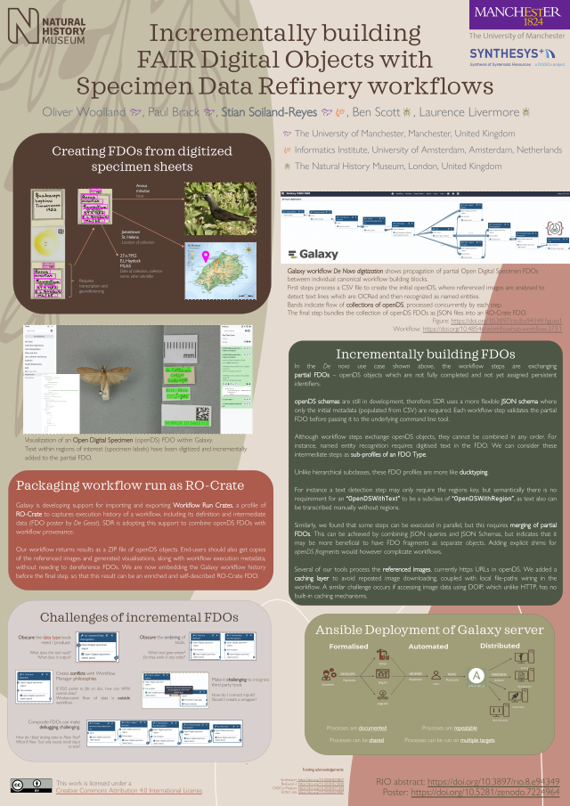

<h2>Cite as</h2>

Oliver Woolland, Paul Brack, Stian Soiland-Reyes, Ben Scott, Laurence Livermore (2022):  
**Incrementally building FAIR Digital Objects with Specimen Data Refinery workflows**.  
1st International Conference on FAIR Digital Objects ([FDO 2022](https://www.fdo2022.org/)) (poster)  
_Research Ideas and Outcomes_ **8**:e94349  
<https://doi.org/10.3897/rio.8.e94349>

# Incrementally building FAIR Digital Objects with Specimen Data Refinery workflows

_Oliver Woolland¹, Paul Brack¹, Stian Soiland-Reyes¹², Ben Scott³, Laurence Livermore³_

¹ The University of Manchester, Manchester, United Kingdom  
² University of Amsterdam, Amsterdam, Netherlands  
³ The Natural History Museum, London, United Kingdom  

## Abstract

_Specimen Data Refinery_ (SDR) is a developing platform for automating transcription of specimens from natural history collections [[Hardisty 2022](/2022/phd/specimen-data-refinery/)]. SDR is based on computational workflows and digital twins using FAIR Digital Objects.

We show our recent experiences with building SDR using the Galaxy workflow system and combining two FDO methodologies with open digital specimens (openDS) and RO-Crate data packaging. We suggest FDO improvements for incremental building of digital objects in computational workflows.

### SDR workflows

[SDR](https://sdr.nhm.ac.uk/) is realised as the workflow system Galaxy [[Afgan 2018](https://doi.org/10.1093/nar/gky379)] with [SDR tools](https://github.com/DiSSCo/SDR) installed. An Open Research challenge is that some tools have machine learning models with a commercial licence. This complicates publishing to [Galaxy toolshed](https://toolshed.g2.bx.psu.edu/), however we created [Ansible](https://www.ansible.com/) scripts to install equivalent Galaxy servers, including tools and dependencies, accounts and workflows. SDR workflows are [published in WorkflowHub](https://workflowhub.eu/projects/72) as FDOs.

We implemented the use case _De novo digitization_ in Galaxy [[Brack 2022](https://doi.org/10.48546/workflowhub.workflow.373.1)]. Shown in [Figure 1](#fig:workflow) the workflow steps exchange openDS JSON [[Hardisty 2019](https://doi.org/10.3897/biss.3.37033)], for incremental completion of a digital specimen. Initial stages build a template openDS from a CSV with metadata and image references – subsequent analysis completes the rest of the JSON with _regions_ of interest, _text_ digitised from handwriting, and recognized _named entities_.

{{< figure src="figure1.png" link="figure1.png" id="fig:workflow" 
  width="100%" title="FDO propagation in workflow"
  caption="Draft Galaxy workflow _De Novo digitization_  [[Brack 2022](https://doi.org/10.48546/workflowhub.workflow.373.1)] shows propagation of partial Open Digital Specimen FDOs between individual canonical workflow building blocks. First steps process a CSV file to create the initial openDS, where referenced images are analysed to detect text lines which are OCRed and then recognized as named entities. Bands indicate flow of collections of openDS, processed concurrently by each step. The final step bundles the collection of openDS FDOs as JSON files in a ZIP archive" >}}

Galaxy can visualise outputs of each step ([Figure 2](#fig:visualisaton)), important to make the FDOs understandable by domain experts and to verify accuracy of SDR.



We are adding workflows for partial stages, e.g. detection of regions [[Livermore 2022a](https://doi.org/10.48546/workflowhub.workflow.374.1)] and hand-written text recognition [[Livermore 2022b](https://doi.org/10.48546/workflowhub.workflow.375.1)], which we'll combine with scalability testing and wider testing by project users. Additional workflows will enhance existing FDOs and use new tools such as barcode detection of museums’ internal identifiers.

We are now ready to publish digital specimens as FAIR Digital Objects, with registration into [DiSSCO repositories](https://www.dissco.eu/dissco/technical-infrastructure/), PID assignment and workflow provenance. However, even at this early stage we have identified several challenges that need to be addressed.

### FDO lessons

We highlight the _De novo_ use case because this workflow is exchanging _partial_ FDOs – openDS objects which are not fully completed and not yet assigned persistent identifiers. [openDS schemas](https://github.com/DiSSCo/openDS) are still in development, therefore SDR uses a more[ flexible JSON schema](https://github.com/DiSSCo/SDR/blob/main/galaxy-workflow/config/opends-schema.json) where only the initial metadata (populated from CSV) are required.  Each step validates the partial FDO before passing it to the underlying command line tool.

Although workflow steps exchange openDS objects, they cannot be combined in any order. For instance, _named entity recognition_ requires digitised text in the FDO. We can consider these intermediate steps as _sub-profiles_ of an FDO Type. Unlike hierarchical subclasses, these FDO profiles are more like [ducktyping](https://en.wikipedia.org/wiki/Duck_typing). For instance a _text detection_ step may only require the `regions` key, but semantically there is no requirement for say `OpenDSWithText` to be a subclass of `OpenDSWithRegion`, as text also can be transcribed manually without regions. 

Similarly, we found that some steps can be executed in parallel, but this requires merging of partial FDOs. This can be achieved by combining JSON queries and JSON Schemas, but indicates that it may be more beneficial to have FDO fragments as separate objects. Adding openDS fragment steps would however complicate workflows.

Several of our tools process the referenced images, currently https URLs in openDS. We added a caching layer to avoid repeated image downloading, coupled with local file-paths wiring in the workflow. A similar challenge occurs if accessing image data using DOIP, which unlike HTTP, has no caching mechanisms.

### RO-Crate lessons

Galaxy is developing support for importing and exporting [Workflow Run Crates](https://www.researchobject.org/workflow-run-crate/), a profile of RO-Crate [[Soiland-Reyes 2022b](/2022/phd/fdo-with-ro-crate/)] to captures execution history of a workflow, including its definition and intermediate data [[De Geest 2022](/2022/phd/galaxy-ro-crate/)]. SDR is adopting this support to combine openDS FDOs with workflow provenance, as envisioned by [[Walton 2020](https://doi.org/10.3897/rio.6.e57602)].

Our prototype _de novo_ workflow returns results as a ZIP file of openDS objects. End-users should also get copies of the referenced images and generated visualisations, along with workflow execution metadata. We are investigating ways to embed the preliminary Galaxy workflow history before the final step, so that this result can be an enriched RO-Crate.

### Conclusions

SDR is an example of machine-assisted construction of FDOs, which highlight the needs for intermediate digital objects that are not yet FDO compliant. The passing of such “local FDOs” is beneficial not just for efficiency and visual inspection, but also to simplify workflow composition of canonical workflow building blocks. At the same time we see that it is insufficient to only pass FDOs as JSON objects, as they also have references to other data such as images, which should not need to be re-downloaded. 

Further work will investigate the use of RO-Crate as a wrapper of partial FDOs, but this needs to be coupled with more flexible FDO types as profiles, in order to restrict “impossible” ordering of steps depending on particular inner FDO fragments. A distinction needs to be made between open digital specimens that are in “draft” state and those that can be pushed to DiSSCo registries.

We are experimenting with changing the SDR components into Canonical Workflow Building Blocks [[Soiland-Reyes 2022a](/2022/phd/canonical-workflow-building-blocks/)] using the Common Workflow Language [[Crusoe 2022](/2022/phd/methods-included/)]. This gives flexibility to scalably execute SDR workflows on  different compute backends such as HPC or local cluster, without the additional setup of Galaxy servers.

## Presenting Author

Stian Soiland-Reyes

## Submitted to present at

First International Conference on FAIR Digital Objects, poster

<picture>
  <!--<source srcset="2022-10-26-fdo2022-poster-sdr.svg" type="image/svg+xml" media="(min-width: 1920px)">-->
  <source srcset="2022-10-26-fdo2022-poster-sdr-1920.webp" type="image/webp" media="(min-width: 1024px)" />
  <source srcset="2022-10-26-fdo2022-poster-sdr-1920.png" type="image/png" media="(min-width: 1024px)" />
  <source srcset="2022-10-26-fdo2022-poster-sdr-1024.webp" type="image/webp" media="(min-width: 640px)" />
  <source srcset="2022-10-26-fdo2022-poster-sdr-1024.png" type="image/png" media="(min-width: 640px)" />
  <!--
  <source srcset="2022-10-26-fdo2022-poster-sdr-640.webp" type="image/webp" media="(max-width: 640px)" />
  <source srcset="2022-10-26-fdo2022-poster-sdr-640.png" type="image/png" media="(max-width: 640px)" />
  -->
  
</picture>

* Poster: <https://doi.org/10.5281/zenodo.7233688>

## Acknowledgements

We acknowledge the [SYNTHESYS+](https://www.synthesys.info/) and [DiSSCO](https://www.dissco.eu/) project members who have been invaluable in early evaluation and feedback on the development of SDR.

## Funding

This work has received funding from the European Union's Horizon 2020 research and innovation programme under grant agreement numbers [823827](https://doi.org/10.3030/https://doi.org/10.3030/) (SYNTHESYS Plus), [871043](https://doi.org/10.3030/871043) (DiSSCo Prepare), [823830](https://doi.org/10.3030/823830) (BioExcel-2), [824087](https://doi.org/10.3030/824087) (EOSC-Life).

## Contributions

Author contributions to this article according to the Contributor Roles Taxonomy[ CASRAI CrEDiT](https://casrai.org/credit/):

Oliver Woolland
: Data curation, Resources, Software, Visualization, Writing – review & editing

Paul Brack
: Conceptualization, Software

Stian Soiland-Reyes
: Investigation, Methodology, Supervision, Writing – original draft, Writing – review & editing

Ben Scott
: Data curation, Software, Validation

Laurence Livermore
: Conceptualization, Data curation, Funding acquisition, Methodology, Project administration, Resources, Writing – review & editing

## References

[Afgan 2018] Enis Afgan, Dannon Baker, Bérénice Batut, Marius van den Beek, Dave Bouvier, Martin Čech, John Chilton, Dave Clements, Nate Coraor, Björn A Grüning, Aysam Guerler, Jennifer Hillman-Jackson, Saskia Hiltemann, Vahid Jalili, Helena Rasche, Nicola Soranzo, Jeremy Goecks, James Taylor, Anton Nekrutenko, Daniel Blankenberg (2018):  
**The Galaxy platform for accessible, reproducible and collaborative biomedical analyses: 2018 update**.  
_Nucleic Acids Research_ **46**(W1)  
<https://doi.org/10.1093/nar/gky379>

[Brack 2022] Paul Brack, Oliver Woolland, Laurence Livermore (2022):  
**De novo digitisation.** (Galaxy workflow) _WorkflowHub_  
<https://doi.org/10.48546/workflowhub.workflow.373.1>

[Crusoe 2022] Michael R. Crusoe, Sanne Abeln, Alexandru Iosup, Peter Amstutz, John Chilton, Nebojša Tijanić, Hervé Ménager, Stian Soiland-Reyes, Bogdan Gavrilović, Carole Goble, The CWL Community (2022):  
[**Methods Included: Standardizing Computational Reuse and Portability with the Common Workflow Language**](../methods=included/).  
_Communications of the ACM_ **65**(6)  
<https://doi.org/10.1145/3486897>

[De Geest 2022] Paul De Geest, Frederik Coppens, Stian Soiland-Reyes, Ignacio Eguinoa, Simone Leo (2022):  
[**Enhancing RDM in Galaxy by integrating RO-Crate**](../galaxy-ro-crate/).  
1st International Conference on FAIR Digital Objects ([FDO 2022](https://www.fdo2022.org/)) (poster)  
_Research Ideas and Outcomes_ 
<https://doi.org/10.3897/rio.8.e95164>

[Hardisty 2019] Alex R Hardisty, Keping Ma, Gil Nelson, Jose Fortes (2019):  
**‘openDS’ – A New Standard for Digital Specimens and Other Natural Science Digital Object Types**.  
_Biodiversity Information Science and Standards_ **3**:e37033  
<https://doi.org/10.3897/biss.3.37033>

[Hardisty 2022] Alex Hardisty, Paul Brack, Carole Goble, Laurence Livermore, Ben Scott, Quentin Groom, Stuart Owen, Stian Soiland-Reyes (2022):  
[**The Specimen Data Refinery: A canonical workflow framework and FAIR Digital Object approach to speeding up digital mobilisation of natural history collections**](../specimen-data-refinery/).  
_Data Intelligence_ **4**(2)  
<https://doi.org/10.1162/dint_a_00134>

[Livermore 2022a] Laurence Livermore, Oliver Woolland (2022):  
**DLA-Collections-test.** (Galaxy workflow)  
_WorkflowHub_ 
<https://doi.org/10.48546/workflowhub.workflow.374.1>

[Livermore 2022b] Laurence Livermore, Oliver Woolland (2022):  
**HTR-Collections-test**. (Galaxy workflow)  
_WorkflowHub_  
<https://doi.org/10.48546/workflowhub.workflow.375.1>

[Soiland-Reyes 2022a] Stian Soiland-Reyes, Genís Bayarri, Pau Andrio, Robin Long, Douglas Lowe, Ania Niewielska, Adam Hospital, Paul Groth (2022):  
[**Making Canonical Workflow Building Blocks interoperable across workflow languages**](../canonical-workflow-building-blocks/).   
_Data Intelligence_ **4**(2)  
<https://doi.org/10.1162/dint_a_00135>

[Soiland-Reyes 2022b] Stian Soiland-Reyes, Genís Bayarri, Pau Andrio, Robin Long, Douglas Lowe, Ania Niewielska, Adam Hospital, Paul Groth (2022):  
[**Packaging research artefacts with RO-Crate**](../ro-crate).  
_Data Science_ (pre-press)  
<https://doi.org/10.3233/DS-210053>

[Walton 2020] Stephanie Walton, Laurence Livermore, Olaf Bánki, Robert Cubey, Robyn Drinkwater, Markus Englund, Carole Goble, Quentin Groom, Christopher Kermorvant, Isabel Rey, Celia Santos, Ben Scott, Alan Williams, Zhengzhe Wu (2020):  
**Landscape Analysis for the Specimen Data Refinery**.  
_Research Ideas and Outcomes_ **6**:e57602  
<https://doi.org/10.3897/rio.6.e57602>
