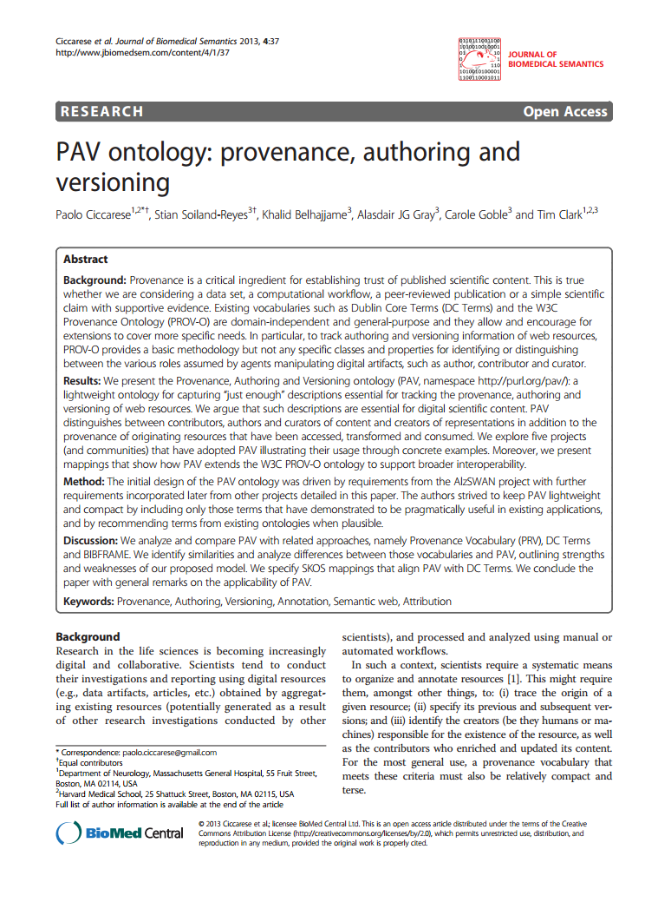

 

Our recent [paper about the PAV ontology](https://doi.org/10.1186/2041-1480-4-37 "PAV ontology: provenance, authoring and versioning") has been classified as [highly accessed](http://www.jbiomedsem.com/content/4/1/37/about) by _Journal of Biomedical Semantics_, with more than 1097 views since it was published two months ago, with an [Altmetric score](http://www.altmetric.com/details.php?citation_id=1925490 "Altmetric score for PAV Ontology paper") of 12. 

The [PAV ontology](http://purl.org/pav/home "PAV homepage") provides a lightweight approach to record typical Provenance, Authorship and Versioning information, and builds upon existing standards like [PROV-O](http://www.w3.org/TR/prov-o/) and [DC Terms](http://dublincore.org/documents/dcmi-terms/ "DCMI Terms"). Our previous Practical Provenance post gives a brief [overview of PAV](../2013/pav/ "Recording authorship, curation and digital creation with the PAV ontology"), but you might also want to explore these links for more details:

*   ~~[PAV homepage](https://code.google.com/p/pav-ontology/wiki/Homepage "PAV homepage")~~ (Google Code retired: [archived 2012-02-18](https://web.archive.org/web/20120218065441/http://code.google.com:80/p/pav-ontology/wiki/Homepage), see [GitHub](https://github.com/pav-ontology/pav)) and list of ~~[releases of PAV](https://code.google.com/p/pav-ontology/wiki/Versions)~~ ([archived 2016-08-06](https://web.archive.org/web/20120219061803/http://code.google.com/p/pav-ontology/wiki/Versions), see [GitHub wiki](https://github.com/pav-ontology/pav/wiki/Versions))
*   [PAV documentation](http://purl.org/pav/html) (including descriptions of each term)
*   [PAV OWL ontology](http://purl.org/pav) (or `owl:import` <http://purl.org/pav/>)
*   [PAV mailing list / forum](https://groups.google.com/d/forum/pav-ontology "PAV on Google Groups") at Google Groups