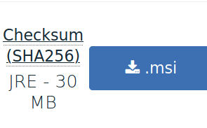
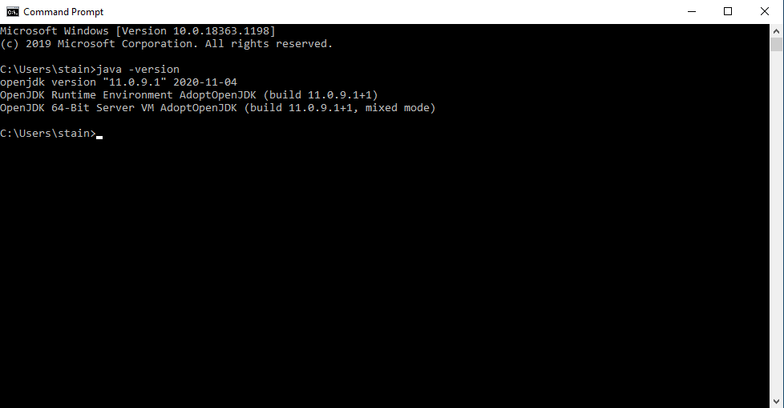
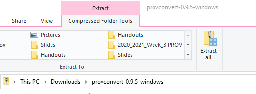
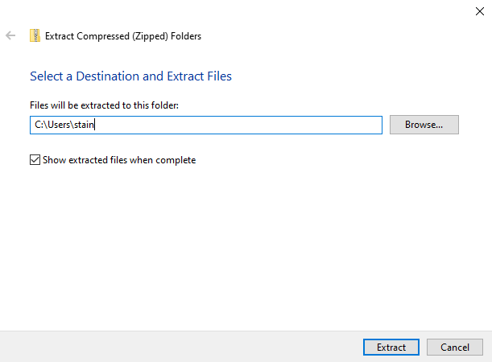
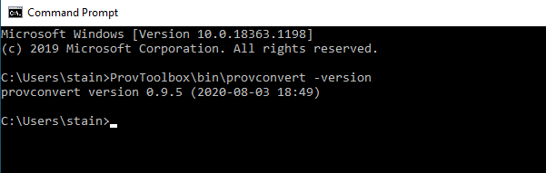
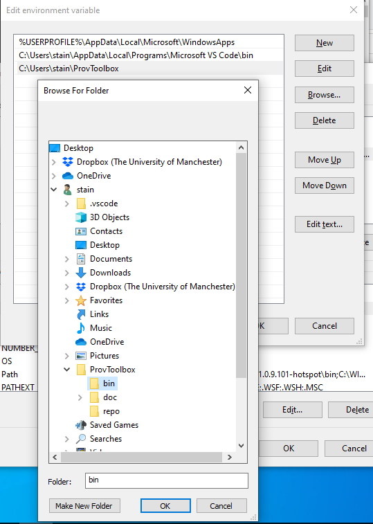
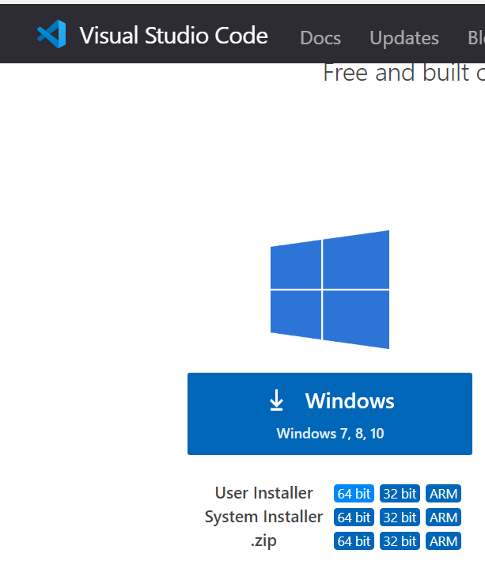
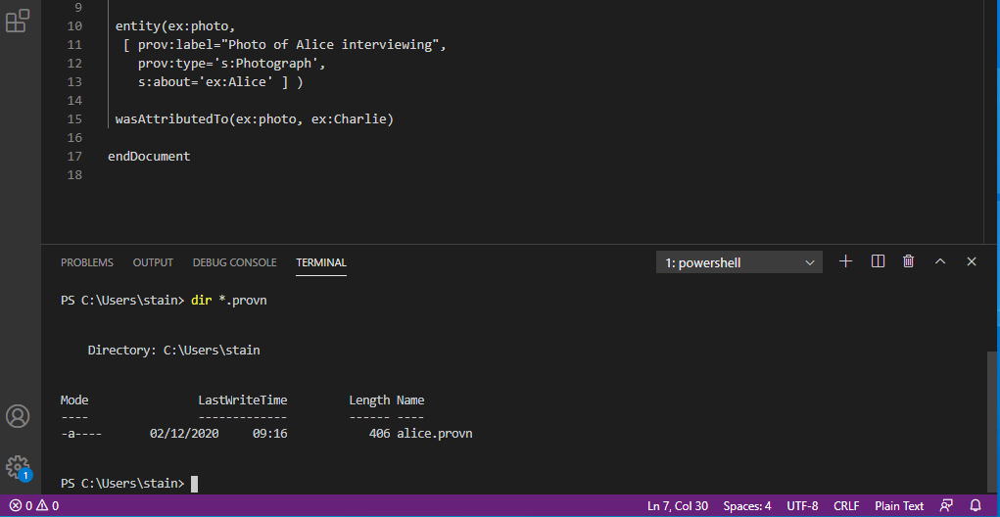

While there are several tools available for [validating and visualizing PROV](../validating-and-visualising-prov/), the [ProvToolbox](http://lucmoreau.github.io/ProvToolbox/) is perhaps the most useful for validating PROV-N syntax. However, the normal releases [does not run in Windows](https://github.com/lucmoreau/ProvToolbox/issues/153) due to a operating system restriction for command line and folder path length.

We have [suggested a fix](https://github.com/lucmoreau/ProvToolbox/pull/166), but while we wait for that, here we describe a patch build that should work on Windows. We also show how to install dependencies: Java for executing ProvToolbox, and [Graphviz](https://graphviz.org/download/) for visualization. (See also [macOS install](https://practicalprovenance.wordpress.com/2020/12/08/installing-provtoolbox-on-macos/)).

Install Java for Windows
------------------------

You will need **Java JRE 9** or later to run ProvToolbox 0.9.5, so below we show how to install JRE 11 LTS on Windows. Do **not** install from `java.com` as that provides the older Java 8, which unfortunately do not work with this ProvToolbox release.

Unfortunately there are quite a few alternatives for installing Java in Windows:

Oracle provide [installers of JDK 11 for Windows x64](https://www.oracle.com/java/technologies/javase-jdk11-downloads.html), however they are distributed under a [restrictive license](https://www.oracle.com/downloads/licenses/javase-license1.html) you or your organization may have reservations against using. These are however straight forward to install if you only want to run ProvToolbox for personal or development use.

The official _open source_ release of [OpenJDK 11 for Windows](http://jdk.java.net/java-se-ri/11) do not provide an installer, and are fairly large. If you choose to install this you will need to modify your `PATH` system environment variable manually depending on where you extract the folder `jdk-11` to.

Alternatively [RedHat provide OpenJDK installers](https://developers.redhat.com/products/openjdk/download) based on the open source JDK, we would recommend **[jre-11.0.9.1-x64 MSI](https://developers.redhat.com/download-manager/file/java-11-openjdk-11.0.8.10-2.windows.redhat.x86_64.msi)** or newer. The **MSI** packages are installable by double-click in newer versions of Windows. You will need to create a RedHat account to download.

Finally, [AdoptOpenJDK](https://adoptopenjdk.net/) is a community project for providing user-friendly open source builds of Java. We found option this to be the **easiest** to install in Windows, as they provide a MSI installer of the smaller JRE distribution, and do not require registration. However the website needs some help navigating as they provide many alternatives.

### Installing AdoptOpenJDK

We **recommend** this open source option for installing Java for Windows users.

From [https://adoptopenjdk.net/](https://adoptopenjdk.net/) select [Other Platforms](https://adoptopenjdk.net/releases.html), giving the full list of downloads. Make sure you select:

*   Version: Open JDK **11** (LTS)
*   JVM: **HotSpot**
*   Operating System: **Windows**
*   Architecture: **x64** (64-bit Windows)
    *   If you use 32-bit Windows, say on an older or smaller machine, try **x86** instead


Download the **JRE** as a **MSI** installer (the _ZIP_ file does not include an installer).



Before you open the MSI you may need to change the Windows Store settings to allow installing applications. From the start menu type **Add or Remove Programs** to open the Settings pane for **Choose where to get apps**. Select **Anywhere**.


Now double-click the MSI file from the Download folder and walk through the Installer. Enable the "_Set JAVA\_HOME environment variable_" option.


Now open the Command Prompt window:


Run `java -version` to check you now got OpenJDK 11 installed on the PATH.



Install ProvToolbox (patched)
-----------------------------

Now we will install ProvToolbox 0.9.5 including the [suggested fix](https://github.com/lucmoreau/ProvToolbox/pull/166) so it runs in Windows. Until this fix has been accepted, for now we'll use the [ProvToolbox 0.9.5 for Windows](https://github.com/stain/ProvToolbox/releases/tag/ProvToolbox-0.9.5.windows) patch release from the _fork_ [https://github.com/**stain**/ProvToolbox/](https://github.com/stain/ProvToolbox/).


Download [provconvert-0.9.5-windows.zip](https://github.com/stain/ProvToolbox/releases/download/ProvToolbox-0.9.5.windows/provconvert-0.9.5-windows.zip) and, after opening, click **Extract All**:



Shorten the path to install the folder to your home directory, e.g. `C:\Users\stain`



You should now have a folder ProvToolbox in your home directory:


You should now be able to run `ProvToolbox\bin\provconvert` from the Command Prompt open in your home directory:



Note that if you change the directory with `cd` you will need to modify the path to provconvert. To avoid that we'll add it to the System Environment Variable `PATH`. In the **Start** menu, type `PATH` and select **Settings -> Edit the system environment variables**.


Click **System Environment**, then under **User variables** select **PATH** and click **Edit**. (If not found, click New and set _Variable Name_ as `PATH`). Add a new line (or set _Variable Value_) where you can use Browse to navigate to find the full path of the `ProvToolbox\bin` folder:



After applying the settings with **OK** you will need to close and **restart the Command Prompt** window. This time `provconvert -version` should work from any path.


Install Graphviz for Windows
----------------------------

ProvToolbox can also generate visualization, but for this we need to install the open source tool [Graphviz](https://graphviz.org/).

Following the link for downloading [Stable Windows Install Packages](https://www2.graphviz.org/Packages/stable/windows/) we are unfortunately thrown into an undocumented directory browsing. We found that the [cmake/Release/x64 installer](https://www2.graphviz.org/Packages/stable/windows/10/cmake/Release/x64/) worked well on 64-bit Windows (for older 32-bit Windows, try [Win32](https://www2.graphviz.org/Packages/stable/windows/10/cmake/Release/Win32/)).

You will need to allow the unsifned package to install


When running the install wizard for GraphViz, make sure you enable to **add GraphViz to the system PATH for the current user**:


Close and restart the Command Prompt Window. This time `**dot -V**` (notice capital) should work:


Unfortunately the installer of GraphViz does not initialize the plugins for graphical formats. To fix this we need to open another Command Prompt, but **running as Administrator**:


In this window, run `**dot -c**` to initialize the GraphViz plugins.


Installing Visual Studio Code
-----------------------------

[VSCode](https://code.visualstudio.com/) is a free and lightweight text editor which is useful for writing \*.provn files. The **User Installer** for **64-bit Windows** should work for most users.



**Note:** After installing VSCode you will need to **Restart Windows** to pick up the updated `PATH` for ProvToolbox.

### Running provconvert from VSCode

Remember to save PROV-N files ([example](example.provn)) with the extension `.provn` so that ProvToolbox can recognize the file type. The first time you may need to select **No Extension** and add `.provn` yourself to the filename.


In VSCode's menu, select **Terminal -> New Terminal**, an embedded command prompt should open in the correct directory. Check with `dir *.provn` that the file is present with the correct name.



You should now be able to convert the provn file to a PNG image, in our example using the command:

```
provconvert -infile alice.provn -outfile alice.png
```


You will be able to navigate and open the PNG image within VSCode. See [validating and visualisation](../validating-and-visualising-prov/) for details.

If you have made a syntactical error in the PROV-N file, then `provconvert` report errors by line numbers, which you can recognize within the VSCode editor. Note that VSCode has no native PROVN support and so its _Problems_ tab is currently unable to detect these errors.


Remember an error early in the file, such as a broken `prefix`, or a missing `)`, may cause phantom errors to be reported later in the file.