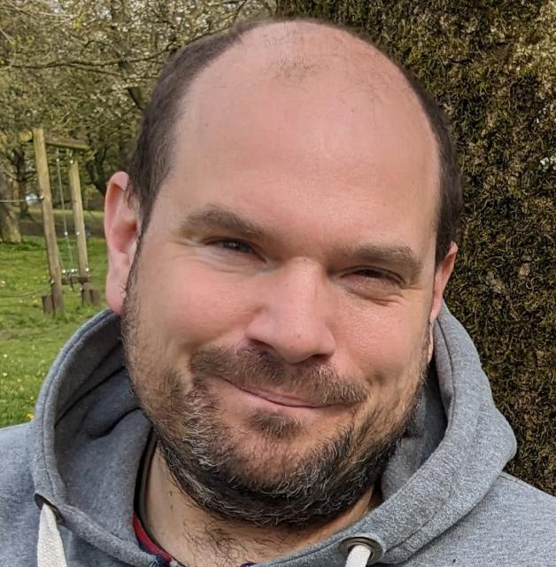

## Overview

> tl;dr: Senior Lecturer in FAIR, Open and Reproducible Digital Research. Research interests include Linked Data, FAIR digital objects, metadata, provenance, annotations, open source and software development best practices.

* <a rel="me" href="https://www.research.manchester.ac.uk/portal/soiland-reyes.html">research.manchester.ac.uk/portal/soiland-reyes.html</a>
* <a rel="me" href="https://www.uva.nl/en/profile/s/o/s.soilandreyes/s.soiland-reyes.html">uva.nl/en/profile/s/o/s.soilandreyes/s.soiland-reyes.html</a>
* <a rel="me" href="https://scholar.social/@soilandreyes">scholar.social/@soilandreyes</a> (Mastodon)
* <a rel="me" href="https://bsky.app/profile/soilandreyes.bsky.social">@soilandreyes.bsky.social</a> (Bluesky)
* <a rel="me" href="https://orcid.org/0000-0001-9842-9718">orcid.org/0000-0001-9842-9718</a>
* [slides.com/soilandreyes](https://slides.com/soilandreyes)
* [github.com/stain](https://github.com/stain)
* [linkedin.com/in/stain/](https://www.linkedin.com/in/stain/)
* ~~[twitter.com/soilandreyes](https://twitter.com/soilandreyes)~~
* ~~[slideshare.net/soilandreyes](https://www.slideshare.net/soilandreyes)~~

## Biography

Stian Soiland-Reyes is a Senior Lecturer in FAIR, Open and Reproducible Digital Research and co-leader of the [eScience Lab](https://esciencelab.org.uk/ "eScience Lab at The University of Manchester") in the [Department of Computer Science](https://www.cs.manchester.ac.uk/) at The University of Manchester. 

In his research he is working on _reproducibility_, _provenance_ and _metadata_ to improve [FAIR](https://www.go-fair.org/fair-principles/ "FAIR principles") sharing of open research data and [computational workflows](https://doi.org/10.1162/dint_a_00033), within [ELIXIR Europe](https://elixir-europe.org/), European Open Science Cloud ([EOSC](https://ec.europa.eu/info/research-and-innovation/strategy/goals-research-and-innovation-policy/open-science/european-open-science-cloud-eosc_en)) projects and the workflow repository [WorkflowHub.eu](https://workflowhub.eu/), as well as building [FAIR](https://www.go-fair.org/fair-principles/) approaches for [computational workflows](https://workflows.community/groups/fair/) and [FAIR Digital Objects](https://fairdo.org/). Stian contributed to the [W3C PROV](https://www.w3.org/TR/prov-overview/) standard and its [implementation in workflow systems](https://doi.org/10.1093/gigascience/giz095 "Sharing interoperable workflow provenance: A review of best practices and their practical application in CWLProv"). 

As one of the early founders of the [Research Object](https://www.researchobject.org/) approach for sharing research outputs using Linked Data, he is the co-lead of [**RO-Crate**](https://www.researchobject.org/ro-crate/), a community-based lightweight approach to [packaging and publishing research data](https://www.researchobject.org/2021-packaging-research-artefacts-with-ro-crate/) with structured metadata. RO-Crate has been recognized for the [EOSC Interoperability Framework](https://doi.org/10.5281/zenodo.10843882).

He is a strong proponent of using open Web standards, including the use of [FAIR Signposting](https://signposting.org/FAIR/) to enable machine-actionable navigation to open data. 

Stian is on the leadership team of [Common Workflow Language](https://www.commonwl.org/), a standard for [interoperable computational workflows](/2022/phd/methods-included/), and he was on the technical steering committee for [BioCompute Object](https://www.biocomputeobject.org/), an approach for describing workflows for submission to regulatory authorities. Stian is the Technical and Community Advisor for the [Workflows Community Initiative](https://workflows.community/) where he contributes to the task force [FAIR Computational Workflows](https://workflows.community/groups/fair/). 

Stian graduated with a BSc (2003) and [MSc](https://doi.org/11250/251073) (2007) in Computer Science from the [Norwegian University of Science and Technology (NTNU)](https://www.ntnu.no/) and in 2025 defended his [PhD thesis](../phd/) at the [Informatics Institute of University of Amsterdam](https://ivi.uva.nl/). 

He has more than two decades of experience as an IT professional, including 16 years as a software developer working across academia and industry. He joined the [eScience Lab](https://esciencelab.org.uk/ "eScience Lab") in 2005 (then called the [myGrid team](http://www.mygrid.org.uk/)), where he became the _Technical Lead Developer_ of the open-source scientific workflow management system [Taverna](http://taverna.incubator.apache.org/). As part of the EU FP7-funded [Wf4Ever project](/2020/archive/wf4ever/), Stian contributed to the [W3C PROV](https://www.w3.org/TR/prov-overview/ "W3C PROV-Overview") specifications for capturing provenance and co-developed the [Research Object](http://www.researchobject.org/) model and ontologies.  More recently Stian has continued this passion for reproducibility, structured metadata and open scholarship with engagement in several projects related to FAIR, computational workflows, and RO-Crate. 

In 2023, Stian became a _Research Fellow_, and in November 2023 he was promoted to _Senior Lecturer_ at the Department of Computer Science, taking up teaching duties, supervision and co-leadership of the eScience Lab.

## Research projects

Stian is co-leading and contributing to [eScience Lab's participation](https://esciencelab.org.uk/projects/) in several European-wide research projects, including:

* **CLIMATE-ADAPT4EOSC** -- Horizon Europe #101188248, call [HORIZON-INFRA-2024-EOSC-01-01](https://ec.europa.eu/info/funding-tenders/opportunities/portal/screen/opportunities/topic-details/horizon-infra-2024-eosc-01-01) _FAIR and open data sharing in support of the mission adaptation to climate change_ (pending signed Grant Agreement)
* **[EOSC-ENTRUST](https://esciencelab.org.uk/projects/eosc-entrust/)**  - A European Network of TRUSTed research environments.
* **[EVERSE](https://esciencelab.org.uk/projects/everse/)** -- European Virtual Institute for Research Software Excellence.  Includes support for RO-Crate in the Workflow Execution Service ([WfExS](https://github.com/inab/WfExS-backend)), continuing work started in EOSC-Life, BY-COVID and TRE-FX.
* [**HDR Federated Analytics**](https://esciencelab.org.uk/projects/federated-analytics/) -- understand the challenges of computational reproducibility and FAIR data sharing within HDR UK federated data infrastructures, extends on TRE-FX prototype.  
  <small>[HDR UK](https://www.hdruk.ac.uk/), UKRI [HDR-CORE](https://gtr.ukri.org/projects?ref=HDR-CORE), HDR QQ2</small>
* **[EuroScienceGateway](https://esciencelab.org.uk/projects/eurosciencegateway/)** -- making a federated open access computational infrastructure through Galaxy as a gateway for data resources, tools and applications following the FAIR principles.  
  <small><http://eurosciencegateway.eu/> Horizon Europe [101057388](https://doi.org/10.3030/101057388), UKRI [10038963](https://gtr.ukri.org/projects?ref=10038963)</small>
* **[FAIR-IMPACT](https://esciencelab.org.uk/projects/fair-impact/)** -- which is improving the FAIR publication and indexing of semantic artefacts and their catalogues, with associated Linked Data tooling including RO-Crate.  
  <small><http://fair-impact.eu/> Horizon Europe [101057344](https://doi.org/10.3030/101057344), UKRI [10038992](https://gtr.ukri.org/projects?ref=10038992)</small>
* [**ELIXIR Scientific Programme 2024-28**](https://elixir-europe.org/sites/default/files/documents/elixir-programme-24-28-full.pdf) including _Tools platform_, _Compute platform_
* **[BioDT](https://esciencelab.org.uk/projects/biodt/)** -- making Digital Twins for BioDiversity using FAIR Digital Object, [RO-Crate](https://www.researchobject.org/ro-crate/), [FAIR Workflows](https://workflows.community/groups/fair/) and [WorkflowHub](https://workflowhub.eu/).  
  <small><https://biodt.eu/> Horizon Europe [101057437](https://doi.org/10.3030/101057437), UKRI [10038930](https://gtr.ukri.org/projects?ref=10038930))</small>
* **[BY-COVID](https://esciencelab.org.uk/projects/by-covid/)** -- making COVID-19 data open, standardized and linked using FAIR metadata and computational workflows. Stian is a task leader and focus on metadata standards, provenance and [Workflow Run RO-Crate](https://www.researchobject.org/workflow-run-crate/).  
  <small><https://by-covid.eu/> Horizon Europe #[101046203](https://doi.org/10.3030/101046203)</small>
* **[Biodiversity Genomics Europe (BGE)](https://esciencelab.org.uk/projects/biodiversitygenomics/)** -- where the eScience Lab will help develop FAIR Data infrastructures.  
  <small><https://biodiversitygenomics.eu/> Horizon Europe #[101059492](https://doi.org/10.3030/101059492), UKRI [10040409](https://gtr.ukri.org/projects?ref=10040409)</small>

### Previous projects

* [TRE-FX](https://esciencelab.org.uk/projects/tre-fx/) -- Delivering a [federated network of TREs](https://doi.org/10.5281/zenodo.10055354) to enable safe analytics. Workflow execution in Trusted Research Environments using [5-Safe RO-Cratre](https://trefx.uk/5s-crate/).  
  https://trefx.uk/ <small>[DARE UK](https://dareuk.org.uk/), UKRI [MC_PC_23007](https://gtr.ukri.org/projects?ref=MC_PC_23007)</small>
* [EOSC-Life](https://esciencelab.org.uk/projects/eosclife/) -- FAIR data processing for life sciences. Here Stian mainly contributed to the [Tools Collaboratory](https://www.eosc-life.eu/tools-workflows/) for [WorkflowHub](https://workflowhub.eu/), using [RO-Crate](https://www.researchobject.org/ro-crate/), [CWL](https://www.commonwl.org/), [Galaxy](https://galaxyproject.org/) and other [existing workflow systems](https://s.apache.org/existing-workflow-systems).  
  <small><https://www.eosc-life.eu/> Horizon 2020 #[824087](https://doi.org/10.3030/824087)</small>
* [Synthesys+](https://esciencelab.org.uk/projects/synthesys/)  where Stian led Manchester's part of developing the [Specimen Data Refinery](/2022/phd/specimen-data-refinery/) using Galaxy workflows, RO-Crate for provenance and [FAIR Digital Objects](/2022/phd/incrementally-building-fdos/) using [Open Digital Specimens](https://github.com/DiSSCo/openDS).  
  <small><https://www.synthesys.info/> Horizon 2020 #[823827](https://doi.org/10.3030/823827)</small>
* [BioExcel](https://esciencelab.org.uk/projects/bioexcel/), a Centre of Excellence for Computational Biomolecular Research, where Stian was deputy work package leader with focus on workflows, scalability, reproducibility, metadata.  
  <small><http://bioexcel.eu/> Horizon 2020 #[823830](https://doi.org/10.3030/823830), #[675728](https://doi.org/10.3030/675728)</small>
* [BCO-RO-Crate](https://biocompute-objects.github.io/bco-ro-crate) (NIH), consultancy for [HIVE Lab at George Washington University](https://hive.biochemistry.gwu.edu/) to develop tutorial for packaging BioCompute Objects as RO-Crate Research Objects.
* [FAIR-CURES-RO](https://esciencelab.org.uk/projects/ro-composer/) (NIH/NHLBI), subcontract for [Mendeley Data](https://data.mendeley.com/) to compose Research Objects through a REST API to be used in the [FAIR4CURES](https://www.elsevier.com/about/press-releases/archive/science-and-technology/elsevier-and-seven-bridges-receive-nih-data-commons-grant-for-biomedical-data-analysis) participation in the [NHLBI BioData Catalyst](https://biodatacatalyst.nhlbi.nih.gov/) project.
* [Open PHACTS](https://esciencelab.org.uk/projects/openphacts/), bringing together pharmacological data resources in an integrated, interoperable infrastructure using Linked Data.  
  <small><https://www.openphactsfoundation.org/> IMI [115191](https://cordis.europa.eu/project/id/115191)</small>
* [Wf4Ever](/2020/archive/wf4ever/), developing methods for preservation of computational workflows, their dependencies and provenance. This was demonstrated using Taverna and Research Objects.  
  <small><http://wf4ever.org/> FP7 #[270192](https://doi.org/10.3030/270192)</small>
* [caGRID](https://esciencelab.org.uk/projects/cagrid/), where Stian was integrating Taverna into the [caBIG](https://en.wikipedia.org/wiki/CaBIG) infrastructure using Grid/WSDL/WSRF
* [OMII-UK](https://web.archive.org/web/20070717065359/http://omii.ac.uk/) (EPS), where the [myGrid team](https://esciencelab.org.uk/about/#history) developed the [Taverna](https://en.wikipedia.org/wiki/Apache_Taverna) workflow system.

## Teaching and supervising

In the Department of Computer Science, Stian assists in the teaching for:

- COMP1INTRO [Welcome week](https://studentnet.cs.manchester.ac.uk/ugt/year1/firstweeks/) _Boot-up labs_ with introduction to Linux, Git, GitLab
- [COMP16412](https://portal.manchester.ac.uk/uPortal/p/course-unit-info.ctf1/max/render.uP?pP_action=viewCUDetails&pP_location=/CourseUnitPublishing/CourseUnitDataFiles/COMP/039761COMP164122023-08-011V14.xml) _Introduction to Programming 2_ (Java, JavaFX)
- Tutorial group of ~6 students [COMP10120](https://portal.manchester.ac.uk/uPortal/p/course-unit-info.ctf1/max/render.uP?pP_action=viewCUDetails&pP_location=/CourseUnitPublishing/CourseUnitDataFiles/COMP/020952COMP101202023-08-011V14.xml) _First Year Team Project Group_ 

From 2025/2026, the Computer Science MSc pathways will include programmes for _AI_, _Cyber Security_, _Machine Learning_, _Software Engineering_, and a more flexible programme _Advanced Computer Science_. For these programmes, Stian collaborates in developing course units for _Data Engineering Concepts_ and _AdvanCed Topics in Knowledge Representation and Reasoning_.

Stian teaches [provenance](/2022/prov/) models, FAIR data and reproducibility as part of the course unit _Understanding Data and their Environment_ in the cross-faculty [MSc Data Science](https://www.manchester.ac.uk/study/masters/courses/list/11552/msc-data-science-computer-science-data-informatics/) programme at The University of Manchester.

As of 2024, Stian is supervising 2 PhD students in Manchester (in collaboration with Professor Carole Goble), two [MSc projects](/2023/comp66090/) for 2023/2024, and 6 BSc third-year projects for 2024/2025.  He is one of the cohort advisors for postgraduate students in Computer Science.

He has previously co-supervised 1 PhD student and multiple BSc/MSc student projects. He has informally mentored PhD students internationally, as well as mentoring several student projects of [Google Summer of Code](https://summerofcode.withgoogle.com/).

## PhD Candidate

In July 2019, Stian started as a [PhD Candidate](/phd/) in the [INDElab](https://indelab.org/) at the [Informatics Institute](http://ivi.uva.nl/) of the [University of Amsterdam](http://uva.nl/). The PhD defence is scheduled for January 2025.

## Member of committees and professional bodies

Stian has participated in [W3C](http://www.w3.org/) activities, co-authoring W3C Recommendations for [Provenance](http://www.w3.org/TR/prov-o/), and collaborating on W3C Community efforts like [Open Annotation](http://www.openannotation.org/spec/core/) (now [Web Annotation Model](https://www.w3.org/TR/annotation-model/)), [JSON-LD](http://json-ld.org/) and [w3id](https://w3id.org/). He edited the [ORE JSON-LD](http://www.openarchives.org/ore/0.9/jsonld) specification. He is part of the [Common Workflow Language](http://www.commonwl.org/) leadership team and co-author of the [CWL specification](http://www.commonwl.org/v1.0/). He is a [Force11 member](https://www.force11.org/users/stian-soiland-reyes), where he promotes reproducibility best practices and open science. He is a member of the Technical Steering Committee for [BioCompute Objects](http://biocomputeobject.org/), and co-chair of [Research Object Crate](http://researchobject.org/ro-crate/). He is a member of the [task force for FAIR Metrics and Digital Objects Task Force](https://eosc.eu/advisory-groups/fair-metrics-and-digital-objects-task-force/) in the European Open Science Cloud ([EOSC](https://eosc.eu/)). In the [FAIR Digital Object Forum](https://fairdo.org/) Stian is a member of the [Technical Advisory Committee](https://fairdo.org/wg/fdo-tac/), [Technical Specification & Implementation Group](https://fairdo.org/wg/fdo-tsig-ii/) and [FDO Semantics Group](https://fairdo.org/wg/fdo-sig/).

Stian used to be an active [open source developer](https://github.com/stain), and have contributed to software like [ORCID](https://github.com/ORCID/ORCID-Source), [Apache Jena](http://jena.apache.org/), [OWL API](https://github.com/owlcs/owlapi), [JSON-LD Java](https://github.com/jsonld-java/jsonld-java), as well as maintaining several [Docker images](https://hub.docker.com/u/stain/).  He is a [Foundation Member](https://www.apache.org/foundation/members) of the **[Apache Software Foundation](http://apache.org/)**, where he is a on the [Project Management Committee](https://www.apache.org/dev/pmc.html) of [Apache Commons](http://commons.apache.org/),  and [Apache Incubator](http://incubator.apache.org/). He was a committer on [Taverna in Apache Incubator](https://incubator.apache.org/projects/taverna.html) and worked on [Commons RDF](http://commons.apache.org/proper/commons-rdf/). He is an occassional curator of [abandomware](https://en.wikipedia.org/wiki/Abandonware) including [jai-imageio-core](https://github.com/jai-imageio/jai-imageio-core) and [beanshell](https://github.com/beanshell/beanshell).

