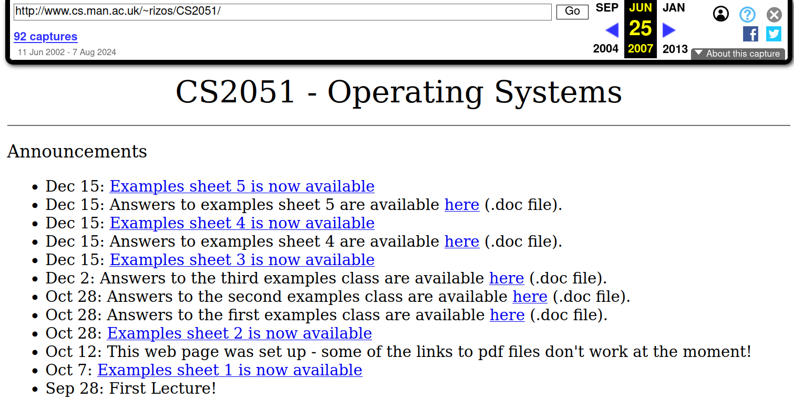

_COMP66090 MSc project 2024/2025_

* [COMP66090 Handbook entry](https://studentnet.cs.manchester.ac.uk/pgt/2023/COMP66090/project/projectbookdetails.php?projectid=56744)
* This project has PhD potential
* This project is suitable for MSc Data Science students
* Skills needed: Experimental design, Interdiciplinary work
* Project type: Advanced web applications, Data on the Web, Mobile communications and Networks

## Background

The Web was started by Tim Berners-Lee as a [global information system](https://doi.org/10.1016/0169-7552\(92\)90039-S), using open protocols and hypermedia document, with the mesh of cross-organisational links forming a Web of user-driven information. While the Web was started for the purpose of changing academic publishing, an important principle of "Web 1.0" was *decentralisation*, no single corporation controlled which information could be published or linked to. Search engines like Google used the [PageRank algorithm](https://towardsdatascience.com/pagerank-algorithm-fully-explained-dc794184b4af) to determine a quality metric of indexed pages based on incoming links from other pages, recursively qualified by the page ranking of those source pages.

The [HTML](https://html.spec.whatwg.org/) language allows in a textual way for construction of Web documents, combining traditional document structures (headlines, bullet points, lists, figures) with hyperlinks for navigation and interactive elements (e.g. forms) to communicate with the Web server. [CSS](https://www.w3.org/Style/CSS/current-work) stylesheets adds powerful design control, while [JavaScript (ECMAScript)](https://www.w3schools.com/js/) gives Web pages ability to modify its content dynamically and perform API calls over HTTP with data structures in [JSON format](https://www.json.org/), leading to the development of powerful Web applications (e.g. GMail, Google Docs, Office 365).

Archival efforts like [Internet Archive Wayback](https://web.archive.org/) machine have captured more than 900 billion web pages since 1996\. The Web is now used for practically all public information, UK's gov.uk domain for instance has [over 1.3 million pages](https://www.bing.com/search?q=site%3Agov.uk). Being available on the Web, and more importantly, findable in a search engine, is the first priority of any start-up company, possibly even before hiring staff or getting investment — about half of all websites currently use [structured data](https://w3techs.com/technologies/details/da-jsonld) as part of their Search Engine Optimization (SEO) strategy.

The Web architecture is now ubiquious for distributed computer systems, with the HTTP protocols used by almost all modern apps and cloud services (e.g. Netflix, Spotify, YouTube, banking), as well as social media (e.g. Instagram, Snapchat, Facebook). The rise of "[Web 2.0](https://www.oreilly.com/pub/a/web2/archive/what-is-web-20.html)" democratised access for participating in the global information space, with content now being created and shared by the minute from and to our mobile phones. *Influencers* rely on platforms like YouTube as their main source of income.

However, the use of mobile applications and social media can mean that information disappears from the global information system, and by consequence of archivers inability to access these, disappears from human cultural history.

For instance, consider CS2051, a module taught at Department of Computer Science in 2005\. The CS2051 teaching material, including all slides, have been archived by the [Wayback machine](https://web.archive.org/web/20070625233132/http://www.cs.man.ac.uk/~rizos/CS2051/), and even remain available at the [original URL](http://www.cs.man.ac.uk/~rizos/CS2051/). 




For comparison, the 2025 syllabus for the equivalent [COMP15212](https://www.slate.courses/units/edit/COMP15212) is shown as a single login page, and only enrolled students can access the content through deep navigation in the teaching platform Blackboard (which is due to be decommissioned in 2026). 


While it is possible to time travel to the experience of the social media of [1990s GeoCities](https://oldweb.today/?browser=ie5#19960101/http://geocities.com/), it is almost impossible to recreate a TikTok scrolling experience from a month earlier in 2024.

<figure id="fig:tiktok">

 <video controls="controls" poster="tiktok.png" width="100%">
   <source src="tiktok.webm" type='video/webm; codecs="vp8,vorbis"' />
   <source src="tiktok.m4v" type='video/mp4"' />
   <p>
	<a href="tiktok.m4v"></a>
   </p>
  </video>

<figcaption>
Screen capture of HTTP network activity when scrolling through a TikTok feed.
</figcaption>
</figure>

Even traditional document-based Web sites and repositories are increasingly developed using similar Web technologies, which results in a large number of network requests (as shown above), using a skeleton HTML which do not reflect the human-readable content, but serves only as a launching point for a "single page app" ([SPA](https://developer.mozilla.org/en-US/docs/Glossary/SPA)) which loads the content dynamically. This means the information is at risk from not being indexed, archived or machine-readable (e.g. for text mining).


```html
<!doctype html><html lang="en"><head><meta charset="utf-8">
<meta http-equiv="X-UA-Compatible" content="IE=edge">
<meta name="viewport" content="width=device-width,initial-scale=1,maximum-scale=1,user-scalable=no">
<link rel="icon" href="/assets/favicon.ico">
<title>FAIRsharing</title>
<link rel="stylesheet" href="https://fonts.googleapis.com/css?family=Roboto:100,300,400,500,700,900">
<link rel="stylesheet" href="https://cdn.jsdelivr.net/npm/@mdi/font@latest/css/materialdesignicons.min.css">
<script defer="defer" src="/js/chunk-vendors.97c4cd60.js"></script>
<script defer="defer" src="/js/app.8b24872e.js"></script>
<link href="/css/chunk-vendors.84a9b648.css" rel="stylesheet">
<link href="/css/app.79569373.css" rel="stylesheet"></head>
<body><noscript><strong>We're sorry but this website doesn't work 
    properly without JavaScript enabled. Please enable it to continue.</strong></noscript>
<div id="app"></div></body></html>
```

Increasingly, in enterprise environment, security concerns about spoofing, viruses and social engineering means that even traditional communication methods like email may filter any URLs in the message, to rewrite them through a security proxy. When multiple such manglers combine, URLs ("Uniform Resource Locator") loose their intrinsic value, as they can no longer be Located, and no longer be given to another person to address them towards a particular Web resource.

<pre>
https://urlisolation.com/browser?clickId=B23D741D-999F-4828-AB2B-04A2F9CA147A&traceToken=1739813018%3Bmanchesteruni\_hosted%3Bhttps%3A%2Fel219.r.ag.d.sendibm3.com&url=https%3A%2F%2Fopenscienceretreat.zbw.eu%2F
</pre>

Increasingly the combined devaluing of the URL as a purpose of linking to websites has led to changes in social practices, as the use of low resolution screenshots ironically becomes more reliable to forward media, e.g. to forward a post from one platform to another, but at the cost of reduced accessibility, traceability and retractability. 


## Description

In this project you will research the development of the Web and current Web architecture technologies. You will experiment with Web archivers and build a cohort of web sites to be examined in detail from the perspective of global information system and cultural preservation. 

You may develop a measurement of hypermedia linkability and proliferance of links in these sites, and suggest measures for supporting modern Web applications at the same time as preserving the document nature of the Web.

Choosing a social media platform, you can examine to which extent its modern API usage can be utilised to improve archiving aspects (e.g. recursively snapshotting a "current posts" API calls), and you can prototype an application that intercepts or captures the interaction and experience of using said platform.

## Deliverables

This project has some choices in terms of Computer Science skills required, you may choose to look at this from a global perspective and examine the Web protocols and research current use of Web frameworks and their effect on information decay, for this you may need some data science capabilities, possibly debugging network communications (e.g. using browser's development inspection tools).

Alternatively you may take a more active development path and build a prototype of a social media archiver, working more closely with a particular platform and considering how UX navigation can be emulated in a historical capture of a social media stream.

This project may be suitable for two students taking these different paths, or comparing different Web cohorts.

I encourage development of open source software, and will be assisting you in following best practices for research software engineering.

## References

* <https://www.scientificamerican.com/article/long-live-the-web/>
* <https://html.spec.whatwg.org/>
* <https://www.oreilly.com/pub/a/web2/archive/what-is-web-20.html>
* <https://towardsdatascience.com/pagerank-algorithm-fully-explained-dc794184b4af>
* <https://doi.org/10.1016/0169-7552(92)90039-S>
