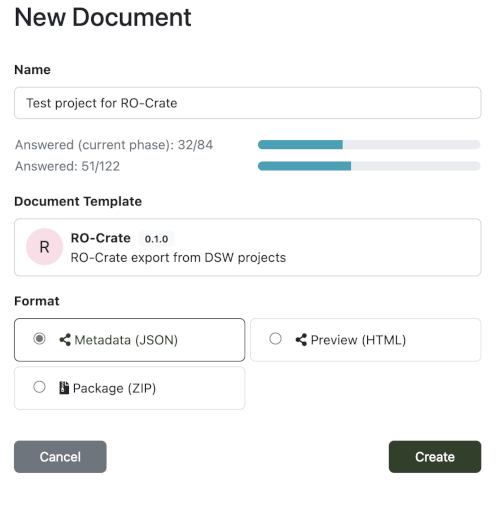

<h2>Cite as</h2>

Ignacio Eguinoa, Marek Suchánek, Vojtěch Knaisl, Jan Slifka, Paul De Geest, David López, Björn Grüning, Simone Leo, Stian Soiland-Reyes (2023):  
**BioHackEU22 Report: Enhancing Research Data Management in Galaxy and Data Stewardship Wizard by utilising RO-Crates**.  
_BioHackrXiv_  
<https://doi.org/10.37044/osf.io/24jst>


# BioHackEU22 Report: Enhancing Research Data Management in Galaxy and Data Stewardship Wizard by utilising RO-Crates

_Ignacio Eguinoa¹, Marek Suchánek², Vojtěch Knaisl², Jan Slifka², Paul De Geest¹, David López³, Björn Grüning⁴, Simone Leo⁵, Stian Soiland-Reyes⁶⁷_

<div class="affiliations">

¹ VIB-UGent Center for Plant Systems Biology, BE  
² Czech Technical University in Prague, Prague, CZ   
³ Department of Computer Science, University of Freiburg, Freiburg, DE  
⁴ Albert-Ludwigs-Universität Freiburg, Galaxy Freiburg Team, Freiburg, DE  
⁵ Center for Advanced Studies, Research and Development in Sardinia (CRS4), Pula (CA), IT  
⁶ Department of Computer Science, The University of Manchester, Manchester, UK  
⁷ Informatics Institute, University of Amsterdam, Amsterdam, NL  

</div>

* **License**: Creative Commons Attribution License ([CC BY 4.0](https://spdx.org/licenses/CC-BY-4.0)). 
* **Modifications**: Formatting as Markdown; figure caption formatting; reference in s11 house style; inline citation hyperlinks. Section Ambitions/Progress has rewritten bullet points to sentences and removed some technical details. Participation moved to Acknowledgement section. Added citations [[Arend 2022]], [[Chilton 2023]], [[Hooft 2019]]. 


## Background

[RO-Crate](https://w3id.org/ro/crate) [[Soiland-Reyes 2022]] is a generic packaging format containing datasets and their description using standards for FAIR Linked Data. Based on rich schema.org metadata, such datasets can be interpreted as workflow definitions, datasets, data associated with workflow invocations, inputs, outputs, etc.

The [Galaxy workflow framework](https://galaxyproject.org/) [[Afgan 2018]] is handling all of those objects and supports users in the daily RDM. Integrating RO-Crate deeply into Galaxy and offering import and export options of various Galaxy objects as Research Objects will greatly standardize and improve the RDM in Galaxy and smoothen the UX as well as improving interoperability with other systems.

The low hanging fruit of this proposal is to add support for import/export of RO-Crates following its Workflow profiles [[De Geest 2022]]. Those Crates should contain as much metadata as the Galaxy framework can provide. This includes workflow metadata such as Licence, Creator, CWL-abstract description, workflow history, contextually also references (DOIs, bio.tool IDs), EDAM terms, and formats of inputs/outputs of data processing of each step of the workflow.

Exports of History and Workflow Invocations need work on the corresponding RO-Crate profile and on the Galaxy codebase. RO-Crates already can be visualized, this would add a human-readable HTML rendering of the Galaxy export and metadata. Close collaboration between RO-Crate and Galaxy developers will speed up this development; the groundwork could be completed during the BioHackathon so that both Crates will be supported by the Galaxy 23.01 release.

[Data Stewardship Wizard](https://ds-wizard.org/) (DSW) [[Pergl 2019]] is a tool for data management planning with focus on FAIR metrics, proper guidance and integration with other tools in the data stewardship domain. Thus, similarly to utilising RO-Crates in Galaxy, the import and export functionality would be highly beneficial for DSW in terms of promoting interoperability and FAIRness in general. Existing RO-Crates can be used to pre-fill specific parts of DMPs, and vice versa, RO-Crates can be created or initiated from a DMP. Such support of RO-Crates in DSW can lay a foundation for closer integration with Galaxy and potentially other ELIXIR Tools platform components.

This project benefitted largely from collaborations with other BioHackathon projects such as _“#25: Scientific and technical enhancement of bioinformatics software metadata using the Tools Ecosystem open infrastructure”_ as they are also leveraging workflow and software metadata from the same resources,  _“#22: Plant data exchange and standard interoperability”_ which are combining the standards MIAPPE, ISA and RO-Crate for describing plant studies and data [[Arend 2022]]. 

## Ambitions for hackathon

Our original aim was to use RO-Crate to enhance Research Data Management for Galaxy workflows and Data Management Plans, including export of detailed workflow provenance, improve the RO-Crate profile for execution details and to explore using RO-Crate for Data Stewardship Wizard. 

We expected to achieve an export of Galaxy history, and also to prototype Galaxy import of RO-Crates. With DSW we wanted to conceptually map its concepts to RO-Crate before experimenting with import/export from DSW. Practically we also aimed to publish the first release of the `runcrate` command line.


## Progress from Hackathon

During the hackathon we realized we needed to improve DSW's import flow. Importing RO-Crate into Galaxy had wider implications and was planned to be utilising the existing Rule builder [[Chilton 2023]] in Galaxy, but selecting elements of the Crate instad of columns.

The automated build pipeline for the `runcrate` tool was improved to simplify releases, incorporating the _CWLProv_ converter. Work on Galaxy progressed well to prototype export of RO-Crate from a workflow execution. 

In DSW RO-Crate was mapped for both export and import, initially for project metadata. This was supported using templates.

We also clarified Workflow Run Crate Profile requirements in collaboration with the teams working on WfExS (#29) and Sapporo (#35). 


### Command line tool runcrate

[Workflow Run RO-Crate](https://www.researchobject.org/workflow-run-crate/profiles/) is a collection of [RO-Crate profiles](https://www.researchobject.org/ro-crate/profiles.html) for capturing the provenance of the execution of computational workflows. To drive the development of the profile's specification, particularly for what concerns the internal details of each task execution, the working group developed a Python tool to convert CWLProv research object bundles [[Soiland-Reyes 2022]] into Workflow Run RO-Crates. This tool was initially implemented as a single `cwlprov_to_crate.py` script hosted in a subfolder of the [Workflow Run RO-Crate GitHub repository](https://github.com/ResearchObject/workflow-run-crate). Though equipped with a command line interface and unit tests, the tool lacked a proper build setup and automated tests execution. Additionally, we wanted it to be ready for expansion into a generic software toolkit to manipulate Workflow Run RO-Crates, including the upcoming Galaxy history conversion feature.

Part of the work in this project consisted of turning the `cwlprov_to_crate.py` standalone script into a properly maintained Python package called `runcrate`. We created the [runcrate repository](https://github.com/ResearchObject/runcrate) and moved the code there, turning it into the `rocrate` package; added a modern build configuration using `pyproject.toml` and `setup.cfg`; added a [Sphinx](https://www.sphinx-doc.org/en/master/)-based documentation setup; configured multiple [tox](https://tox.wiki/en/latest/) environments for linting, testing, building the package and the docs; configured a GitHub CI workflow to run the tox in multiple environments.


### Provenance export of workflow runs from Galaxy

The prototype workflow provenance export [feature](https://github.com/galaxyproject/galaxy/pull/15101) in Galaxy implements the [Workflow Run Crate Profile](https://www.researchobject.org/workflow-run-crate/profiles/workflow_run_crate) while including the individual steps in preparation for lifting the export to the more detailed [Provenance Run Crate Proile](https://www.researchobject.org/workflow-run-crate/profiles/provenance_run_crate). Additionally, the export feature includes Galaxy specific workflow attributes such as [dataset collections](https://training.galaxyproject.org/training-material/topics/galaxy-interface/tutorials/collections/tutorial.html) and [workflow parameters](https://training.galaxyproject.org/training-material/topics/galaxy-interface/tutorials/workflow-parameters/tutorial.html). Finally, this work also included setting up the necessary unit -, API - and integration tests.

### RO-Crate in DSW

In RO-Crates, metadata plays a crucial role in describing and providing context for research data, and a data management plan (DMP) outlines how data will be collected, processed, and preserved throughout the research project. The use of RO-Crate metadata can help ensure that DMPs are accurately and comprehensively informed. This has been already investigated with use of machine-actionable DMPs (based on the RDA DMP Common Standard) [[Miksa 2020]]. And vice versa, a DMP can be used to pre-populate an RO-Crate, i.e. creating a RO-Crate to be *filled* during the project. Thus, a transformation between RO-Crate and DMP can facilitate the creation and implementation of both. Therefore, combining RO-Crate with DMPs can enhance data management and sharing practices. DSW supports both import and export functionality for a specific format to be developed as standalone packages without need to change anything directly in the DSW codebase.

#### Mapping RO-Crate Metadata with KM

As a first step, we needed to identify what metadata in RO-Crates are related to questions and answers in DSW questionnaires. The questions, answers, and other elements consituting the guidance are specified in so-called knowledge models (KMs). For data stewardship, we commonly use the [Common DSW Knowledge Model](https://registry.ds-wizard.org/knowledge-models/dsw:root:latest) initially based on the Rob Hooft's mindmap [[Hooft 2019]]. We investigated the commonly used metadata in RO-Crates and tried to find corresponding questions in the KM, the matches were captured in a table containing a UUID of the target question. We covered the following entities and their properties:

* project contributors (name, email, orcid, affiliation, roles),
* project information (name, acronym, abstract, URL, start and end date, funding),
* produced and published datasets (name, description, keywords, distrbutions, PIDs).

That is, of course, a very limited portion of a DMP. However, it covers the most essential information that overlaps in both DMP and RO-Crate. We discussed several possibilities to include and distinguish different types of datasets (re-used, produced, published, etc.); however, in the end we decided to cover just those that are outputs of the project and should be present in an RO-Crate for such a research project.

#### Export RO-Crates from DSW

To export a project from DSW, one need to have a so-called *Document Template*. These document templates allows to retrieve all information about the project, its questionnaire with replies, and used knowledge model in order to transform it into any textual file. It is mainly using the [Jinja templating language](https://jinja.palletsprojects.com/en/3.1.x/) but has also other possible steps that can further convert or transform the generated document (or more generally, the artifact). First, as RO-Crates commonly use ZIP-packaging, we implemented a step in the document worker component that allows to archive a document created with Jinja in a ZIP (or TAR) archive. The `archive` step can be used as shown in the code example:

```json
{
  "uuid": "b3c42edb-c858-4073-853e-751e75d8ee02",
  "name": "Package (ZIP)",
  "icon": "fas fa-file-archive",
  "steps": [
      {
          "name": "jinja",
          "options": {
              "template": "src/template.json.j2",
              "content-type": "application/json",
              "extension": "json"
          }
      },
      {
          "name":"archive",
          "options": {
              "type": "zip",
              "inputFileDst": "ro-crate-metadata.json"
          }
      }
  ]
}
```

Then we proceeded to create the document template itself with support of JSON-LD, HTML (for preview), and ZIP formats. The essential part is encoding the mapping described in the previous section. In `template.json.j2` file of the template, we encoded the mapping in Jinja to compose the RO-Crate metadata file (the JSON object and pretty-print it out in the file). This single file is then used for all three formats, either it is used directly, loaded in the HTML using `include` of Jinja, or added to a ZIP archive. The document template is compatible with knowledge models `dsw:root:2.4.4` / `dsw:lifesciences:2.4.4` (and higher). It is also distributed via the [DSW Registry](https://ds-wizard.org) and as open-source project via [GitHub.com/ds-wizard/ro-crate-template](https://github.com/ds-wizard/ro-crate-template).



### Import RO-Crates to DSW

For the opposite direction, i.e. to turn an existing RO-Crate (its metadata) in a DSW project, a project importer needs to be developed. Previously, we developed [RDA maDMP Importer](https://github.com/ds-wizard/dsw-madmp-importer) and [DSW Replies Importer](https://github.com/ds-wizard/dsw-replies-importer) using our [DSW Importer SDK](https://github.com/ds-wizard/dsw-importer-sdk). When user press the import button in DSW, a popup window is opened with the importer. There the importer may require various actions from the user, e.g. filling some form, interacting with other service, or typically loading a file. When the importer is ready, it can specify using the SDK API what replies should be loaded in the project and send them back to DSW, it closes the popup and imported replies can be reviewed in the DSW.

During the hackathon we significantly improved the reviewing of imported replies. Initially, there was just an indication how many replies will be imported and how many errors occured. With the new one, user can se individual replies that are going to be added to the questionnaire and decide whether to finalize the import or not. For us as developers, this was a useful also for debugging purposes. Then, we developed the [DSW RO-Crate Importer](https://github.com/ds-wizard/dsw-ro-crate-importer) which encodes again the same mapping but queries the loaded JSON-LD file and if matching value is found, then it is turned into a reply for DSW.

### Potential Future Development

In the future, there is a need to increase the coverage of RO-Crate metadata both in import and export processes. This includes improving the detailed dataset information and funding information that can be included in the RO-Crate package (and vice versa). The ability to include more detailed dataset information will enhance the discoverability and reuse of research data. Additionally, including funding information will enable better tracking and attribution of the sources of support for research projects. We hope that this further development will be done in community manner as both document template for export and project importer for import are available as open-source projects enabling community contributions.

Another area for future work is to support ZIP import in addition to JSON-LD import. This will provide more flexibility and ease of use for researchers who may be using a variety of tools and workflows to manage and share their research data. The ability to import RO-Crate packages in ZIP format will allow researchers to directly use their package. Overall, increasing the coverage of RO-Crate metadata and supporting ZIP import can help to facilitate the adoption and widespread use of RO-Crate in combination with DMPs.

#### Importing RO-Crate in Galaxy

The proposed implementation plan for a general RO-Crate import module in Galaxy consists of four parts: 1) Drag and Drop functionality for ro-crate's to be imported in Galaxy's GUI; 2) Detection of workflows and/or datasets and decide what to do with them; 3) Detect file types (fastq, images, txt, etc); 4) Allow the user to organise detected files within Galaxy's GUI.

Questions that still need to be solved include: which datasets should be included in the import? Which datatypes do we allow (and do we validate filetypes)? Do we allow for multiple (nested) workflows and workflow runs to be imported? Do we preserve the RO-crate ID's? How do we account for missing tools in Galaxy?  

Due to these types of issues we propose an optional guidance or hint file to inform Galaxy, via the [Galaxy rule-builder](https://training.galaxyproject.org/training-material/topics/galaxy-interface/tutorials/upload-rules/tutorial.html), how to organize the RO-crate's metadata (and data). Alternatively, [Gsuite](https://github.com/gtrack) and [fairtracks](https://github.com/fairtracks/fairtracks_standard) could represent and organize the RO-crate metadata. In this case we would need some kind of conversion for Galaxy tools to be able to use this metadata.

## Discussion

In conclusion, the integration of RO-Crates in Data Stewardship Wizard and Galaxy during (and after) the hackathon is a significant step towards improving data management and sharing in scientific research. By using RO-Crates, researchers can easily create machine-readable metadata for their datasets, ensuring that the data remains discoverable, accessible, and reusable in the long term. The integration of RO-Crates in these platforms also lays foundation to seamless collaboration between different researchers and institutions, making it easier to share and reuse data across projects and domains.

Moving forward, there is a lot of potential for further development and expansion of RO-Crates in scientific research. For instance, future efforts could focus on improving the interoperability of RO-Crates with other metadata standards and data management platforms. Additionally, there is a need for more outreach and education to promote the adoption of RO-Crates across different scientific communities. Finally, as data management and sharing become increasingly important in research, it is crucial to continue developing and refining tools such as RO-Crates to ensure that they remain effective and relevant in meeting the evolving needs of researchers and institutions.

## Acknowledgements

We acknowledge funding from European Commission under contracts [824087](https://doi.org/10.3030/824087) (EOSC-Life), [101046203](https://doi.org/10.3030/101046203) (BY-COVID), [101057388](https://doi.org/10.3030/101057388) (EuroScienceGateway). The BioHackathon was supported by [ELIXIR](https://elixir-europe.org/), the research infrastructure for life-science data. The operation and development of Data Stewardship Wizard is supported by ELIXIR CZ research infrastructure (MŠMT Grants No.: [LM2018131](https://starfos.tacr.cz/en/project/LM2018131) and [LM2023055](https://starfos.tacr.cz/en/project/LM2023055)).

### Participation 

- DSW team: Marek, Vojtěch, Jan, Paulette (virtual)
- Galaxy export implementation: Paul and David
- runcrate lead: Simone (virtual participant)
- The brains behind RO-Crate: Stian & RO-Crate community
- Thanks to teams Bioschemas (#5 #23 #25), workflow executions (#29 #35) Galaxy-CWL (#28) and MIAPPE (#22)!


## References

[Afgan 2018]: https://doi.org/10.1093/nar/gky379 "The Galaxy platform for accessible, reproducible and collaborative biomedical analyses"
\[Afgan 2018\] Enis Afgan, Dannon Baker, Bérénice Batut, Marius van den Beek, Dave Bouvier, Martin Čech, John Chilton, Dave Clements, Nate Coraor, Björn A. Grüning, Aysam Guerler, Jennifer Hillman-Jackson, Saskia Hiltemann,
Vahid Jalili, Helena Rasche, Nicola Soranzo, Jeremy Goecks, James Taylor, Anton Nekrutenko, Daniel Blankenberg (2018):  
[**The Galaxy platform for accessible, reproducible and collaborative biomedical analyses**: 2018 update](https://doi.org/10.1093/nar/gky379).  
*Nucleic Acids Research* **46** W537--W544.  
<https://doi.org/10.1093/nar/gky379> [cito:citesAsDataSource]

[Arend 2022]: https://doi.org/10.37044/osf.io/c724r "Plant data exchange and standard interoperability"
\[Arend 2022\] Daniel Arend, Sebastian Beier, laurent bouri, Marco Brandizi, Donald Hobern, Erwan Le Floch, Timo Mühlhaus, Cyril Pommier, Stuart Owen, Philippe Rocca-Serra, Thomas Rosnet, Stian Soiland-Reyes (2022):  
[**BioHackEU22 Project 22: Plant data exchange and standard interoperability**](https://doi.org/10.37044/osf.io/c724r).  
_BioHackrXiv_  
<https://doi.org/10.37044/osf.io/c724r> [cito:agreesWith]

[Chilton 2023]: https://gxy.io/GTN:T00160 "Rule Based Uploader"
\[Chilton 2023\] John Chilton, Helena Rasche (2023):  
[**Rule Based Uploader**](https://gxy.io/GTN:T00160)
_Galaxy Training Materials_  
<https://gxy.io/GTN:T00160> [cito:citesAsPotentialSolution]

[De Geest 2022]: https://doi.org/10.3897/rio.8.e95164 "Enhancing RDM in Galaxy by integrating RO-Crate"
\[De Geest 2022\] Paul De Geest, Frederik Coppens, Stian Soiland-Reyes, Ignacio Eguinoa, Simone Leo (2022):  
[**Enhancing RDM in Galaxy by integrating RO-Crate**](../../2022/phd/galaxy-ro-crate/).  
*Research Ideas and Outcomes* **8**:e95164  
<https://doi.org/10.3897/rio.8.e95164> [cito:usesMethodIn]

[Hooft 2019]: https://doi.org/10.5281/zenodo.3351949 "Data Stewardship Mindmap"
\[Hooft 2019\] Rob W. W. Hooft (2019):  
[**Data Stewardship Mindmap**](https://doi.org/10.5281/zenodo.3351949).  
_Zenodo_  
<https://doi.org/10.5281/zenodo.3351949> 

[Miksa 2020]: https://doi.org/10.4126/FRL01-006423291 "Research Object Crates and Machine-actionable Data Management Plans"
\[Miksa 2020\] Tomasz Miksa, Maroua Jaoua, Ghaith Arfaoui (2020):  
[**Research Object Crates and Machine-actionable Data Management Plans**](https://doi.org/10.4126/FRL01-006423291).  
*DaMaLOS - First Workshop on Data and Research Objects Management for Linked Open Science*  
Co-located at the International Semantic Web Conference ISWC 2020, Virtual Conference, November 2-3, 2020  
<https://doi.org/10.4126/FRL01-006423291> [cito:citesAsDataSource]

[Pergl 2019]: https://doi.org/10.5334/dsj-2019-059 "Data stewardship wizard"
\[Pergl 2019\] Robert Pergl, Rob Hooft, Marek Suchánek, Vojtěch Knaisl, Jan Slifka (2019):  
[**'Data stewardship wizard'**: A tool bringing together researchers, data stewards, and data experts around data management planning](https://doi.org/10.5334/dsj-2019-059).  
*Data Science Journal* **18**  
<https://doi.org/10.5334/dsj-2019-059> [cito:citesAsDataSource]

[Soiland-Reyes 2022]: https://doi.org/10.3233/ds-210053 "Packaging research artefacts with RO-crate"
\[Soiland-Reyes 2022\] Stian Soiland-Reyes, Peter Sefton, Mercè Crosas, Leyla Jael Castro, Frederik Coppens, José M. Fernández, Daniel Garijo, Björn Grüning, Marco La Rosa, Simone Leo, Eoghan Ó Carragáin, Marc Portier, Ana Trisovic, RO-Crate Community, Paul Groth, Carole Goble (2022):  
[**Packaging research artefacts with RO-Rrate**](../../2022/phd/ro-crate/).  
*Data Science* **5**(2)  
<https://doi.org/10.3233/ds-210053> [cito:discusses]