<h2>Cite as</h2>

Rudolf Wittner, Matej Gallo, Simone Leo, Cecilia Mascia, Francesca Frexia, Markus Plass, Stian Soiland-Reyes, Heimo Müller, Jörg Geiger, Petr Holub (2023):  
**Linking provenance and its metadata in multi-organizational environments of life sciences**.  
(Submitted)  

# Linking provenance and its metadata in multi-organizational environments of life sciences

_Rudolf Wittner1,2,3, Matej Gallo2, Simone Leo4, Cecilia Mascia4, Francesca Frexia4, Markus Plass5, Stian Soiland-Reyes6,7, Heimo Müller1,5, Jïrg Geiger8, Petr Holub1,2,3_

1 BBMRI-ERIC, Graz, AT  
2 Faculty of Informatics, Masaryk University, Brno, CZ  
3 Institute of Computer Science, Masaryk University, Brno, CZ  
4 CRS4 -- Center for Advanced Studies, Research and Development in Sardinia, Pula (CA), IT  
5 Diagnostic and Research Center for Molecular BioMedicine, Diagnostic \& Research Institute of Pathology, Medical University of Graz, Graz, Austria  
6 Department of Computer Science, The University of Manchester, UK  
7 Informatics Institute, University of Amsterdam, Amsterdam, NL  
8 Interdisciplinary Bank of Biomaterials and Data Würzburg (ibdw), University and University Hospital of Würzburg, Würzburg, DE  

* **License**: Creative Commons Attribution License ([CC BY 4.0](https://spdx.org/licenses/CC-BY-4.0)). 
* **Modifications**: Formatting as Markdown, references in s11 house style.

## Abstract

Reproducibility issues are widely reported in life sciences. As a response, scientific communities have called for enhanced provenance information documenting the complete research life cycle, starting from biological or environmental material acquisition and ending with translating research results into practice. The integrity and trustworthiness of such provenance can be achieved by applying versioning mechanisms and cryptographic techniques, such as hashes or digital signatures, which are provenance metadata. However, the available provenance literature lacks an analysis of exchange of provenance and its metadata between organizations and absents a grounded proposal of linking provenance and its metadata. In this work, we provide an in-depth analysis of the methods for coupling provenance information and its metadata with documented research objects in the context of their exchange between organizations, leading to the categorization of possible approaches, description of their key properties, and derivation of requirements for underlying provenance models. We address the requirements by proposing a mechanism for linking provenance and its metadata by extending the Common Provenance Model, an open conceptual foundation for the development of the ISO 23494 provenance standard series. The concepts are demonstrated on a complex AI-based use case from digital pathology domain. This work is intended as a harmonized source of information on provenance coupling in the context of exchange of provenance between organizations, which can be used when designing or choosing a provenance solution. This is exemplified in the extension of the Common Provenance Model as another step toward a provenance standard for life sciences.

# Introduction

Verifiability of existing scientific results is the cornerstone of research since new scientific advances are typically built on existing ones \[1\]. Reproducibility allows to verify the results by re-executing experiments, which can be, depending on the context, purpose, and precise definition of the term, performed by the original or a different team or with the same or different experimental setup. Despite the fact that the meaning of the term *reproducibility* varies in literature \[2–3\] (in this work we use the term broadly to include both replicability and aspects of reusability), there is a clear consensus that reproducibility is a way to verify scientific results. Additionally, reproducibility requires the results and associated metadata to be traceable. This metadata consequently enables us to assess the quality of the results so that new studies can assess whether the results fit the purpose of the given study, which is a standardized understanding of the term quality \[4\]. The trustworthiness of the metadata enables us to rely on them and provides us with guarantees that the information is authentic, truthful, and not fabricated.

However, problems with research results’ quality, trustworthiness, and reproducibility have been often reported in life sciences \[1–5–11\], impacting health, economics, and political decisions \[3–12–14\]. Poor documentation of data precursors, such as biological or environmental specimens from which the data was generated, is a significant reason for the problems. Consequently, improved and standardized documentation of data and its precursors used in research studies is requested by professional societies and researchers \[15–19\].

Generally speaking, *provenance* is information about the history of an object throughout its lifetime \[20\]. During the last decades, provenance has been widely adopted in scientific domains to support traceable lineage of research objects, such as biological material, workflows or data. The purpose of provenance adoption varies, for instance, to support replication conducted experiments \[21–22\], or to assess the quality of data \[23–24\], source biological material \[25\], or related processes. Research objects are frequently exchanged between organizations. For instance, biological material in a trial could be acquired from a patient in clinical setting, and the resulting samples processed in a laboratory (so called pre-analytical processing) and stored in a biobank \[26–27\]. The samples can be handed over to another institution for analysis and resulting data, such as omics or images, can be further processed and passed to another academic or industrial user as input for consecutive studies. The data can be pre-processed, analyzed, and potentially integrated with data coming from different sources. In such a distributed environment, each organization can provide provenance information only about a limited part of the described object’s life cycle. As a result, a complete provenance chain documenting the whole research process involving the object or its derivates is formed by individual provenance components that correspond to the parts of the life cycle. These components may be generated, managed, and stored independently by different heterogeneous organizations (Fig [\[fig:prov-obj-correspondence\]](#fig:prov-obj-correspondence)).

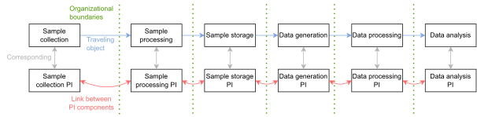

The resulting provenance chain serves as documentation of the object’s history. Enabling queries over such a distributed provenance information is important to achieve tasks like tracing the history of the object, or assessing the object’s fitness for purpose. For instance, given a trained AI model, we may request information about how the data used for the training and validation of the model has been curated or how the original biological material, from which the data used for the model training derives, was acquired since this information affects to which other data sets the trained model can be applied. Acquisition, processing, and staining the biological material prior to scanning and using it in a AI model development may have profound impact on usability of the AI model. Thus the ability to examine the whole provenance chain is critical to assess the AI model.

In order to establish trustworthy provenance chains, properties, such as provenance authenticity, integrity, and non-repudiation, must be supported \[28\]. In addition, the distributed provenance framework must provide means to make permissible modifications to the chain without breaking its integrity and validity, and these modifications must be transparent and traceable. This is necessary, for instance, when an erroneous provenance component of the chain is detected and must be corrected. These properties can be achieved by recording relevant metadata about provenance – *meta-provenance*, or *provenance of provenance* in other words – such as attributions, version numbers, hashes, or digital signatures, corresponding to a provenance component. As a result, each component of a provenance chain has corresponding meta-information (Fig [\[fig:prov-meta-correspondence\]](#fig:prov-meta-correspondence)).

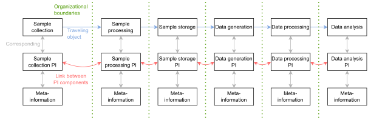

One of the main goals of the current distributed provenance research is to enable a unified traversal, processing, and analysis of distributed provenance chains. The current state-of-the-art model for distributed provenance information – the Common Provenance Model (CPM) \[29\] – provides a groundwork that enables traversal through the chain and describes how meta-information related to the versioning of components can be represented. The CPM is also an open foundation for the *“ISO 23494 Biotechnology — Provenance information model for biological material and data”* series \[30\], which is currently under development. However, the model does not prescribe how to create links between components of a distributed provenance chain and their corresponding meta-information. Consequently, adopters of the model are free to decide what means are used to represent the links. This creates room for incompatibilities between implementations, preventing the application of common general mechanisms to process the meta-information for tasks such as verification of provenance integrity and authenticity.

Determination of how provenance and corresponding meta-information is interlinked depends on the characteristics of the exchanged object and additional requirements that the attached provenance information must meet. These requirements may include whether meta-information about a provenance component can be distributed across multiple storage locations or whether meta-information about multiple provenance components may be integrated, which could affect the need for the uniqueness of identifiers used in meta-information. However, current literature on provenance lacks a thorough assessment of how the linking, characteristics of exchanged objects, and related requirements affect each other: the matter is either addressed marginally in the context of exchanged objects or not addressed at all. Considering the wide range of areas where provenance information is being adopted, an in-depth analysis of such fundamental aspects may be of use in many domains, where the research focus shifted heavily on the analysis of data sets whose creation is typically preceded by complex, distributed, and heterogeneous processes \[8\]. Additionally, underlying provenance models must be designed to integrate with existing domain-specific approaches \[31\] easily so they are flexible enough to cover a wide range of use cases. For that reason, having a set of recommendations and guidelines related to the provenance and meta-information linking in the context of exchanging research objects would be beneficial.

This work fills the aforementioned gaps by providing an in-depth analysis of existing provenance coupling schemes \[32\] and by extending the CPM with a unified representation of links between provenance chain components and the corresponding meta-information and describes the application of the proposed concepts on a use case from the digital pathology domain. In particular, we revise provenance coupling schemes for provenance and meta-information in the context of exchanged objects. As a result, we create a simple categorization of potential approaches – *provenance exchange schemes* – and describe their impact on various properties, including the confidentiality of sensitive data. Based on this analysis, we derive general requirements for provenance models to enable the interlinking of provenance and the corresponding meta-information. Finally, we extend the CPM with a representation of the links according to the emerging requirements. We demonstrate the functionality of the proposed extension by an exemplary implementation applied to a digital pathology example using RO-Crate \[33\], a recent lightweight implementation of FAIR digital objects \[34–35\].

The main contributions of this work are the following:

  - An in-depth analysis of provenance coupling schemes in the context of exchanged research objects and their relationship to distributed provenance chains.

  - Introduction of provenance exchange schemes - a novel categorization of properties with respect to the content of communication between collaborating organizations and provenance.

  - Formulation of general provenance model requirements related to linking components of a provenance chain and their meta-information in the context of exchanged research objects.

  - Extension of the CPM to handle new requirements. In particular, the definition of how to link provenance and meta-information in terms of the provenance model using persistent identifiers \[36\] (PIDs) and attributes of related provenance structures.

  - Extension of the CPM to support access control and opaque provenance components in distributed provenance chains, introducing the concepts of master bundles and views over master bundles.

  - Implementation of the provenance and meta-information linking concept using RO-Crate applied to a use case from the digital pathology domain, where AI models are trained to detect carcinoma cells in high-resolution images generated from human prostate scans.

This paper is structured as follows. The Background section describes the concepts used in this work as a starting point. In particular, it describes a running example, existing coupling schemes, and relevant aspects of the CPM. In the Results section, the provenance exchange schemes are defined, the requirements on links between provenance and its metadata are stated and addressed by an extension of the CPM. The Implementation section briefly describes how the proposed extension of the CPM has been implemented for the running example. The Discussion section outlines various aspects of the proposed provenance model, such as the importance and relevance of the presented work, practical aspects that must be considered when adopting the CPM, and directions for future work. The Methods section describes how the analysis of related work was conducted and how the CPM and its current extension were developed. Finally, the Related Work section provides a survey of recent surveys, taxonomies, and systematic literature reviews, describes the current state-of-the-art for distributed provenance information and shows examples of how provenance information can be exchanged. The [supplementary file](supplementary.html)  contains a technical description of the implemented mechanism and a description of the resulting RO-Crate. The RO-Crate is available on the link in the "Availability of supporting data and materials" section.

# Background

This section describes concepts we use in our work as a starting point. These include a running example used to pilot the implementation of the presented contributions, provenance coupling schemes, and relevant aspects of the CPM.

## Running Example

The presented example, which has also been used for the development of the model and prototype implementation of the proposed concepts, comes from the digital pathology domain. Digital pathology is a research field in which imaging technologies and machine learning is applied with the aim of developing systems supporting a diagnosis of patients. The systems are based on trained AI models that consume the patient’s clinical data and high-resolution scans of histopathological biological material (i.e., gigabytes per image) – Whole Slide Images (WSIs). The use case consists of several steps that involve a hospital, biobank, analytical laboratory, and a research infrastructure. Here, we focus solely on the computational steps of the research pipeline. The complete description of the pipeline, including biological material acquisition, processing, and data generation, can be found in our previous work \[29\].

The computational steps of the pipeline include the following:

1.  **WSI data preprocessing**. The goal of the data preprocessing is to split the high-resolution WSIs into smaller segments, as the AI model can not process the raw WSIs. Each segment is assigned either in a training or testing data set.

2.  **AI model training**. The AI model is provided with the training data set, which includes a portion of the input WSIs and their annotations. The model is trained to detect the presence of carcinoma cells in the WSIs, and the result of this step is a trained AI model (i.e., weights of the model with the best preliminary predictions).

3.  **AI model evaluation**. The trained AI model is provided with the testing data set without the annotations and is executed to predict the presence of carcinoma cells in the WSIs. The derived predictions are then compared with the original annotations to evaluate the trained models’ performance.

Trustworthy provenance information documenting the research pipeline can play a crucial role in the clinical application of the trained model. Depending on the exact purpose of the provenance collection, the resulting provenance chain, and respective meta-information can be used, for instance, to prove compliance with regulations, such as the In Vitro Diagnostic Regulation \[37\] and the Medical Device Regulation (MDR), to evaluate fitness-for-purpose of the trained AI model (as the model may be trained for a specific category of biological samples), or just to trace origins of errors or inconsistencies in the input data set \[38\].

## Coupling Schemes

One of the most fundamental aspects affecting the properties of provenance chains is provenance coupling, i.e., whether provenance information is stored as part of a documented object or whether it is a standalone piece of information linked with the object externally. There are currently three coupling schemes described in the literature:

  - **Tight/high coupling**. Provenance is stored directly with the data for which provenance is recorded \[39\].

  - **Loose coupling**. Provenance and data are stored in a single system but logically separated (e.g., by storing data and their provenance in different tables of the same database \[32\]) \[39\].

  - **No coupling**. Provenance is stored in one or many repositories which are separate from the data repository \[39\].

Since determining a coupling scheme is an essential architectural question that affects where and how the links between provenance and corresponding meta-information are stored, it significantly impacts the properties of the resulting provenance chain and communication between organizations. However, the coupling schemes are primarily considered storage methods, while how they affect provenance in transfer is not described.

In this work, we revise the coupling schemes in the context of distributed provenance and exchanged research objects, describe their properties, and derive the requirements they pose on underlying provenance models able to handle them.

## Distributed Provenance Information & CPM

The Common Provenance Model (CPM) \[29\] is a novel model for representing distributed provenance information. The main goal of the model is to enable the creation of distributed provenance chains across heterogeneous environments in life sciences, with support for unified traversal and querying mechanisms, independently from particular processes or research objects documented by the provenance. This way, the CPM directly addresses the traceability of research objects and their provenance in both backward and forward direction. Additionally, depending on the specific provenance content, the CPM supports the reproducibility of research results and related experiments.

The core concept of the model is that each organization involved in a documented object’s life cycle generates standardized provenance information represented as a single component of a chain (called *bundle* in terms of the CPM and underlying PROV data model \[40\]), and links it to each existing provenance produced by other actors involved in the object’s life cycle. In particular, a described object and its provenance are transferred between organizations – from a *sender* to a *receiver* (Fig [1](#fig:chain-create-a)). The exchanged provenance is generated during a *finalization event* which is a specific time instance when available information from log files or information systems is translated into a data model that conforms to the CPM. The *finalized provenance information* is archived by the sender and provided to a receiver with the described object. This way, the receiver is provided with a standardized representation of provenance together with the described object and can use it to assess the object’s fitness for purpose or for other purposes. The receiver, in turn, can use the object and generate additional finalized provenance information, which links to the previous provenance component of the chain that was previously archived by the sender (*backward link*). In addition to the backward link, optionally, the receiver can inform the sender about the new finalized provenance component to update the sender’s finalized provenance information to include the *forward link* to the receiver’s finalized provenance. This creates a distributed provenance chain (Fig [2](#fig:chain-create-b)).

A provenance chain documenting the three steps of the running example is designed to include three provenance components (Fig [3](#fig:AI-chain)), each documenting an individual step of the example: data preprocessing, AI model training, and AI model evaluation. The decision to create three individual components for the example was based on the fact that despite each of these steps is being handled by the same research group, the steps can be executed individually, and there might be significant time delays between the executions.

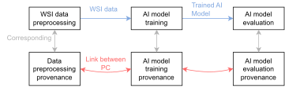

The underlying provenance is built on the W3C PROV standard \[40\] and is represented as a graph structure with annotated nodes and edges to express their semantics. The nodes represent activities, entities, or agents, and the edges represent their mutual relationships. The CPM extends the PROV model with definitions of specific semantics to link the provenance components of the chain and to represent standardized derivation paths between inputs and outputs of a process as follows.

The forward and backward links between provenance components are implemented by a special type of entities, the *Connectors* (Fig [\[fig:chain-intro\]](#fig:chain-intro)). A *sender connector* is a provenance structure that represents a snapshot of the described object at the time when it is sent from a sender to a receiver. The sender creates the sender connector, includes it in its finalized provenance, and provides it to the receiver. The receiver then includes this provenance structure (uses the same id for the structure) as *receiver connector* in its finalized provenance information and creates another provenance structure – the *external input connector* entity – which represents the snapshot of the described object at the time of its receipt. Finally, the receiver creates an edge between these two structures to express the derivation path between the two states of the object. If the receiver provides the results of its process to another organization, a new sender connector is created in the sender’s finalized provenance. The connector is then related using the *Derivation* relation to the external input connector and provided along with the described object and its provenance to the new receiver. This process is applied iteratively each time a described object is passed between organizations. This set of standardized derivation paths between inputs and outputs of documented processes is called *provenance backbone*, which forms the core of the resulting provenance chain. The CPM also prescribes additional provenance structures and a method to attach domain-specific information to the derivation paths. However, since this part of the CPM is irrelevant to this work, its description is omitted.

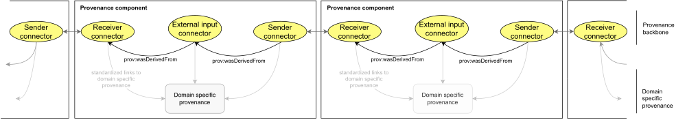

The connectors presented in the running example represent inputs and outputs, which are being exchanged between the steps of the documented research pipeline (Fig [\[fig:AI-chain-connectors\]](#fig:AI-chain-connectors)). For the WSI preprocessing step, the input WSI data set is represented as a single receiver connector, and the resulting training and testing data sets are represented as two separate sender connectors. For the AI training step, a single receiver connector represents the training data set linking to the WSI preprocessing step, and a single output – the trained model – is represented as a sender connector. The provenance component documenting the AI model evaluation step includes two receiver connectors – one linking to the trained model from the AI training step and the second one linking to the testing data set from the WSI preprocessing step. No sender connector is present in the last provenance component to indicate that outputs of the evaluation step have not been used in any consecutive process yet, so this is the end of the provenance chain.

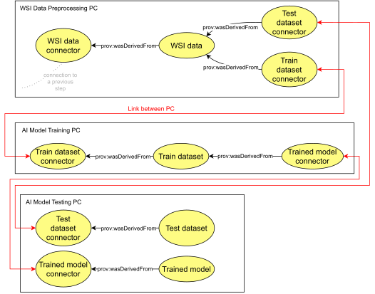

The links between distributed provenance components are implemented as attributes of the connectors (Fig [\[fig:connectors\]](#fig:connectors)). In particular, the connectors must include an identifier of the destination provenance component and a service identifier where the corresponding provenance component can be requested.

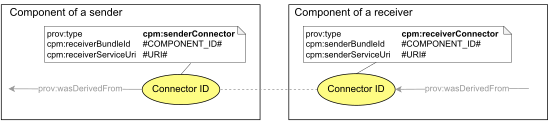

In this work, we revise the attributes of connectors and of the external input structure to better align with new requirements that emerge from the analysis of provenance coupling schemes conducted in the context of distributed provenance and exchanged described objects. Additionally, we extend the CPM with means to refer to meta-information about provenance components, complying with the new requirements, and suggest how to apply PIDs to connectors.

## Versioning of Distributed Provenance in CPM

The CPM describes provenance versioning, a method to perform authorized changes of provenance chains, and prescribes how to represent the change in meta-information – *meta-provenance* in terms of the CPM. To update a chain component, a new component is created and linked with the original version in meta-provenance. The new version supersedes the original version, is considered a replacement of the original component, and can contain new, reduced, or updated information. The original component must not be deleted but is kept archived in the original location to avoid disrupting the chain’s integrity since other components may still refer to the original version. As a result, each provenance component of the chain may have multiple historical versions and refer to a specific version of another chain component (Fig [\[fig:chain-versions\]](#fig:chain-versions)).

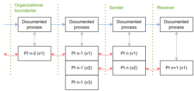

The CPM defines a standardized way of representing provenance component versions in meta-provenance (Fig [4](#fig:Metabundle-versioning)). The proposed mechanism for provenance components versioning loosely follows the semantics defined in the PAV ontology \[41\] and is an application of a provenance revision pattern \[42\]. The resulting scheme is depicted in Fig [4](#fig:Metabundle-versioning).

![Schema of how different versions of a provenance component are represented in meta-provenance according to the CPM. In particular, each component version is represented in meta-provenance as a provenance structure of type *Bundle*. Each new component version is related to the previous version of the component using the *Revision* relation. Finally, all the versions are related to the common abstract entity that represents the common aspects of all the versions using the *Specialization* relation.](figures/Metabundle-versioning.svg)

In this work, we build on the existing mechanism to include standardized links from meta-provenance to provenance and express provenance authorization units – a master bundle and views over the master bundle – to manage access control to components of a provenance chain.

## Appending New Information To a Chain in CPM

If a documented research object is modified, the corresponding provenance component must be appended to the chain, and the corresponding meta-provenance must be generated. The CPM provides two general strategies for appending new information:

1.  By the addition of a new provenance component to a provenance chain, whose connector refers to the existing finalized provenance component (section Distributed provenance information & CPM);

2.  By replacing the latest provenance component in the chain with a new version, presuming this operation does not modify existing provenance descriptions (section Versioning of distributed provenance & CPM).

Intuitively, if a described research object is modified and a new version of that object is obtained, the versioning mechanism should be applied. On the other hand, if an object is modified and a new object is obtained as a result, then a new provenance component should be appended to a provenance chain. However, determining when an object can be considered a new version or a new object is not always straightforward. Additionally, as it will be shown in this work, each appending strategy has implications, and it may not always be applicable despite the original intuition. Being familiar with these properties is essential to make informed decisions when designing or choosing a provenance solution. However, the benefits of choosing one appending strategy over the other in the context of distributed provenance chains are not described in the literature.

In this work, we analyze the general appending strategies in the context of exchanged research objects and list general aspects that affect decision-making.

# Results

## Provenance exchange schemes

In this section, we introduce a categorization of how provenance information and meta-provenance can be handled with regard to exchanged research objects, which results in three provenance exchange schemes: attached, semi-attached and detached. The schemes loosely follow the semantics of the coupling schemes, and we describe how our categorization relates to the existing one. Each of the introduced schemes exhibits distinct properties of provenance, which might be appropriate for different application scenarios. In addition, each scheme results in distinct requirements for linking provenance and meta-provenance in the underlying provenance models. These requirements are described at the end of this section.

### Attached Scheme

In the attached scheme, provenance information and meta-provenance are part of the communication between a sender and receiver. In particular, when the object is exchanged between organizations, the copy of the corresponding provenance and meta-provenance is also exchanged. This may be done either by embedding the information directly in the documented object (Fig [5](#fig:scheme-attached-b)) or by providing it as a standalone piece of information outside the object (Fig [6](#fig:scheme-attached-a)). As a result, when the process of the object exchange is finished, the receiver has an actual copy of the provenance and meta-provenance. For instance, FAIR digital objects encapsulating data with provenance or data formats that include provenance information in their header fall within this category.

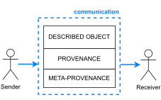

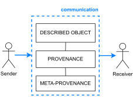

### Semi-attached schemes

In the semi-attached scheme, either provenance information or meta-provenance is not part of the communication between a sender and receiver (only one is present). As a consequence, the receiver of the object has to make an additional request to get an actual copy of the missing part after the object exchange is finished. For instance, FAIR digital objects that encapsulate data with a reference to its provenance stored externally to the object fall within the semi-attached scheme.

1.  **Semi-attached scheme with provenance attached**: Provenance information is part of the communication between a sender and receiver, but the corresponding meta-provenance is not part of the communication (Fig [7](#fig:scheme-semi-a)).

2.  **Semi-attached scheme with meta-provenance attached**: meta-provenance is part of the communication between a sender and receiver, but provenance information is not part of the communication (Fig [8](#fig:scheme-semi-b)).

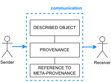

### Detached scheme

In the detached scheme, neither provenance nor meta-provenance is part of the communication between a sender and receiver (Fig [9](#fig:scheme-detached)). As a consequence, the receiver of the object has to make an additional request to get actual copies of both provenance and meta-provenance after the object exchange is finished. For instance, FAIR digital objects that encapsulate data with a reference to its provenance and meta-provenance stored externally to the object fall within the detached scheme (for an elaboration on possible configurations of byte sequences and metadata references in FAIR Digital Objects we refer to \[43\]).

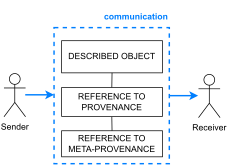

### Properties of the schemes

The available literature presents various properties of the provenance coupling schemes which can be adopted for the presented provenance exchange schemes. These properties are amended and described in the context of the provenance exchange schemes in Table [\[tab:schemes-props\]](#tab:schemes-props).

width=0.7

<table style="width:95%;">
<colgroup>
<col style="width: 15%" />
<col style="width: 40%" />
<col style="width: 40%" />
</colgroup>
<thead>
<tr class="header">
<th style="text-align: left;">Property of a scheme*</th>
<th style="text-align: left;">Attached scheme</th>
<th style="text-align: left;">Semi-attached and detached schemes</th>
</tr>
</thead>
<tbody>
<tr class="odd">
<td style="text-align: left;">Accessibility</td>
<td style="text-align: left;">As the actual copy of provenance and meta-provenance** are immediately available to the receiver after the exchange of the object is finished, the scheme is less prone to accessibility errors in comparison with the detached schemes. The reason is that no additional query is needed to get the actual copies, and there is no need to maintain an additional reference to provenance or meta-provenance.</td>
<td style="text-align: left;">As the actual copy of provenance or meta-provenance is not immediately available to the receiver after the exchange of the object is finished, the scheme is more prone to accessibility errors than the attached scheme. The reason is that there is a need to make an additional request to get the actual copies, and a reference to the actual copy must be maintained.</td>
</tr>
<tr class="even">
<td style="text-align: left;">Access control [44]</td>
<td style="text-align: left;">
Case-by-case access control may be difficult to achieve. Once the provenance and meta-provenance are attached to an exchanged object, each consecutive receiver will have access to it by design. Provenance encryption can be used to protect sensitive information, but this would introduce additional complexity related to encryption/decryption keys management and pose additional risks related to keys leakage or keys/scheme deprecation.

The attached scheme does not allow for the separation of access control strategies for exchanged objects and provenance, as they are provided to a receiver together.
</td>
<td style="text-align: left;">
Case-by-case access control management is achievable. Once a receiver requests provenance or meta-provenance, the sender may decide the authorization result case-by-case and make individual decisions specific to each consecutive provenance receiver in the chain.

The semi-attached and the detached scheme provide better support for the separation of access control strategies for exchanged objects and provenance, as they are exchanged between a sender and a receiver separately.
</td>
</tr>
<tr class="odd">
<td style="text-align: left;">Distributed &amp; heterogeneous environments [39–45]</td>
<td style="text-align: left;">For provenance information embedded within the object, the scheme requires a higher level of standardization than the semi-attached or the detached schemes, as different steps of a research pipeline must be able to deal with a single format of the exchanged object in which provenance is embedded.</td>
<td style="text-align: left;">The schemes require a lower level of standardization than the attached scheme, as provenance or meta-provenance are not embedded directly within the exchanged object.</td>
</tr>
<tr class="even">
<td style="text-align: left;">Consistency [44–46]</td>
<td style="text-align: left;">If provenance and meta-provenance are embedded directly within the exchanged object, they are less prone to accidental loss.</td>
<td style="text-align: left;">Provenance or meta-provenance is more prone to accidental loss than the attached scheme since the linked information can be corrupted, e.g., during backups, restoration, copies, etc.</td>
</tr>
<tr class="odd">
<td style="text-align: left;">Interoperability</td>
<td style="text-align: left;">If provenance and meta-provenance are embedded directly within the exchanged object, they must be stored in a standardized format to achieve interoperability between implementations.</td>
<td style="text-align: left;">Provenance or meta-provenance can be stored in an arbitrary format but must be provided to a receiver in a standardized format to enable its processing.</td>
</tr>
<tr class="even">
<td style="text-align: left;">Size &amp; Ease of Distribution</td>
<td style="text-align: left;">Since provenance and meta-provenance may be bigger than the exchanged object (e.g., for small data sets with very granular provenance descriptions), their inclusion inside the communication between a sender and a receiver may negatively affect the ease of their distribution.</td>
<td style="text-align: left;">The size of the communication is not affected by the corresponding provenance or meta-provenance size.</td>
</tr>
<tr class="odd">
<td style="text-align: left;">Non-repudiation (Trustworthiness [44])</td>
<td style="text-align: left;">Since an exchanged object may pass through an untrusted environment, non-repudiation of provenance and meta-provenance would be practically unattainable.</td>
<td style="text-align: left;">The ability to achieve non-repudiation of provenance or meta-provenance is not directly affected by an untrusted environment through which an exchanged object is passed since it can be stored remotely in a secure environment.</td>
</tr>
<tr class="even">
<td style="text-align: left;">Physical objects</td>
<td style="text-align: left;">Provenance and meta-provenance can not be part of physical objects like biological samples. For the description of physical objects, an attached scheme with the provenance information and meta-provenance outside the object, a semi-attached scheme, or the detached scheme applies.</td>
<td style="text-align: left;">The detached scheme can be used for the description of physical objects.</td>
</tr>
<tr class="odd">
<td style="text-align: left;"></td>
<td style="text-align: left;"></td>
<td style="text-align: left;"></td>
</tr>
<tr class="even">
<td style="text-align: left;"></td>
<td style="text-align: left;"></td>
<td style="text-align: left;"></td>
</tr>
<tr class="odd">
<td style="text-align: left;"></td>
<td style="text-align: left;"></td>
<td style="text-align: left;"></td>
</tr>
</tbody>
</table>

Another important aspect is that the exchange schemes are defined with respect to a sender and a receiver and communication between them. As a result, distinct parts of a distributed provenance chain may correspond to different provenance exchange schemes.

### Relating provenance exchange schemes and coupling schemes

Despite the similarity between provenance exchange and coupling schemes, we have not identified any implicit general relation between the schemes. In particular, none of the provenance coupling schemes generally implies a specific exchange scheme and vice versa. For instance, if provenance is tightly coupled with an exchanged object, the object can be separated from the provenance before it is passed to a receiver, and only a reference to the provenance may be provided, resulting in the detached scheme. If provenance is not coupled with an exchanged object, the provenance can be retrieved from the storage and passed to a receiver along with the object, resulting in the attached scheme. For the loose coupling storage scheme, either option applies depending on the particular context. This is summarized in Table [\[tab:ex-coupling\]](#tab:ex-coupling).

| Coupling strategy   | Exchange scheme | Description                                                                                                                                  |
| :------------------ | :-------------- | :------------------------------------------------------------------------------------------------------------------------------------------- |
| Tight coupling      | Attached scheme | The exchanged object is passed to a receiver as stored or is transformed to a different representation.                                      |
| Tight coupling      | Detached scheme | The exchanged object is separated from its provenance before it is passed to a receiver. A reference to the object’s provenance is provided. |
| Loose & no coupling | Attached scheme | A copy of the corresponding provenance information is passed to the receiver directly together with an exchanged object.                     |
| Loose & no coupling | Detached scheme | A reference to the corresponding provenance information is passed to the receiver together with an exchanged object.                         |

Once the exchanged object and provenance and meta-provenance or a reference to it are received and processed by a receiver, the receiver can decide where the provenance component corresponding to its process will be stored. This can be done in principle according to one of the coupling schemes. However, further aspects may affect the decision, such as requirements for the assignment of identifiers or the exchanged object’s format. How these aspects affect the decision is described in the “Revision of the Common Provenance Model appending strategies” section.

## Requirements on links between provenance and meta-provenance

In order to enable a provenance receiver to locate the “missing piece” in the semi-attached or the detached scheme (provenance, meta-provenance, or both), a link to it must be provided. For the attached scheme, a local link may be provided, e.g., referring to a part of the exchanged information intended for provenance or meta-provenance representation. Standardized representation of links to provenance and meta-provenance has the benefit of reducing the overhead of the underlying data formats otherwise necessary since format developers do not necessarily need to develop their own format-specific links representation, as the standardized representation would be available. Such standardized representation of links could be part of the communication between a sender and a receiver, either as part of standardized provenance or meta-provenance, embedded within the described object directly, or provided as a standalone piece of information.

Each component of a provenance chain relevant to an exchanged object may be generated independently by different organizations. If a detached scheme is used, each of the organizations should be enabled to choose storage modalities for referenced provenance or meta-provenance. This is because the enforcement of having prescribed provenance and meta-provenance storage for different components in the chain – i.e., for distinct organizations – might be too restrictive, preventing the organizations from adopting such a solution. Additionally, it is practically impossible to prescribe a centralized provenance and meta-provenance storage for such a heterogeneous environment as the life sciences. Consequently, the underlying provenance model should provide standardized means to include references to components of the provenance chain from meta-provenance, each reference corresponding to a distinct part of the chain. Similarly, the underlying provenance model should provide standardized means to include references to meta-provenance from provenance, each reference corresponding to a distinct part of the chain. These requirements are summarized in Table [\[tab:req-summary\]](#tab:req-summary).

Applying these requirements to the running example, each provenance component – namely for the data preprocessing, AI model training, and AI model evaluation – is enabled to link to its own meta-provenance by its own reference (Fig [10](#fig:AI-chain-meta-a)). In other words, if each of the steps will be executed by a different organization, the requirements impose that the organizations would not be forced (but are free) to use a shared meta-provenance location. Conversely, a reference to corresponding provenance components should be enabled in each meta-provenance bundle. If the meta-provenance bundle would be shared for all three provenance chain components, it is allowed to include three different references in meta-provenance, each for corresponding provenance component individually (Fig [11](#fig:AI-chain-meta-b)).

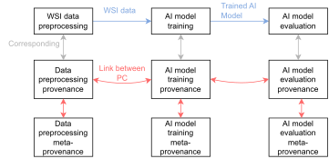

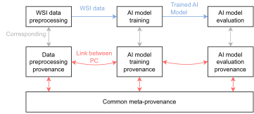

Some parts of the underlying provenance chain may have multiple versions, e.g., due to detected errors in provenance, which have been later corrected (see Background for versioning description). If a new provenance component version is created, two actions are required with regard to meta-provenance: 1) recording information about the new version into meta-provenance; b) relating the new record with records about the previous versions. In this case, the corresponding meta-provenance related to a particular provenance component should not be fragmented (Figures [12](#fig:AI-chain-meta-c), [13](#fig:AI-chain-meta-e), and [14](#fig:AI-chain-meta-d)) – so it can be referenced by a single reference – since the additional complexity potentially introduced by enabling the fragmentation of the meta-provenance outweighs potential benefits. An advantage of such functionality is that it provides more flexibility for implementers to decide where to store the new meta-provenance record. On the other hand, this could cause meta-provenance for different versions of the same provenance component to be fragmented into multiple storage locations and formats, which would overcomplicate meta-provenance generation process and representation. In addition, consistency and continuity of such fragmented meta-provenance should be achieved and verifiable.

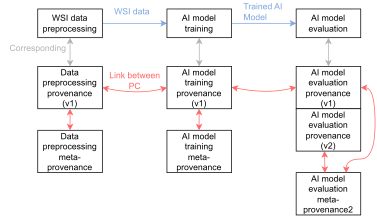

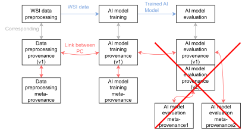

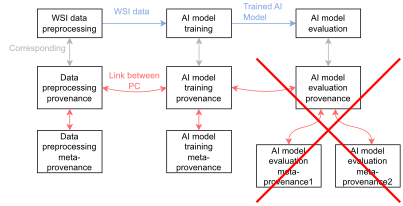

|     | Derived requirements related to provenance and meta-provenance linking.                                                                                                                                                                                   |
| :-- | :-------------------------------------------------------------------------------------------------------------------------------------------------------------------------------------------------------------------------------------------------------- |
| 1\. | A standard way to represent links between provenance and meta-provenance.                                                                                                                                                                                 |
| 2\. | A standard way to include references to meta-provenance in the provenance and vice versa. Different components may have different references (Figures [10](#fig:AI-chain-meta-a) and [11](#fig:AI-chain-meta-b)).                                         |
| 3\. | Avoid fragmentation of meta-provenance related to a provenance component. A single reference to meta-provenance is enabled per provenance component (Fig [14](#fig:AI-chain-meta-d)).                                                                     |
| 4\. | Avoid fragmentation of meta-provenance related to different versions of a provenance component. Only a single reference to meta-provenance is enabled for all the component versions (Figures [12](#fig:AI-chain-meta-c) and [13](#fig:AI-chain-meta-e)). |

## Revision of the Common Provenance Model appending strategies

As was argued in the previous sections, bi-directional links between provenance components and corresponding meta-provenance should be supported in underlying provenance models. Additionally, meta-provenance corresponding to a provenance component should not be fragmented and potentially stored in distinct locations, so multiple versions of the same provenance component can link to a single meta-provenance component. As a consequence, an organization creating a new version of a component in a provenance chain should be provided with means to update the corresponding meta-provenance component.

In the attached scheme, the two general appending strategies, i.e., versioning or adding provenance components in the provenance chain, do not differ significantly. If an object and related meta-provenance are meant to “travel together” (e.g., as part of the data file header), then a receiver of the object can always re-write it, with no respect to which of the two appending strategies is used. On the other hand, if any of the information is referenced in a semi-attached or the detached scheme, the properties of the two appending strategies vary. If a new version of a provenance component is created in the chain, a receiver must be able to append the new versioning information to the corresponding meta-provenance. On the other hand, if a receiver adds a new provenance component to the provenance chain, he is not bound to use any specific meta-provenance bundle.

One of the most important questions is whether a receiver of an object should even be able to create a new version of an existing component that was created by another organization. Since provenance components document part of a research object life cycle when a particular organization handles it, we propose that this documentation should not be outdated by another organization, and suggest enabling the creation of new versions by different organizations (different from the organization that originally created the finalized provenance component) only in justified cases, e.g., when an organization ceases to exist and an error in provenance is detected later. In this situation, it would be beneficial if another organization, e.g., an authority, could create a corrected version. As a result, the versioning mechanism should not be used to append new information to a chain without additional integrity assurances when an object passes across organizational boundaries. The assurance must guarantee that the new version of the component only appended a content, and that the original provenance content was not modified.

Another aspect that affects the determination of appending strategy is the intended usage of the formats of exchanged objects. For instance, genomic data and their metadata is part of the MPEG-G standard \[47\], which currently covers documentation of steps starting from raw sequence reads up to their alignment to a reference sequence. Each time a new dataset is derived from an MPEG-G file (e.g., a raw genomic dataset is stored as an MPEG-G file, and another dataset with aligned reads will be derived from that raw genomic dataset), it is expected that the derived dataset is represented as new MPEG-G file. In this scenario, the new file is a new object that should be documented in a new provenance component.

The determination of provenance appending strategy might also be affected by the assignment of identifiers for documented exchanged objects. For example, Zenodo \[48\], a popular open repository for storing digital research objects, distinguishes identifiers for the objects themselves and for their specific versions. Using such identifiers for the objects might indicate situations when appending a new provenance component is more appropriate over the provenance versioning mechanism (or vice versa).

## Extending the CPM with the links between provenance and meta-provenance

Distributed provenance chains are based on a provenance backbone (see Background section). However, the CPM does not provide a description of how to create links between the provenance backbone and meta-provenance. To achieve this, we propose the following mechanism based on the existing provenance backbone structures and PIDs.

### Linking from a provenance component to meta-provenance

The provenance backbone contains three types of PROV entities: sender connector, receiver connector, and external input connector. We suggest that each of these is identified with a PID within provenance information and that the PIDs resolve to the following information:

1.  The corresponding entity represented by the PID in any serialization (might be subject to a content negotiation protocol);

2.  Identifier of a corresponding provenance component that contains that entity:
    
    1.  For a receiver connector, it is the identifier of the preceding component in the chain.
    
    2.  For an external input connector, it is an identifier of the “current” provenance component.
    
    3.  For a sender connector, it is the identifier of the consecutive provenance component in the chain.

3.  Identifier of meta-provenance, where the provenance of the corresponding provenance component is present:
    
    1.  For a receiver connector, it is the identifier of the meta-provenance component corresponding to the preceding component in the provenance chain.
    
    2.  For an external input connector, it is an identifier of the meta-provenance component corresponding to the “current” provenance component.
    
    3.  For a sender connector, it is the identifier of the meta-provenance component corresponding to the consecutive provenance component in the chain.

As the sender connector and the corresponding receiver connector are identified with the same identifier (required by the CPM), the corresponding PID resolves to both provenance components identifiers in which they are present (Fig [\[fig:conenctors-pid-resolution-id-resolution\]](#fig:conenctors-pid-resolution-id-resolution), green arrows). Consequently, the information the PID resolves to must be updated each time a new component containing the sender/receiver connector is added to the provenance chain.

Following the general mechanism for provenance access described in the PROV-AQ \[49\] specification, we suggest that the provenance components identifiers and meta-provenance identifiers are resolvable and that these resolve to particular content (presuming appropriate authorization) (Fig [\[fig:conenctors-pid-resolution-id-resolution\]](#fig:conenctors-pid-resolution-id-resolution), red arrows). As a result, the proposed mechanism implements links from provenance components to the corresponding meta-provenance content through a pair of resolvable identifiers. Adopting the PIDs for provenance components and meta-provenance is unnecessary since these identifiers are part of a particular connector PID resolution.

Further details about the selected format and other properties of the information which connector PIDs resolve to and new connector attributes to support the proposed functionality are described in the [supplementary file](supplementary.html).

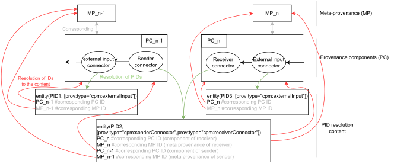

### Linking from meta-provenance to provenance

Each provenance component is identified in meta-provenance and is represented as a PROV entity. As we suggested earlier, the provenance components and meta-provenance identifiers resolve to their actual content. Consequently, the link from meta-provenance to corresponding provenance components is established by the inclusion of that identifier in meta-provenance (see the Background section for further details on how specific component’s versions are expressed in meta-provenance).

### Master bundles and views representation in meta-provenance

We suggest that each provenance component version can have multiple views to better support access control to sensitive information in provenance. One of these is a master view – called *master bundle* – which contains “full” information. The other views – *views over the master bundle* – contain reduced content compared to the master view. The views may differ in the inclusion of connectors to hide links to some parts of the chain.

Similarly to provenance versioning information, the expression of a master bundle and related views in meta-provenance is domain-agnostic information. For this reason, having a standardized representation of this relationship across different domains will positively contribute to interoperability between implementations and the traversal of distributed provenance chains. To support this, we integrate the CPM and its current proposal of provenance versioning representation in meta-provenance with support for relating a master bundle and views over this bundle.

Building on top of the existing mechanism for provenance versioning expression in meta-provenance, we suggest that the specific provenance component version identifier, as it is used currently, identifies the master bundle and is explicitly typed with `prov:type` value `cpm:masterBundle`. A consequence of this is that each provenance component version will have a corresponding master bundle defined. To express views over the master bundle, we define an entity attribute `cpm:viewsOverTheBundle`, which is a list of identifiers of the bundles which are views of the corresponding master bundle. This attribute can then be used with the `cpm:masterBundle` type to list the views over the bundle.

The proposed mechanism for representing a master bundle and its views relates to the resolution of PIDs, which are used for connector identification. Since each connector PID may resolve to multiple provenance components identifiers in which the connector is present, the corresponding PID then must resolve to the list of identifiers that identify each view of the bundle in which it is present.

## Implementation

We have implemented the proposed mechanism for provenance and meta-provenance linking for the computational steps of the running example: WSI data preprocessing, AI model training, and AI model evaluation. Each of these steps generates intermediate results either consumed by a consecutive step of the pipeline or by a finalized provenance information generation script that uses generated log files to create provenance information according to the CPM. As a result, each step of the pipeline is documented in a separate provenance component, and these three components form a provenance chain. In addition, the provenance finalization scripts generate a corresponding meta-provenance file that is interlinked with the generated provenance chain. The actual PIDs are implemented using Digital Object Identifiers ([doi.org](doi.org)) generated by the DataCite (<https://datacite.org/>) registration agency. Each of the DOIs resolves to a file that is hosted on the institutional Gitlab instance together with the resulting provenance files.

Finally, all the computational artifacts are packed together into an RO-Crate that conforms to the Process Run Crate \[50\] and CPM RO-Crate \[51\] profiles specification. The RO-Crate corresponds to the Detached scheme when exchanged.

See the [supplementary file](supplementary.html) for a detailed description of the provenance generation process and the resulting RO-Crate, and the "Availability of Supporting Data and Materials" section for references to the resulting RO-Crate.

# Methods

The first draft of the CPM was published as an EOSC-Life project (<https://www.eosc-life.eu/>) deliverable \[52\], and contained definitions of the finalization event, connectors, and provenance versioning mechanism. The initial version was later extended \[29\] with the provenance backbone concept, and further aspects were added, namely opaque provenance components, integrity, non-repudiation, and support for missing provenance components. The latter version corresponds to a new work item proposal submitted to the ISO/TC 276. In order to further validate the proposed concepts, we integrated the CPM with RO-Crate – an implementation of FAIR digital objects \[34\] – which was the main trigger for the conducted analysis and further extensions of the CPM presented in this work.

In particular, we had to decide how provenance components would be serialized in an RO-Crate: whether we allow to split a component into multiple files or to have multiple provenance components in a single file; how to represent meta-provenance in an RO-Crate; or how to represent links between provenance components and meta-provenance. To make an informed decision, we conducted a survey of related work with the objective of finding an analysis, requirements, or recommendations which will guide us to resolve the related questions.

The Systematic review of provenance systems\[32\] was used as a starting point for our related work survey, as we consider it the most comprehensive provenance literature review. The Systematic review identified 251 provenance systems and selected 105 papers as a basis for the development of a taxonomy of provenance characteristics. The taxonomy was created as an extension of a previous categorization \[45\], which was considered the most complete one at the time of publication of the systematic review. In this context, we have analyzed the systematic review, the original categorization, and the surveys and reviews referred to from the systematic review, which were listed in the storage dimension of the taxonomy \[39–45–53\], as this one contained a description of the provenance coupling schemes, which was the most relevant for our work. However, the reviews and associated provenance taxonomy of provenance characteristics did not contain information about the consequences of distinct provenance exchange schemes.

Since the taxonomy was based on the work published between 2001 and July 2017, we wanted to ensure that the analysis we sought was not conducted later. Therefore, we extended our survey of provenance-related taxonomies to work published between July 2017 and August 2022. In particular, we used Google Scholar (<https://scholar.google.com/>) and searched for recent work using the keywords “provenance survey” and “provenance review” in the publication name, which were published in the range between 2017 and 2022, and checked the first five pages of the search results. Inclusion criteria were that the result was: i) a survey or a systematic review related to provenance information; ii) available to us without further payment; iii) an officially published article (not a preprint). In addition to this, we included the work that cited the systematic review and was categorized as “taxonomy”, “review”, or “survey” to include additional provenance-related surveys, reviews, or taxonomies. As a result, additional 22 papers published between July 2017 and August 2022 were identified as relevant and analyzed. However, neither of these included an analysis of how provenance exchange schemes affect the properties of the resulting distributed provenance.

The provenance exchange schemes presented in this work were created as a result of the analysis of related work, iterative deep discussions of all the authors, and lessons learned during the development of the CPM RO-Crate profile \[51\]. Feasibility of the requirements was validated on the running example, a use case from the digital pathology domain, where traces of image data preprocessing, AI model training, and AI model evaluation execution are documented by CPM compliant provenance and encapsulated into an RO-Crate conformant to the developed profile. Implementation of the provenance generation and its embedding in an RO-Crate is part of this work.

# Discussion and conclusion

The results presented in this work have a practical impact on the current state-of-the-art in the provenance information domain. The conducted analysis and associated general requirements derivation are applicable to wide range of provenance models. While exploring possibilities for how the links between provenance and meta-provenance can be designed, we have achieved specific architectural decisions related to the matter, which enabled us to extend the current state-of-the-art provenance information model for distributed provenance with new features. As several authors of this work are leading and contributing to the development of ISO 23494 standard series \[30\], the presented results will be integrated with the draft proposal of the standardized provenance model. Consequently, this work is another step in global provenance information standardization. Without the proposed extension for the standardized links representation and associated PIDs resolution presented in this work, adopters of the provenance model would have to design the links by themselves, which can lead to incompatible solutions. This has already been witnessed with the existing W3C PROV standard, which is too flexible to enable unified traversal through distributed provenance chains \[29–54\].

Adoption of the CPM includes aspects that must be taken into consideration – i.e., determination of specific semantics of the connectors, the granularity of provenance descriptions, and a level of collaboration between organizations that handle the exchanged object \[29\]. In addition, choosing an appropriate provenance exchange method depends on the specific use case. This work describes the general properties of the provenance exchange schemes. However, the properties of the resulting provenance chain are determined by the combination of all provenance exchange schemes between different organizations in a chain and the application of provenance coupling schemes for provenance storage within each organization. For example, if the whole chain adopts the attached provenance exchange scheme and tight coupling of the object with provenance – e.g., all the provenance information and documented object is present in an exchanged RO-Crate, which is iteratively appended – each consecutive organization will have access to it. On the other hand, if a detached scheme is used for a single segment of this chain, an authorized receiver can access related provenance through a reference and can distribute this provenance on its own, providing access to other organizations in the chain similarly to the attached scheme. This bottleneck can not be simply prevented by architectural decisions but must be addressed, e.g., by contractual agreements between organizations involved in distributed provenance handling.

In the case of the detached scheme, neither standardized provenance nor standardized meta-provenance is part of the communication between a sender and a receiver. In this scheme, how the references are designed and represented is within the constituency of the exchanged information format or communication protocol between a sender and a receiver. The analyses presented in this work may serve as a starting point to design representations of references in the communication. They can be potentially reused when designing interlinking provenance and meta-provenance outside the standardized provenance information. For instance, if a given organization provides objects via /objects/\<ID\> in a REST API, it could provide (meta)provenance via /(meta)provenance/\<ID\>. Another option could be to point to the object, provenance link, and meta-provenance link from appropriate fields in the JSON object returned by the API endpoint, which would serve as a higher-level wrapper around both the object and the CPM artifacts.

One of the features of the proposed mechanism for linking from provenance to meta-provenance is that the link is implemented only in cases when at least one connector is present in a provenance component. On the other hand, if a connector is not present in a component, meta-provenance corresponding to the component would not be linked. However, this case is irrelevant to our work because a component without a connector is not part of a provenance chain, and these are not the subject of the CPM.

An alternative to the expression of views of the master bundle in meta-provenance would be the expression of each view as a standalone provenance structure, which would be related to the corresponding master bundle using the PROV Derivation relation. Compared to the proposed mechanism, using the standalone structures and the derivation relation is more flexible, allowing one to attach more information related to the view. However, using the derivations would be more verbose, and we have not witnessed a use case that would require such a verbose expression of the views over the master bundle, so we have decided to suggest the more simple mechanism. The more verbose option is backward compatible with the suggested mechanism, so it can be applied in the future if required.

The resolvability of provenance component identifiers is an additional requirement related to provenance chain components implementation. For instance, PROV bundles serialized into files can be made directly accessible (with authorization) using web servers. However, implementing the components using a graph database would require identifying the graph within the database and its extraction when requested \[49\].

Literature surveys and systematic literature reviews are important in categorizing different approaches, harmonizing related terminology and perspectives, and defining future research directions. Importantly, they often provide a consolidated overview of heterogeneous requirements, which are originally fragmented across the literature. This plays an important role since such a centralized and harmonized source of requirements may be used when designing a solution for provenance, so designers can make informed decisions when selecting or designing a provenance solution \[55\]. However, the review of provenance coupling schemes presented in this work has limitations. The Systematic Literature Review \[32\], the starting point for our related work survey, has identified 251 published papers related to existing provenance systems. It is out of the scope of our work to review all the systems for additional inputs related to the coupling schemes for our analysis. The reason for bounding our literature review is that attention was brought to research objects exchange and distributed provenance only in recent years, so we do not presume that less recent work would have conducted such an in-depth analysis of the schemes in the current context. For this reason, we have decided to build mainly on available taxonomies and literature surveys instead of reviewing all the possibly related papers.

## Future Work

Our work can be divided into two main branches – development of the CPM to support various functional and non-functional requirements, such as provenance authenticity or non-repudiation assurances, and continuous validation of the model on various use cases.

Now, when a representation for the standardized links between provenance and meta-provenance components is defined, we will continue with definitions of standardized representation for domain-agnostic information included in meta-provenance. Similarly to the representation of provenance components versioning and master bundles, we will work on the representation of security-related aspects of provenance, namely authenticity, integrity, and non-repudiation. To achieve this, we will integrate the current CPM with our previous work on provenance non-repudiation in the context of clinical decision support systems \[56\]. This direction aims to enable provenance chain traversal with support for unified meta-provenance-related queries resolution. Examples of such queries are “Is the given provenance component of a chain authentic, e.g., was it generated by the claimed organization?” or “Was the given research object created as a result of an unreliable process, for which a trustworthy provenance information component is not available?”. The results in this direction will be proposed to become an input for the *ISO 23494-6 Biotechnology – Provenance Information Model for Biological Material and Data – Part 6: Security Extensions*.

For the purpose of the model validation, we will apply it to document a wide range of use cases coming from the life sciences, including optical microscopy experiments, genomic data compression, biological samples handling, or computational workflow based experiments. The model will be provided to the ISO 23494 TC276 Biotechnology WG5 as a groundwork for the development of domain-specific provenance standard parts, namely ISO 23494-3 (biological material provenance), ISO 23494-4 (data generation provenance), and ISO 23494-5 (computational workflows provenance). The further development of the CPM will be coordinated with the development of the MPEG-G standard \[47\] under an ad hoc group under JTC1/SC29/WG08, which is currently being formally established. The model is already being adopted in the BY-COVID project (<https://by-covid.org/>), where it is being integrated with the Process Run Crate profile specification \[50\] to document federated queries over sensitive data in trusted environments. In this context, we await motivation for several possible extensions of the CPM. These may include limitations of the number of allowed connectors per provenance component, definitions of additional types of connectors to support advanced methods of provenance chain traversal, or an extension of the master bundle views expression in meta-provenance using more verbose methods.

# Related Work

The related work section is divided into three main parts. The first part provides an overview of recent provenance surveys, reviews, and taxonomies and puts them into the context of the proposed provenance exchange schemes. The second part focuses on distributed provenance information representation and provides an overview of relevant provenance models. The third part presents examples of methods to exchange provenance information between organizations.

## Provenance Taxonomies

A Systematic Review of Provenance Systems\[32\] is the most comprehensive provenance-related systematic literature review. The main contribution of the work is a unified taxonomy of provenance systems characteristics. The taxonomy is based on 105 provenance-related papers but is not specific to any domain or provenance management technique. The most relevant taxonomy dimension related to our work is the storage dimension which includes approaches to registering provenance information.

Among these, the coupling mechanisms included within this dimension are the most relevant for our work since they affect who and how appends new provenance information to the chain. However, the taxonomy does not describe any properties nor requirements on how the different coupling mechanisms – loose-coupling, no-coupling, tight-coupling – behave when documented objects are exchanged between organizations. We presume that these properties were not comprehensively described in the literature earlier. Otherwise, they would be described or referenced from the review, which is not the case. The original work \[39\] that introduced the three coupling categories states that the no-coupling strategy can deal with heterogeneous environments and that most annotation-based approaches use tight or loose coupling strategy. Other literature related to the storage taxonomy dimension just repeats this information \[45\] or omits any description of the coupling schemes at all \[53\]. Although a deeper analysis of the coupling schemes is not presented in the survey, some fragments can be found in the literature. \[44–46\] state that the benefit of the tight coupling scheme is that it provides better support for ensuring consistency between provenance and data during manipulation. On the contrary, separating provenance from data enables better separation of access policies for provenance and data.

The systematic review covers work up to July 2017. Since then, several surveys and review provenance-related papers have been published. \[57\] provides an overview of what provenance is used for, what types of provenance have been defined and captured for different applications, and which resources and system requirements affect the choice of deploying a particular provenance solution. However, the Decoupling category in this overview is not related to the coupling of provenance to documented objects but concerns the coupling of provenance collection mechanisms with existing systems. In \[58\], the authors propose a number of design requirements for data provenance in IoT and provide a deep-insight review of existing schemes of IoT data provenance. However, as the concerned coupling mechanism is rather a property of overall provenance architectural design rather than a requirement, a deeper discussion on this topic is not included. On the other hand, the attachment of provenance information to data and separate provenance information management are mentioned as two distinct approaches to provenance management, and the authors identify flexible data provenance management as a future research direction. \[59\] survey state-of-the-art for the provenance of scripts and propose a taxonomy for this field, which includes three dimensions – provenance collection, provenance management, and provenance analysis. The most relevant to our work, the Distribution category under the Management dimension, is dedicated to means of distributing provenance information to consumers – local (OPM files, PROV files, logic programming formats (e.g., Prolog or Datalog files) or graph formats (e.g., Graphviz files)) and remote (repositories and web). Although these can be seen as potential options for implementing the exchange schemes presented in our work, any discussion about how the dimensions relate to coupling or exchange schemes is not presented. \[60\] reviews best-practice recommendations for workflow enactment metadata sharing and applies them in CWL PROV specification, which results in a *CWLProv research object*, a standardized representation of shareable data and metadata for workflow execution. The specification addresses the recommendations related to preserving workflow-related information, such as execution parameters, inputs, intermediate results, or provenance. However, as \[60\] is focused on the format and tooling, a deeper analysis relevant to the provenance exchange schemes is not provided.

The rest of the recent provenance-related reviews and surveys do not tackle the coupling schemes or exchanged objects at all. \[61\] provides an overview of security enhancements for provenance in the Internet of Health Things domain. \[62\] focuses on analyzing the provenance of human-computer interactions. \[63\] is a systematic literature review that aims to map how provenance is handled in the Numerical Weather Prediction Models domain. \[64\] describes a protocol for a scoping review of provenance in biomedical data sets and workflows, but at the time of conducting our survey, the actual review was not available yet. \[65\] concerns the problem of extracting useful information out of huge amounts of collected provenance information. It surveys state-of-the-art work related to provenance analytics and proposes a taxonomy to categorize related aspects. \[28\] surveys provenance collection methods and their security. \[66\] provides a bibliometric analysis of explainable AI, trustworthy AI, and provenance-related literature. \[67\] presents a literature review of approaches and the influence that social network analysis and data provenance have on recommender systems. \[68\] provides an evaluation of research in the Provenance-based Intrusion Detection Systems field and proposes a novel taxonomy for the systems.

## Distributed Provenance Information

The term distributed provenance can be meant to imply a possibly unlimited scope of use cases that can be documented, as we may recursively ask for the provenance of any process inputs. In this sense, distinct parts of distributed provenance can be generated, stored, and managed independently. However, such a distributed provenance has not attracted much attention so far. The term distributed provenance is sometimes used in the context of provenance collection in distributed architectures (e.g., distributed networks \[69\] or grids \[70\]), in which the collection is implicitly distributed by the system design. However, these applications of provenance still concern a limited scope of a specific area or use case or break our distributed and independent provenance management presumption.

The first attempt to formalize distributed provenance \[71\] as the provenance of two independent communicating processes was built on ideas from graph grammars \[72\], recursive state machines \[73\], graph rewriting \[74\], and hypergraphs \[75\]. The Provenance Composition Pattern \[76\] is an implementation of the concept, which applies the idea of shared identifiers for relevant provenance structures, and enables pasting the provenance graphs over these structures (similarly to the JOIN operation in relational databases). The idea of shared identifiers has already been used in implementations, for instance, in the context of decentralized operating systems provenance \[77\], or has been recommended as a best practice \[60\] for computational workflows provenance to navigate between provenance of different granularity.

W3C PROV \[78\] is a general provenance information standard that aims to support interchange provenance information in heterogeneous environments using widely accepted technologies and formats, such as XML or RDF. One of the main features of the PROV data model is its wide applicability, so it can be adopted in various domains to describe any item – digital, physical, or conceptual. In addition, the PROV introduces a concept of bundles, a named set of provenance descriptions that can be used to pack provenance information, and provenance of which can be expressed in terms of provenance of provenance, or meta-provenance in other words. The corresponding PROV-LINKS document \[79\] that defines the bundles highlights the necessity of linking provenance bundles coming from different sources and defines semantics to implement the links. However, the mechanism can not be directly applied to create bi-directional links between bundles \[54\] since their integration would lead to invalid provenance information. In addition, as one of the features of the PROV model is its generality and wide applicability in different domains, its uncoordinated application leads to incompatible solutions.

To address this gap, the Common Provenance Model \[29\] has been designed. The CPM is built on top of PROV and further specifies the required aspects of distributed provenance, which were not addressed in PROV specifically. In comparison to PROV, it aims for advanced interoperability of provenance by defining how to build provenance chains using a domain-agnostic provenance backbone to which domain-specific information is attached in a standardized way and provides a standardized groundwork for provenance components versioning, authenticity, integrity, and non-repudiation. In particular, the CPM reuses the idea of shared identifiers and extends it with the definitions of standardized derivation paths between entities with the shared identifiers – the connectors. The CPM is an open conceptual foundation of ISO 23494 provenance standard series \[30–80\], and can be considered as the current state-of-the-art provenance model for distributed provenance. As the model is being developed, open issues still have to be addressed to enable unified traversal and processing of the provenance chains. As identified, presented, and addressed in this work, there was an existing gap related to linking provenance components and their meta-provenance.

To implement the links between provenance and meta-provenance in our current proposal, a prescribed format of PROV-based provenance structure identifiers was utilized. In particular, PROV requires that each provenance structure is identified with a qualified name, which consists of a prefix and a local name. In addition, PROV stipulates that the identifiers can be mapped to an (not necessarily resolvable) IRI \[81\]. In this work, we require that the IRIs identifying the connectors, provenance components, and meta-provenance bundles resolve to specified content, which implements the actual links between provenance and meta-provenance. In addition, we require that the identifiers of connectors are persistent.

## Provenance Information Exchange

PROV-AQ \[49\] is a specification of how to exchange provenance information using standard web protocols. In particular, it describes mechanisms of how provenance information can be located, assessed, and queried. Accessing provenance can be implemented either by dereferencing a URI to actual provenance content or through a provenance query service in cases where the documented object can not be associated with a URI. In both cases, only a link to provenance is provided, so these mechanisms fall within the detached provenance exchange scheme. The PROV-AQ specification also defines how the URIs are embedded into HTML/RDF objects documented by provenance. The existing specification could be extended to directly support the CPM so that it would define means to link both provenance and meta-provenance and could utilize the PIDs of the connectors.

RO-Crate \[33\] is a lightweight domain-agnostic approach to pack research artifacts, their metadata, and relationships between them, and it serves as a sharable digital research object. The format can be used to encapsulate a wide range of items that contributed to a research outcome, such as data, scripts, configuration files, or provenance, together with metadata that describes them and their relationships with the other data entities and with contextual entities such as authors or organizations. RO-Crate profiles are a mechanism to specialize the general RO-Crate model for specific domains, purposes, or use cases. The CPM RO-Crate profile \[51\] specifies how to identify the CPM-compliant provenance files within an RO-Crate object, providing a means to define the standardized representation of links from the object to respective provenance chain components and their meta-provenance. As the provenance can be stored either internally within the crate or externally and just referenced from the RO-Crate object, it can conform to the attached, semi-attached, or detached provenance exchange scheme.

There are several data format examples \[44\] that implement the attached provenance exchange scheme by embedding provenance information directly in the data files. These include, for instance, Astronomy’s Flexible Image Transport (FITS) format \[82\], which enables data lineage entries as part of their metadata headers \[83\].

The genomic domain is another domain where big data sets are commonly generated through a sequence of complex processes handled in distributed heterogeneous environments, and where adoption of the CPM is currently envisioned. ISO/IEC 23092 series \[47\], commonly known as MPEG-G, is an interoperable solution for the encoding, compression, and management of sequencing data built on the widely established MPEG technology. MPEG-G defines a file format for storing data and a transport format for data streaming. An MPEG-G file is structured in a file header and various layers (i.e., data set group and data sets) down to one or more access units, holding the actual compressed sequencing data. Since provenance information is embedded into the data, an MPEG-G file is aligned with the attached provenance exchange scheme. To each data structure, indeed, two types of optional metadata can be attached: information and protection metadata. While protection metadata offers tools to manage the confidentiality and integrity of the information, information metadata provides general information about the data, such as the origin of the biological sample, a log of the operations carried out on the data, and information associated with the preparation of the samples and the sequencing process. Normative extension mechanisms are also defined to expand the defined set of core elements and include new attributes.

Besides digital research objects, physical objects such as biological or environmental specimens are also commonly exchanged between organizations. Provenance information documenting the specimens needs to cover all steps of the specimen life cycle from their collection to analysis, including data originating from analytical procedures applied to a specimen \[84\].
A general prescription of the sequence of individual steps in a laboratory is provided in Standard Operating Procedures \[85\], and the actual provenance information describing the executed steps is provided in lab books. Historically, lab books were analog (e.g., in paper form), but with the expansion of computer based systems, there are currently many solutions that enable creation of the lab books in a digital form. However, the electronic lab books have still not been widely adopted in academia, mainly due to costs, complexity of use, accessibility issues related to various device types and operating systems \[86\], or wide range of options which make the selection difficult and confusing \[87\]. The electronic lab books are often unstructured and have the form of a generic note-taking software, such as OneNote (<https://www.onenote.com/>) or Evernote (<https://evernote.com/>), or dedicated solutions exists (e.g., eLabFTW \[88\]). However, the solutions are typically not interoperable \[86–89\], which is partially caused by lack of standards between different ELNs manufacturers \[86\]. As the specimen provenance can not be embedded into the physical specimen itself, all these forms of provenance information fall within attached provenance exchange scheme with the provenance information and meta-provenance outside the object, a semi-attached scheme, or the detached scheme.

# Additional information and declarations

## Acknowledgements

Computational resources were supplied by the project "e-Infrastruktura CZ" (e-INFRA CZ LM2018140) supported by the Ministry of Education, Youth and Sports of the Czech Republic.

## Author’s Contributions

R.W. is the main author of the presented work and has carried out the conceptualization, investigation, methodology, visualization, and writing the original draft and the supplementary file. M.G., S.L., C.M., F.F., M.P., S.S.-R., H.M., J.G., P.H. provided feedback to refine the proposed concepts or their implementation, and wrote and edited the manuscript and the supplementary file. M.G. is the main author of the implementation part. J.G. and P.H. supervised the work.

## Availability of Supporting Data and Materials

In this paper, we use representative images downloaded from the Camelyon16 dataset \[90\]. The resulting exemplary implementation of the proposed mechanism for linking provenance information and meta-provenance is publicly available in Zenodo repository \[91\].

1\. Suzanne K. AND Braeuer Mobley Aaron AND Linder (2013): A survey on data reproducibility in cancer research provides insights into our limited ability to translate findings from the laboratory to the clinic. *PLOS ONE*, **8** (2013) 1–4. \<<https://doi.org/10.1371/journal.pone.0063221>\>

2\. Hans E. Plesser (2018): Reproducibility vs. Replicability: A brief history of a confused terminology. *Frontiers in Neuroinformatics*, **11** (2018). \<<https://doi.org/10.3389/fninf.2017.00076>\>

3\. Leonard P. Freedman, Iain M. Cockburn, & Timothy S. Simcoe (2015): The Economics of Reproducibility in Preclinical Research. *PLOS Biology*, **13** (2015) 1–9. \<<https://doi.org/10.1371/journal.pbio.1002165>\>

4\. International Organization for Standardization (ISO) (2015): ISO/IEC 9001:2015 – quality management systems – requirements. (2015)

5\. C. Glenn Begley & John P. A. Ioannidis (2015): Reproducibility in science. *Circulation Research*, **116** (2015) 116–126. \<<https://doi.org/10.1161/CIRCRESAHA.114.303819>\>

6\. Kelly Servick & Martin Enserink (2020): The pandemic’s first major research scandal erupts. *Science*, **368** (2020) 1041–1042. \<<https://doi.org/10.1126/science.368.6495.1041>\>

7\. Sean J. Morrison (2014): Time to do something about reproducibility. *eLife*, **3** (2014) 1–4. \<<https://doi.org/10.7554/eLife.03981>\>

8\. Andreas Holzinger, Katharina Keiblinger, Petr Holub, Kurt Zatloukal, & Heimo Müller (2023): AI for life: Trends in artificial intelligence for biotechnology. *New Biotechnology*, **74** (2023) 16–24. \<<https://doi.org/https://doi.org/10.1016/j.nbt.2023.02.001>\>

9\. Jennifer A. Byrne, Natalie Grima, Amanda Capes-Davis, & Cyril Labbé (2019): The Possibility of Systematic Research Fraud Targeting Under-Studied Human Genes: Causes, Consequences, and Potential Solutions. *Biomarker Insights*, **14** (2019). \<<https://doi.org/10.1177/1177271919829162>\>

10\. Florian Prinz, Thomas Schlange, & Khusru Asadullah (2011): Believe it or not: How much can we rely on published data on potential drug targets? *Nature Reviews Drug Discovery*, **10** (2011) 712–712. \<<https://doi.org/10.1038/nrd3439-c1>\>

11\. David Nickerson, Koray Atalag, Bernard de Bono, Jörg Geiger, Carole Goble, Susanne Hollmann, Joachim Lonien, Wolfgang Müller, Babette Regierer, Natalie J. Stanford, Martin Golebiewski, & Peter Hunter (2016): The Human Physiome: How standards, software and innovative service infrastructures are providing the building blocks to make it achievable. *Interface Focus*, **6** (2016) 20150103. \<<https://doi.org/10.1098/rsfs.2015.0103>\>

12\. Elisabeth Mahase (2020): Covid-19: 146 researchers raise concerns over chloroquine study that halted who trial. *BMJ*, **369** (2020). \<<https://doi.org/10.1136/bmj.m2197>\>

13\. Steve Chaplin (2012): Research misconduct: How bad is it and what can be done? *Future Prescriber*, **13** (2012) 5–76. \<<https://doi.org/10.1002/fps.88>\>

14\. National Academies of Sciences, Engineering, and Medicine (2017): *Fostering Integrity in Research* (Washington, D.C.: National Academies Press, 2017). \<<https://doi.org/10.17226/21896>\>

15\. John P. A. Ioannidis, Sander Greenland, Mark A. Hlatky, Muin J. Khoury, Malcolm R. Macleod, David Moher, Kenneth F. Schulz, & Robert Tibshirani (2014): Increasing value and reducing waste in research design, conduct, and analysis. *The Lancet*, **383** (2014) 166–175. \<<https://doi.org/10.1016/S0140-6736(13)62227-8>\>

16\. Leonard P. Freedman & James Inglese (2014): The Increasing Urgency for Standards in Basic Biologic Research. *Cancer Research*, **74** (2014) 4024–4029. \<<https://doi.org/10.1158/0008-5472.CAN-14-0925>\>

17\. C. Glenn Begley & Lee M. Ellis (2012): Drug development: Raise standards for preclinical cancer research. *Nature*, **483** (2012) 531–3. \<<https://doi.org/10.1038/483531a>\>

18\. Story C. Landis, Susan G. Amara, Khusru Asadullah, Chris P. Austin, Robi Blumenstein, Eileen W. Bradley, Ronald G. Crystal, Robert B. Darnell, Robert J. Ferrante, Howard Fillit, Robert Finkelstein, Marc Fisher, Howard E. Gendelman, Robert M. Golub, John L. Goudreau, Robert A. Gross, Amelie K. Gubitz, Sharon E. Hesterlee, David W. Howells, John Huguenard, Katrina Kelner, Walter Koroshetz, Dimitri Krainc, Stanley E. Lazic, Michael S. Levine, Malcolm R. Macleod, John M. McCall, 3rd Moxley Richard T, Kalyani Narasimhan, Linda J. Noble, Steve Perrin, John D. Porter, Oswald Steward, Ellis Unger, Ursula Utz, & Shai D. Silberberg (2012): A call for transparent reporting to optimize the predictive value of preclinical research. *Nature*, **490** (2012) 187–191. \<<https://doi.org/10.1038/nature11556>\>

19\. Erica E. Benson, Keith Harding, & Jacqueline Mackenzie-dodds (2016): A new quality management perspective for biodiversity conservation and research: Investigating Biospecimen Reporting for Improved Study Quality (BRISQ) and the Standard PRE-analytical Code (SPREC) using Natural History Museum and culture collections as case studies. *Systematics and Biodiversity*, **14** (2016) 525–547. \<<https://doi.org/10.1080/14772000.2016.1201167>\>

20\. Kiran-Kumar Muniswamy-Reddy, Peter Macko, & Margo I. Seltzer (2010): **Provenance for the cloud.** In, *FAST* (2010), pp. 15–14

21\. Luc Moreau (2011): Provenance-based reproducibility in the semantic web. *Journal of Web Semantics*, **9** (2011) 202–221. \<<https://doi.org/https://doi.org/10.1016/j.websem.2011.03.001>\>

22\. Vladimir Korolev, Anupam Joshi, & others (2014): PROB: A tool for tracking provenance and reproducibility of big data experiments. *Reproduce’14. HPCA 2014*, (2014)

23\. Peter Buneman & Susan B. Davidson (2010): **Data provenance–the foundation of data quality**. In, *Workshop: Issues and opportunities for improving the quality and use of data within the dod, arlington, usa* (2010), pp. 26–28

24\. Ashiq Imran & Rajeev Agrawal (2017): **Data provenance**. In Laurie A. Schintler, & Connie L. McNeely,eds., *Encyclopedia of big data* (Cham: Springer International Publishing, 2017), pp. 1–4. \<<https://doi.org/10.1007/978-3-319-32001-4_58-1>\>

25\. Petr Holub, Florian Kohlmayer, Fabian Prasser, Michaela Th. Mayrhofer, Irene Schlünder, Gillian M. Martin, Sara Casati, Lefteris Koumakis, Andrea Wutte, Łukasz Kozera, Dominik Strapagiel, Gabriele Anton, Gianluigi Zanetti, Osman Ugur Sezerman, Maimuna Mendy, Dalibor Valík, Marialuisa Lavitrano, Georges Dagher, Kurt Zatloukal, GertJan B. van Ommen, & Jan-Eric Litton (2018): Enhancing Reuse of Data and Biological Material in Medical Research: From FAIR to FAIR-Health. *Biopreservation and Biobanking*, **16** (2018) 97–105. \<<https://doi.org/10.1089/bio.2017.0110>\>

26\. Heimo Müller, Nicolas Malservet, Philip Quinlan, Robert Reihs, Matthieu Penicaud, Antoine Chami, Kurt Zatloukal, & George Dagher (2017): From the evaluation of existing solutions to an all-inclusive package for biobanks. *Health and Technology*, **7** (2017) 89–95. \<<https://doi.org/10.1007/s12553-016-0175-x>\>

27\. Kurt Zatloukal, Cornelia Stumptner, Penelope Kungl, & Heimo Mueller (2018): Biobanks in personalized medicine. *Expert Review of Precision Medicine and Drug Development*, **3** (2018) 265–273

28\. Wolali Ametepe, Changda Wang, Selasi Kwame Ocansey, Xiaowei Li, & Fida Hussain (2021): Data provenance collection and security in a distributed environment: A survey. *International Journal of Computers and Applications*, **43** (2021) 11–25. \<<https://doi.org/10.1080/1206212X.2018.1501937>\>

29\. Rudolf Wittner, Cecilia Mascia, Matej Gallo, Francesca Frexia, Heimo Müller, Markus Plass, Jörg Geiger, & Petr Holub (2022): Lightweight distributed provenance model for complex real–world environments. *Scientific Data*, **9** (2022) 503. \<<https://doi.org/10.1038/s41597-022-01537-6>\>

30\. Rudolf Wittner, Petr Holub, Cecilia Mascia, Francesca Frexia, Heimo Müller, Markus Plass, Clare Allocca, Fay Betsou, Tony Burdett, Ibon Cancio, Adriane Chapman, Martin Chapman, Mélanie Courtot, Vasa Curcin, Johann Eder, Mark Elliot, Katrina Exter, Carole Goble, Martin Golebiewski, Bron Kisler, Andreas Kremer, Simone Leo, Sheng Lin-Gibson, Anna Marsano, Marco Mattavelli, Josh Moore, Hiroki Nakae, Isabelle Perseil, Ayat Salman, James Sluka, Stian Soiland-Reyes, Caterina Strambio-De-Castillia, Michael Sussman, Jason R. Swedlow, Kurt Zatloukal, & Jörg Geiger (2023): Toward a common standard for data and specimen provenance in life sciences. *Learning Health Systems*, **n/a** (2023) e10365. \<<https://doi.org/https://doi.org/10.1002/lrh2.10365>\>

31\. V. Curcin, S. Miles, R. Danger, Y. Chen, R. Bache, & A. Taweel (2014): Implementing interoperable provenance in biomedical research. *Future Generation Computer Systems*, **34** (2014) 1–16. \<<https://doi.org/10.1016/j.future.2013.12.001>\>

32\. Beatriz Pérez, Julio Rubio, & Carlos Sáenz-Adán (2018): A systematic review of provenance systems. *Knowledge and Information Systems*, **57** (2018) 495–543. \<<https://doi.org/10.1007/s10115-018-1164-3>\>

33\. Stian Soiland-Reyes, Peter Sefton, Mercè Crosas, Leyla Jael Castro, Frederik Coppens, José M. Fernández, Daniel Garijo, Björn Grüning, Marco La Rosa, Simone Leo, Eoghan Ó Carragáin, Marc Portier, Ana Trisovic, RO-Crate Community, Paul Groth, & Carole Goble (2022): Packaging research artefacts with ro-crate. *Data Science*, **5** (2022) 97–138. \<<https://doi.org/10.3233/DS-210053>\>

34\. Koenraad De Smedt, Dimitris Koureas, & Peter Wittenburg (2020): FAIR digital objects for science: From data pieces to actionable knowledge units. *Publications*, **8** (2020). \<<https://doi.org/10.3390/publications8020021>\>

35\. Stian Soiland-Reyes, Peter Sefton, Leyla Jael Castro, Frederik Coppens, Daniel Garijo, Simone Leo, Marc Portier, & Paul Groth (2022): Creating lightweight FAIR digital objects with RO-crate. *Research Ideas and Outcomes*, **8** (2022). \<<https://doi.org/10.3897/rio.8.e93937>\>

36\. Mrio Valle & others (2020): A persistent identifier (pid) policy for the european open science cloud (eosc). (2020). \<<https://doi.org/10.2777/926037>\>

37\. Folker Spitzenberger, Jaimin Patel, Inga Gebuhr, Klaus Kruttwig, Abdulrahim Safi, & Christian Meisel (2022): Laboratory-developed tests: Design of a regulatory strategy in compliance with the international state-of-the-art and the regulation (eu) 2017/746 (eu ivdr \[in vitro diagnostic medical device regulation\]). *Therapeutic Innovation & Regulatory Science*, **56** (2022) 47–64. \<<https://doi.org/10.1007/s43441-021-00323-7>\>

38\. Heimo Müller, Andreas Holzinger, Markus Plass, Luka Brcic, Cornelia Stumptner, & Kurt Zatloukal (2022): Explainability and causability for artificial intelligence-supported medical image analysis in the context of the european in vitro diagnostic regulation. *New Biotechnology*, **70** (2022) 67–72. \<<https://doi.org/https://doi.org/10.1016/j.nbt.2022.05.002>\>

39\. Boris Glavic, Klaus R. Dittrich, A. Kemper, H. Schöning, T. Rose, M. Jarke, T. Seidl, C. Quix, & C. Brochhaus (2007): Data provenance: A categorization of existing approaches. *BTW’07: Datenbanksysteme in Buisness, Technologie und Web*, (2007) 227–241

40\. Khalid Belhajjame, Reza B’Far, James Cheney, Sam Coppens, Stephen Cresswell, Yolanda Gil, Paul Groth, Graham Klyne, Timothy Lebo, Jim McCusker, & others (2013): Prov-dm: The prov data model. *W3C Recommendation*, (2013)

41\. Paolo Ciccarese, Stian Soiland-Reyes, Khalid Belhajjame, Alasdair JG Gray, Carole Goble, & Tim Clark (2013): PAV ontology: Provenance, authoring and versioning. *Journal of Biomedical Semantics*, **4** (2013) 37. \<<https://doi.org/10.1186/2041-1480-4-37>\>

42\. Luc Moreau & Paul Groth (2013): Provenance: An introduction to prov. *Synthesis Lectures on the Semantic Web: Theory and Technology*, **3** (2013) 1–129. \<<https://doi.org/10.2200/S00528ED1V01Y201308WBE007>\>

43\. Larry Lannom, Karsten Peters-von Gehlen, Ivonne Anders, Andreas Pfeil, Alexander Schlemmer, Zach Trautt, & Peter Wittenburg (2022): FDO configuration types. (2022). \<<https://doi.org/10.5281/zenodo.7825703>\>

44\. Faheem Zafar, Abid Khan, Saba Suhail, Idrees Ahmed, Khizar Hameed, Hayat Mohammad Khan, Farhana Jabeen, & Adeel Anjum (2017): Trustworthy data: A survey, taxonomy and future trends of secure provenance schemes. *Journal of Network and Computer Applications*, **94** (2017) 50–68. \<<https://doi.org/https://doi.org/10.1016/j.jnca.2017.06.003>\>

45\. Sérgio Manuel Serra da Cruz, Maria Luiza M. Campos, & Marta Mattoso (2009): **Towards a taxonomy of provenance in scientific workflow management systems**. In, *2009 congress on services - i* (2009), pp. 259–266. \<<https://doi.org/10.1109/SERVICES-I.2009.18>\>

46\. Kiran-Kumar Muniswamy-Reddy, David A. Holland, Uri Braun, & Margo Seltzer (2006): **Provenance-aware storage systems**. In, *Proceedings of the annual conference on usenix ’06 annual technical conference* (USA: USENIX Association, 2006), p. 4

47\. Jan Voges, Mikel Hernaez, Marco Mattavelli, & Jörn Ostermann (2021): An introduction to mpeg-g: The first open iso/iec standard for the compression and exchange of genomic sequencing data. *Proceedings of the IEEE*, **109** (2021) 1607–1622. \<<https://doi.org/10.1109/JPROC.2021.3082027>\>

48\. European Organization For Nuclear Research & OpenAIRE (2013): Zenodo. (2013). \<<https://doi.org/10.25495/7GXK-RD71>\>

49\. Graham Klyne, Paul Groth, Luc Moreau, Olaf Hartig, Yogesh Simmhan, James Myers, Timothy Lebo, Khalid Belhajjame, Simon Miles, & Stian Soiland-Reyes (2013): PROV-aq: Provenance access and query. *W3C Working Group Note*, (2013)

50\. The Workflow Run RO-Crate working group (2023): Process run crate. (2023). <https://w3id.org/ro/wfrun/process/0.1>

51\. Rudolf Wittner, Stian Soiland-Reyes, & Simone Leo (2023): Common provenance model ro-crate profile. (2023). <https://w3id.org/cpm/ro-crate/0.2>

52\. Rudolf Wittner, Cecilia Mascia, Francesca Frexia, Heimo Müller, Jörg Geiger, Katrina Exter, & Petr Holub (2021): EOSC-life common provenance model. *Zenodo*, (2021). \<<https://doi.org/10.5281/zenodo.4705074>\>

53\. Gulustan Dogan (2016): A survey of provenance in wireless sensor networks. *Adhoc & Sensor Wireless Networks*, **30** (2016)

54\. Rudolf Wittner (2022): Distributed provenance information model for sensitive data in life sciences. (2022)

55\. Juliana Freire, David Koop, Emanuele Santos, & Cláudio T. Silva (2008): Provenance for computational tasks: A survey. *Computing in Science & Engineering*, **10** (2008) 11–21. \<<https://doi.org/10.1109/MCSE.2008.79>\>

56\. Elliot Fairweather, Rudolf Wittner, Martin Chapman, Petr Holub, & Vasa Curcin (2021): **Non-repudiable provenance for clinical decision support systems**. In Boris Glavic, Vanessa Braganholo, & David Koop,eds., *Provenance and annotation of data and processes* (Cham: Springer International Publishing, 2021), pp. 165–182. \<<https://doi.org/10.1007/978-3-030-80960-7_10>\>

57\. Melanie Herschel, Ralf Diestelkämper, & Houssem Ben Lahmar (2017): A survey on provenance: What for? What form? What from? *The VLDB Journal*, **26** (2017) 881–906. \<<https://doi.org/10.1007/s00778-017-0486-1>\>

58\. Rui Hu, Zheng Yan, Wenxiu Ding, & Laurence T. Yang (2020): A survey on data provenance in iot. *World Wide Web*, **23** (2020) 1441–1463. \<<https://doi.org/10.1007/s11280-019-00746-1>\>

59\. João Felipe Pimentel, Juliana Freire, Leonardo Murta, & Vanessa Braganholo (2019): A survey on collecting, managing, and analyzing provenance from scripts. *ACM Comput. Surv.*, **52** (2019). \<<https://doi.org/10.1145/3311955>\>

60\. Farah Zaib Khan, Stian Soiland-Reyes, Richard O. Sinnott, Andrew Lonie, Carole Goble, & Michael R. Crusoe (2019): Sharing interoperable workflow provenance: A review of best practices and their practical application in CWLProv. *GigaScience*, **8** (2019). \<<https://doi.org/10.1093/gigascience/giz095>\>

61\. Baogang Bai, Shah Nazir, Yuhe Bai, & Amir Anees (2021): Security and provenance for internet of health things: A systematic literature review. *Journal of Software: Evolution and Process*, **33** (2021) e2335. \<<https://doi.org/https://doi.org/10.1002/smr.2335>\>

62\. Kai Xu, Alvitta Ottley, Conny Walchshofer, Marc Streit, Remco Chang, & John Wenskovitch (2020): Survey on the analysis of user interactions and visualization provenance. *Computer Graphics Forum*, **39** (2020) 757–783. \<<https://doi.org/https://doi.org/10.1111/cgf.14035>\>

63\. Alper Tufek & Mehmet S. Aktas (2022): **A systematic literature review on numerical weather prediction models and provenance data**. In Osvaldo Gervasi, Beniamino Murgante, Sanjay Misra, Ana Maria A. C. Rocha, & Chiara Garau,eds., *Computational science and its applications – iccsa 2022 workshops* (Cham: Springer International Publishing, 2022), pp. 616–627 ISBN [978-3-031-10542-5](https://worldcat.org/isbn/978-3-031-10542-5)

64\. Kerstin Gierend, Frank Krüger, Dagmar Waltemath, Maximilian Fünfgeld, Thomas Ganslandt, & Atinkut Alamirrew Zeleke (2021): Approaches and criteria for provenance in biomedical data sets and workflows: Protocol for a scoping review. *JMIR Res Protoc*, **10** (2021) e31750. \<<https://doi.org/10.2196/31750>\>

65\. Wellington Oliveira, Daniel De Oliveira, & Vanessa Braganholo (2018): Provenance analytics for workflow-based computational experiments: A survey. *ACM Comput. Surv.*, **51** (2018). \<<https://doi.org/10.1145/3184900>\>

66\. Amruta Kale, Tin Nguyen, Jr. Harris Frederick C., Chenhao Li, Jiyin Zhang, & Xiaogang Ma (2023): Provenance documentation to enable explainable and trustworthy AI: A literature review. *Data Intelligence*, (2023) 1–24. \<<https://doi.org/10.1162/dint_a_00119>\>

67\. Korab Rrmoku, Besnik Selimi, & Lule Ahmedi (2022): Provenance and social network analysis for recommender systems: A literature review. *International Journal of Electrical and Computer Engineering*, **12** (2022) 5383

68\. Michael Zipperle, Florian Gottwalt, Elizabeth Chang, & Tharam Dillon (2022): Provenance-based intrusion detection systems: A survey. *ACM Comput. Surv.*, **55** (2022). \<<https://doi.org/10.1145/3539605>\>

69\. Wenchao Zhou, Micah Sherr, Tao Tao, Xiaozhou Li, Boon Thau Loo, & Yun Mao (2010): **Efficient querying and maintenance of network provenance at internet-scale**. In, *Proceedings of the 2010 acm sigmod international conference on management of data* (New York, NY, USA: Association for Computing Machinery, 2010), pp. 615–626. \<<https://doi.org/10.1145/1807167.1807234>\>

70\. Sérgio Manuel Serra da Cruz, Patrícia M. Barros, Paulo M. Bisch, Maria Luiza Machado Campos, & Marta Mattoso (2008): **Provenance services for distributed workflows**. In, *2008 eighth ieee international symposium on cluster computing and the grid (ccgrid)* (2008), pp. 526–533. \<<https://doi.org/10.1109/CCGRID.2008.73>\>

71\. Peter Buneman, Adrian Caro, & Dave Murray-Rust (2016): **Composition and substitution in provenance and workflows**. In, *8th USENIX workshop on the theory and practice of provenance (tapp 16)* (Washington, D.C.: USENIX Association, 2016). <https://www.usenix.org/conference/tapp16/workshop-program/presentation/buneman>

72\. Zhuowei Bao, Susan B. Davidson, & Tova Milo (2012): Labeling workflow views with fine-grained dependencies. *Proc. VLDB Endow.*, **5** (2012) 1208–1219. \<<https://doi.org/10.14778/2350229.2350240>\>

73\. Rajeev Alur, Michael Benedikt, Kousha Etessami, Patrice Godefroid, Thomas Reps, & Mihalis Yannakakis (2005): Analysis of recursive state machines. *ACM Trans. Program. Lang. Syst.*, **27** (2005) 786–818. \<<https://doi.org/10.1145/1075382.1075387>\>

74\. Grzegorz Rozenberg (1997): *Handbook of graph grammars and computing by graph transformation* (WORLD SCIENTIFIC, 1997). \<<https://doi.org/10.1142/3303>\>

75\. F. Drewes, H.-J. Kreowski, & A. Habel (1997): **Hyperedge replacement graph grammars**. In, *Handbook of graph grammars and computing by graph transformation* (1997), pp. 95–162. \<<https://doi.org/10.1142/9789812384720_0002>\>

76\. Peter Buneman, Adrian Gascon Caro, Luc Moreau, & Dave Murray-Rust (2017): *Provenance composition in prov* (2017)

77\. Raza Ahmad, Eunjin Jung, Carolina de Senne Garcia, Hassaan Irshad, & Ashish Gehani (2020): **Discrepancy detection in whole network provenance**. In, *12th international workshop on theory and practice of provenance (tapp 2020)* (USENIX Association, 2020). <https://www.usenix.org/conference/tapp2020/presentation/ahmad>

78\. Paul Groth & Luc Moreau (2013): PROV-overview. *W3C Working Group Note*, (2013)

79\. Luc Moreau & Timothy Lebo (2013): Linking across provenance bundles. *W3C Working Group Note*, (2013)

80\. Rudolf Wittner, Petr Holub, Heimo Müller, Jörg Geiger, Carole Goble, Stian Soiland-Reyes, Luca Pireddu, Francesca Frexia, Cecilia Mascia, Elliot Fairweather, Jason R. Swedlow, Josh Moore, Caterina Strambio, David Grunwald, & Hiroki Nakae (2021): **ISO 23494: Biotechnology – provenance information model for biological specimen and data**. In Boris Glavic, Vanessa Braganholo, & David Koop,eds., *Provenance and annotation of data and processes* (Cham: Springer International Publishing, 2021), pp. 222–225. \<<https://doi.org/10.1007/978-3-030-80960-7_16>\>

81\. M. Duerst & M. Suignard (2005): *Internationalized Resource Identifiers (IRIs)* (RFC; RFC, 2005)

82\. Pence, W. D., Chiappetti, L., Page, C. G., Shaw, R. A., & Stobie, E. (2010): Definition of the flexible image transport system (fits), version 3.0. *A\&A*, **524** (2010) A42. \<<https://doi.org/10.1051/0004-6361/201015362>\>

83\. Yogesh L. Simmhan, Beth Plale, Dennis Gannon, & others (2005): A survey of data provenance techniques. *Computer Science Department, Indiana University, Bloomington IN*, **47405** (2005) 69

84\. J. Ezzelle, IR Rodriguez-Chavez, JM Darden, M. Stirewalt, N. Kunwar, R. Hitchcock, T. Walter, & MP D’souza (2008): Guidelines on good clinical laboratory practice: Bridging operations between research and clinical research laboratories. *Journal of pharmaceutical and biomedical analysis*, **46** (2008) 18–29

85\. Kishu Manghani (2011): Quality assurance: Importance of systems and standard operating procedures. *Perspect Clin Res*, **2** (2011) 34–37

86\. Samantha Kanza, Cerys Willoughby, Nicholas Gibbins, Richard Whitby, Jeremy Graham Frey, Jana Erjavec, Klemen Zupančič, Matjaž Hren, & Katarina Kovač (2017): Electronic lab notebooks: Can they replace paper? *Journal of Cheminformatics*, **9** (2017) 31. \<<https://doi.org/10.1186/s13321-017-0221-3>\>

87\. Roberta Kwok (2018): Lab notebooks go digital. *Nature*, **560** (2018) 269–270

88\. Nicolas CARP, Alexander Minges, & Matthieu Piel (2017): ELabFTW: An open source laboratory notebook for research labs. *J. Open Source Softw.*, **2** (2017) 146

89\. Samantha Kanza, Cerys Willoughby, Richard J. Whitby, Jana Erjavec, Klemen Zupančič, Matjaž Hren, & Katarina Kovač (2017): Dataset for: Electronic lab notebooks: Can they replace paper? (2017). <https://eprints.soton.ac.uk/412672/>

90\. Geert Litjens, Peter Bandi, Babak Ehteshami Bejnordi, Oscar Geessink, Maschenka Balkenhol, Peter Bult, Altuna Halilovic, Meyke Hermsen, Rob van de Loo, Rob Vogels, Quirine F. Manson, Nikolas Stathonikos, Alexi Baidoshvili, Paul van Diest, Carla Wauters, Marcory van Dijk, & Jeroen van der Laak (2018): Supporting data for "1399 H\&E-stained sentinel lymph node sections of breast cancer patients: the CAMELYON dataset". *GigaScience Database*, (2018). \<<https://doi.org/10.5524/100439>\>

91\. Rudolf Wittner, Matej Gallo, Simone Leo, & Stian Soiland-Reyes (2023): Linking provenance and its metadata for an ai-based computation using cpm and ro-crate. (2023). \<<https://doi.org/10.5281/zenodo.7924183>\>

