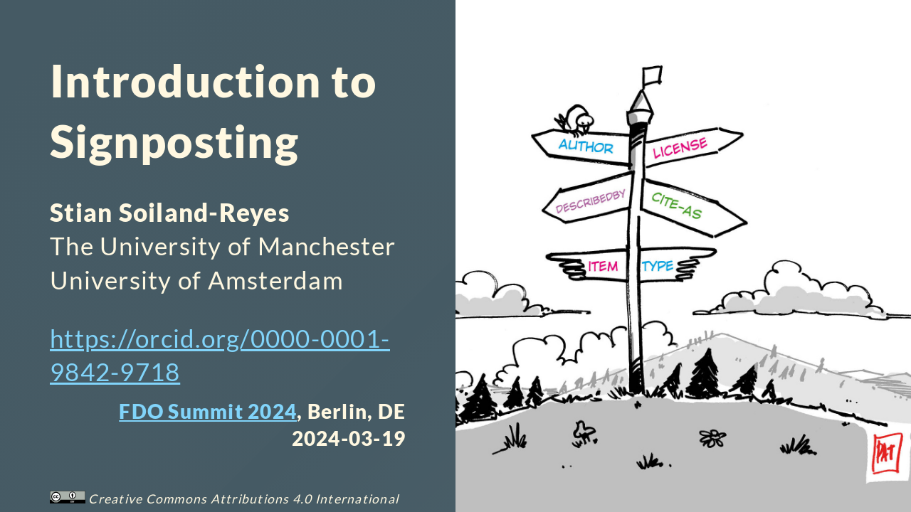

--- 
title: Introduction to Signposting
---

Presented as part of the [Practical web-based FDOs with RO-Crate and FAIR Signposting](https://docs.google.com/document/d/1H9jkOdUrM4sezHVDcnPmYE2aAGAcGYSrv1v53wa5xuo/edit) tutorial session at [FDO Summit 2024](https://fairdo.org/fdof-summit-2024/), Berlin, DE, 2024-03-19

* [Introduction to Signposting (HTML slides)](signposting-intro.html)
* [Introduction to Signposting (PDF slides)](signposting-intro.pdf)
* [Introduction to Signposting (PPTX slides)](signposting-intro.pdf)

## Related resources

* <https://signposting.org/FAIR/>
* <https://github.com/stain/signposting-tutorial>
* <https://signposting.org/adopters/>
