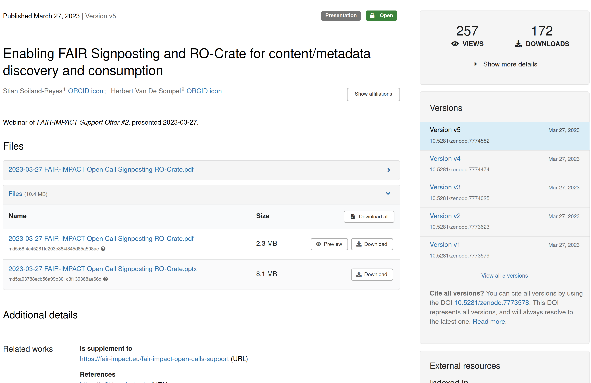
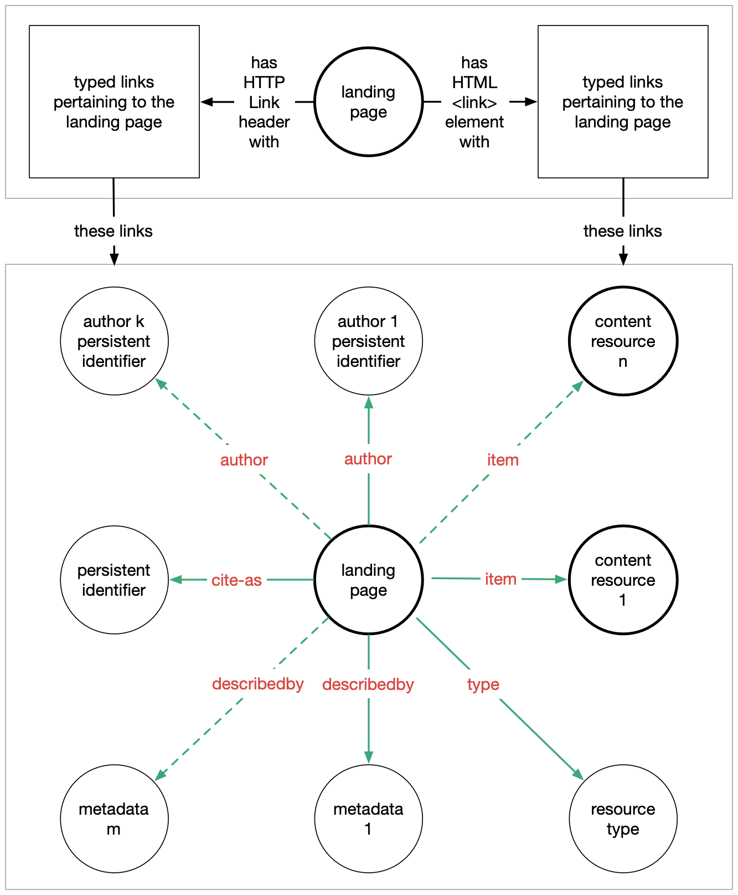

<!-- theme: gaia -->

# Introduction to FAIR Signposting

<!-- class: first invert -->

<https://signposting.org/>

Stian Soiland-Reyes  
The University of Manchester

<https://orcid.org/0000-0001-9842-9718>

_ This content is distributed under the license Creative Commons Attributions 4.0 International
<https://spdx.org/licenses/CC-BY-4.0>_

#### 2024-03-19, FDO Summit 2024, Berlin, DE

---

<!-- class: -->

### A typical PID resolution

```http
GET https://doi.org/10.abcd/j.mystery.14

HTTP/1.1 302 Found
Location: http://www.example.com/repo/item/14
```

Browsers follow the **redirection** to the repository's **landing page**

```http
GET http://www.example.com/repo/item/14

HTTP/1.1 200 OK 
Content-Type: text/html

<html>
  <head> ... </head>
  <body>
  
```

---



---

### A typical landing page


HTML for human readability and human navigation

A **preview** of the resource

**Metadata** (e.g. _title_, _abstract_, _author_) listed as text

Link to **download** (e.g. a `.pdf`)
... and many unrelated links


---

### What about the machines?

 * Site-specific JSON -- schema must be already known
 * "Secret" API -- do some URL rewriting
 * API documented as URL patterns
`http://api.example.com/items/{item}.json`
   * -- but what is the `{item}`?

```http
GET http://api.example.com/items/14.json

HTTP/1.1 200 OK
Content-Type: application/json

{ "title": "Data 14",  "download": "http://cdn.example.net/item14.zip" }
```
---

### Some webby attempts

* If format is known, **content negotiation** can redirect or show alternative content representation

```http
GET http://www.example.com/repo/item/14
Accept: application/json

HTTP/1.1 303 See Other
Location: http://api.example.com/items/14.json
```

* ... but which JSON vocabulary is used? 
* What about the download?
* What was the persistent identifier? Type?

---

## FAIR Signposting

```http
HTTP/1.1 200 OK 
Content-Type: text/html
Link: <http://cdn.example.net/item14.zip>; rel="item"
Link: <http://api.example.com/items/14.json>; rel="describedby"
Link: <https://doi.org/10.abcd/j.mystery.14>; rel="cite-as"
Link: <https://schema.org/TrainingMaterial>; rel="item"

<html>...
```

Additional `Link` headers, just like `rel=stylesheet`

No need to retrieve the HTML, use HTTP `HEAD` to only get headers. 

---

### Link relations



| `rel=`        | FDO concept    |
| ------------- | -------------- |
| `cite-as`     |  PID           |
| `type`        |  FDO type      |
| `describedby` |  metadata FDO  |
| `item`        |  bytestream    |
| `author`      |  _(key-value)_ |
| `license`     |  _(key-value)_ |

---

### Alternative Signposting methods


```html
<html>
<head>

<link rel="cite-as" href="https://w3id.org/signposting-tutorial/stain"  />

<link href="linkset.json"  rel="linkset" 
type="application/linkset+json" />

```
