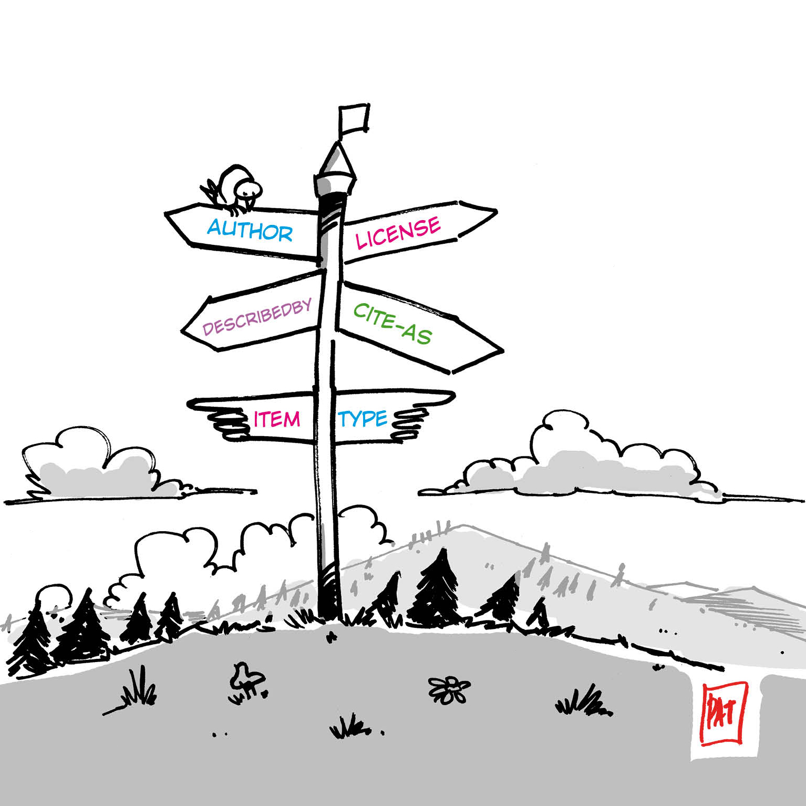
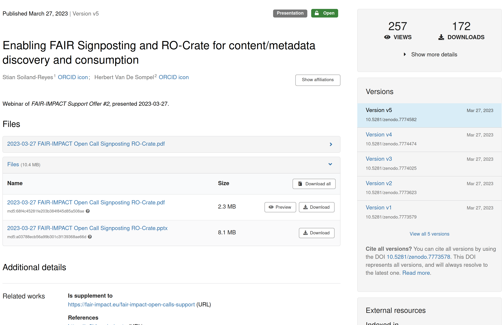
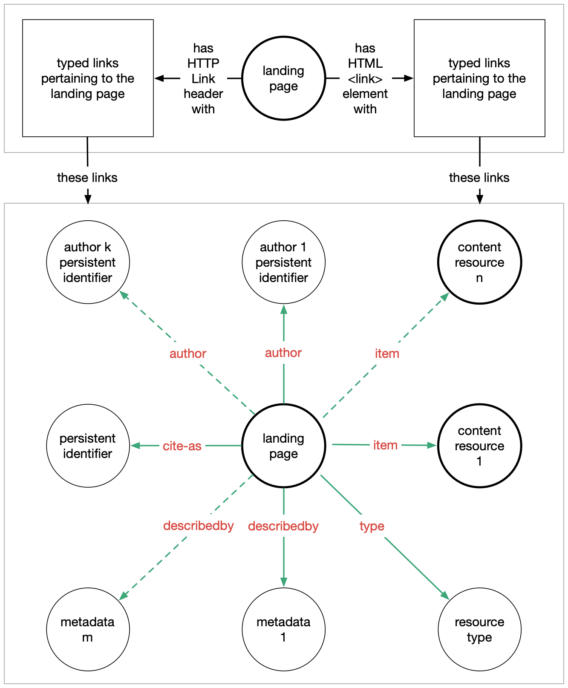

# Introduction to Signposting

<!-- class: first -->



**Stian Soiland-Reyes**
The University of Manchester
University of Amsterdam

<https://orcid.org/0000-0001-9842-9718>

#### [FDO Summit 2024](https://fairdo.org/fdof-summit-2024/), Berlin, DE <br>2024-03-19

_ Creative Commons Attributions 4.0 International_

---

<!-- class: -->

## Overview

1. How do PIDs currently resolve to repositories?
2. Why are the Linked Data practices not enough?
3. Signposting in HTTP
4. FDO and Signposting
5. More "advanced" Signposting

---

### A typical PID resolution

```http
GET https://doi.org/10.abcd/j.mystery.14

HTTP/1.1 302 Found
Location: http://www.example.com/repo/item/14
```

Browsers follow the **redirection** to the repository's **landing page**

```http
GET http://www.example.com/repo/item/14

HTTP/1.1 200 OK 
Content-Type: text/html

<html>
  <head> ... </head>
  <body>
  
```

---



---

### A typical landing page


HTML for human readability and human navigation

A **preview** of the resource

**Metadata** (e.g. _title_, _abstract_, _author_) listed as text

Link to **download** (e.g. a `.pdf`)
... and many unrelated links


---

### What about the machines?

 * Site-specific JSON -- schema must be already known
 * "Secret" API -- do some URL rewriting
 * API documented as URL patterns
`http://api.example.com/items/{item}.json`
   * -- but what is the `{item}`?

```http
GET http://api.example.com/items/14.json

HTTP/1.1 200 OK
Content-Type: application/json

{ "title": "Data 14",  "download": "http://cdn.example.net/item14.zip" }
```
---

### Some webby attempts

* **Content negotiation** can redirect to  alternative content representation -- if format is known

```http
GET http://www.example.com/repo/item/14
Accept: application/json

HTTP/1.1 303 See Other
Location: http://api.example.com/items/14.json
```

* ... but which JSON schema is used? 
* What about those download links?
* What was the persistent identifier? Type?

---

## FAIR Signposting

```http
HTTP/1.1 200 OK 
Content-Type: text/html
Link: <http://cdn.example.net/item14.zip>; rel="item"
Link: <http://api.example.com/items/14.json>; rel="describedby"
Link: <https://doi.org/10.abcd/j.mystery.14>; rel="cite-as"
Link: <https://schema.org/TrainingMaterial>; rel="item"

<html>...
```

Additional `Link` headers, just like `rel=stylesheet`

No need to retrieve the HTML, use HTTP `HEAD` to only get headers. 

<https://doi.org/10.17487/RFC8288>


---

### Link relations



| `rel=`        | FDO concept    |
| ------------- | -------------- |
| `cite-as`     |  PID           |
| `type`        |  FDO type      |
| `describedby` |  metadata    | |
| `item`        |  bytestream    |
| `author`      |  _(attribute)_ |
| `license`     |  _(attribute)_ |

<https://signposting.org/>

---

### Alternative Signposting methods


```html
<html>
<head>

<link rel="stylesheet"  href="https://cdn.jsdelivr.net/npm/bootstrap..." />
<link rel="cite-as"     href="https://doi.org/10.abcd/j.mystery.14"  />
<link rel="item"        href="http://cdn.example.net/item14.zip"  />
<link rel="describedby" href="http://api.example.com/items/14.json" />
<link rel="type"        href="https://schema.org/TrainingMaterial"   />

</head>
<body>
...
```

HTML signposting with `<link>` can be used if you don't have control over the HTTP server, e.g. content delivery network (CDN).


---

#### Linkset JSON (`rel="linkset"`)

```json
{ "linkset": [
  { "anchor": "http://www.example.com/repo/item/14",
    "cite-as": [
      { "href": "https://doi.org/10.abcd/j.mystery.14" }
    ],
    "item": [
      { "href": "http://cdn.example.net/item14.zip" }
    ],
    "describedby": [
      { "href": "http://api.example.com/items/14.json" }
    ]
  },
  { "anchor": "..." }
] }
```
<https://doi.org/10.17487/RFC9264

--- 


## Make the links meaningful

Specify the content `type`:
```
Link: <http://cdn.example.net/item14.zip>; rel="item";
        type="application/zip"
```
_Useful for alternative metadata formats._

For generic types, also specify a `profile`:
```
Link: <http://api.example.com/marc/14>; rel="describedby"; type="application/xml";
        profile="http://www.loc.gov/MARC21/slim"
```
_Useful for JSONs with different schemas_

--- 


## Next steps:

* <https://signposting.org/FAIR/>
* <https://github.com/stain/signposting-tutorial>
* <https://signposting.org/adopters/>

### Acknowledgements

Herbert Van de Sompel <https://orcid.org/0000-0002-0715-6126>

FAIR-IMPACT <https://doi.org/10.3030/101057344>
BY-COVID <https://doi.org/10.3030/101046203>
